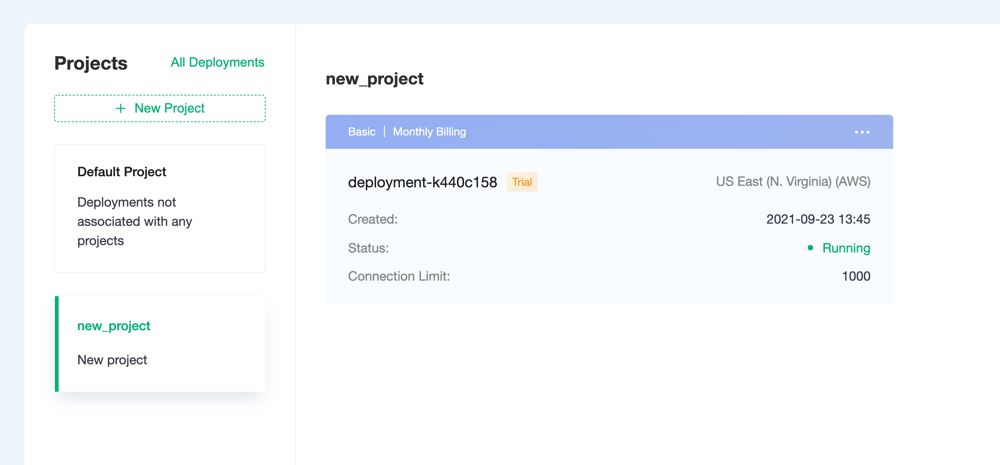
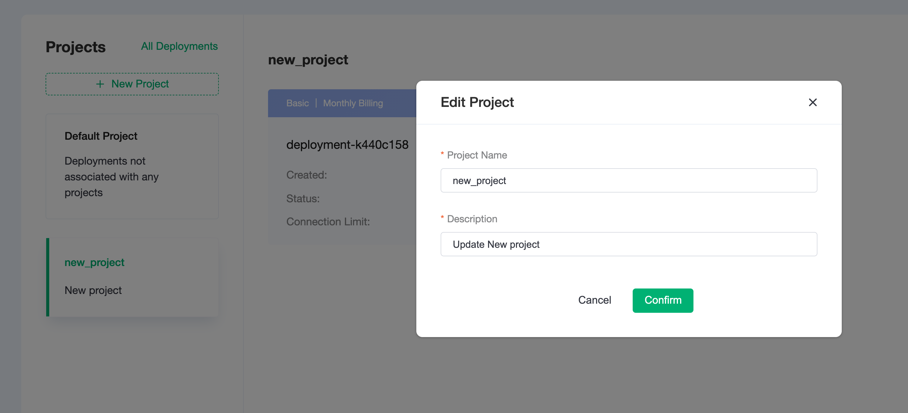

# Project List

Project management is used to group deployments under different projects, making it easy to manage deployments according to the projects.

## Default project

Deployments of unassociated projects will be grouped under the default deployment

## Create project

Click **New Project**, enter the project name and description, you can create a new project.

## Create deployment under project

Select the project on the left, you can create a new deployment under the selected project.

## Move project

Click on the menu in the upper right corner of the deployment and select **Move Project**

Select the target project in the project list

Once you click **Confirm**, you can move the deployment to a new project

## Update project

Hover over the project to see the update button

Click the button to update the project's name and description

## Delete project

> Make sure there are no deployments under the project before deleting it

Hover over the project and click the **Delete** button to delete the project

## All deployments

Click on **All Deployments** in the top right corner to see all deployments

