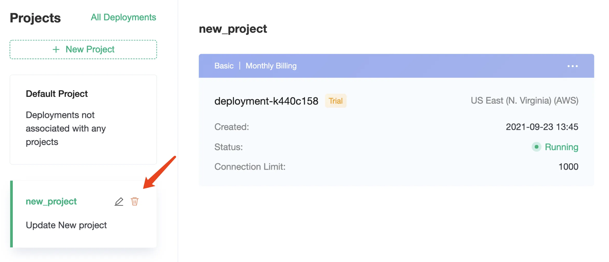

# Project List

Project management is used to group deployments under different projects, making it easy to manage deployments according to the projects.

## Default Project

Deployments of unassociated projects will be grouped under the default deployment.

## Create Project

Click **New Project**, enter the project name and description, you can create a new project.

## Create Deployment under Project

Select the project on the left, you can create a new deployment under the selected project.

## Move Project

Click on the menu in the upper right corner of the deployment and select **Move To**.

Select the target project in the project list.

Once you click **Confirm**, you can move the deployment to a new project.

## Update Project

Hover over the project to see the update button.

Click the button to update the project's name and description.

## Delete Project

> Make sure there are no deployments under the project before deleting it.

Hover over the project and click the **Delete** button to delete the project.

!

## All Deployments

Click on **All Deployments** in the top right corner to see all deployments.

