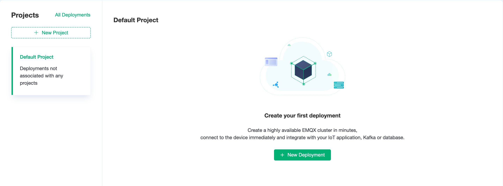
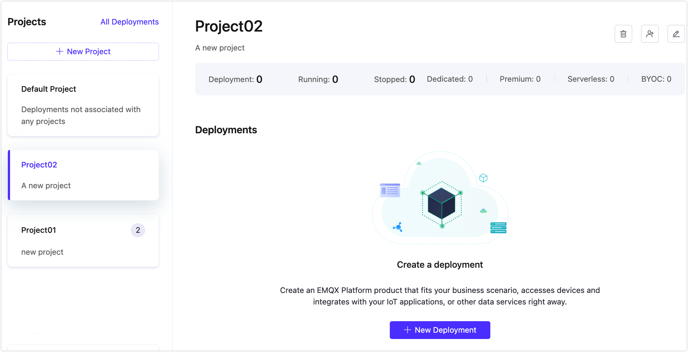

# Project Management

Projects provide the capability for multiple organizations or departments within a company to use and manage MQTT clusters independently, allowing for more detailed management of the platform's capabilities by assigning different roles. Based on projects, each organization or department can manage its own MQTT cluster independently and account for it separately. Under the multi-project mechanism, deployments must be established under a project, and a deployment can only belong to one project.

## Project List

Click **Deployments** in the top menu bar to enter the page, where you can see the project list on the left side of the page.

## Create a Project

Click **New Project**. Enter the project name and note in the pop-up, then click **Confirm** to create a new project.

## Create a Deployment under a Project

Select a project on the left, you can create a deployment under the selected project.

## Move Deployment to Another Project

1. Click the menu in the top right corner of the deployment, and select **Move to**.

2. From the **Choose Project** dropdown, select the target project.

3. After clicking **Confirm**, the deployment can be moved to the target project.

## Update a Project

Select a project, click the edit button in the top right corner, and you can update the project name and description.

## Delete a Project

> Please ensure there are no deployments under the project before deleting it.

Select a project, and click the delete button in the top right corner.

## Link Subuser Accounts

Select a project, click the link account button in the top right corner, you can set the [subuser](https://chat.openai.com/g/g-aAzkOrn2h-ruan-jian-wen-dang-xie-zuo-zhu-shou/c/user.md) for this project.

