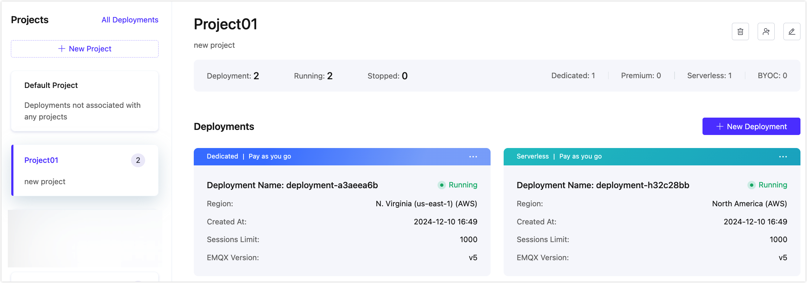
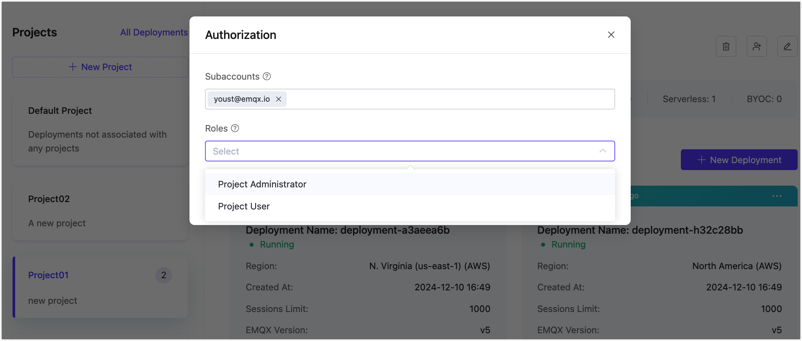

# Project Management

Projects provide the capability for multiple organizations or departments within a company to use and manage MQTT clusters independently, allowing for more detailed management of the platform's capabilities by assigning different roles. Based on projects, each organization or department can manage its own MQTT cluster independently and account for it separately. Under the multi-project mechanism, deployments must be established under a project, and a deployment can only belong to one project.

## View Projects

Click **Deployments** in the top menu bar to enter the page, where you can see the project list on the left side of the page.

::: tip

If you hold the role of Project Administrator or Project User, you can only access the projects you are authorized to view. For detailed information about project management permissions associated with each role, refer to [Roles and Permissions](role.md).

:::

## Create a Project

To create a project, click **+ New Project** at the top of the project list. In the **New Project** pop-up, enter the project name and note, and click **Confirm** to create a new project.

## Create a Deployment Under a Project

Select a project on the left, and click the **+ New Deployment** button to create a deployment under the selected project.

## Move Deployment to Another Project

1. Click the menu in the top right corner of the deployment card, and select **Move to**.

   

2. From the **Choose Project** dropdown, select the target project.

3. After clicking **Confirm**, the deployment will be moved to the target project.

## Update a Project

Select a project, and click the "Edit" icon at the upper right corner of the project page to update the project name and note.

## Delete a Project

> Please ensure there are no deployments under the project before deleting it.

Select a project, and click the "Delete" icon at the upper right corner of the project page to delete the project. You will be prompted to confirm the deletion. Click **Confirm** to proceed with the operation.

## Authorize Subaccounts

If you hold the role of [Administrator](./role.md#accounts-categories), you can authorize [subaccounts](./user.md) with certain project management operation permissions for a specific project.

1. Select a project and click the "Authorization" icon at the top right corner of the project page.

   

2. In the **Authorization** dialog, click **Add** to enter a subaccount and select the role(s) for the subaccount.

   

3. Click **Confirm** to add the subaccount, or you can continue to add more subaccounts.

