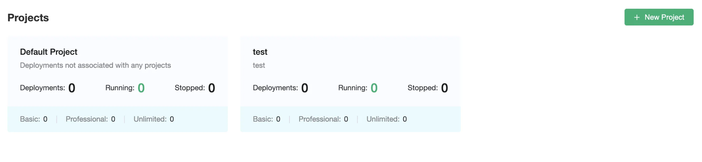
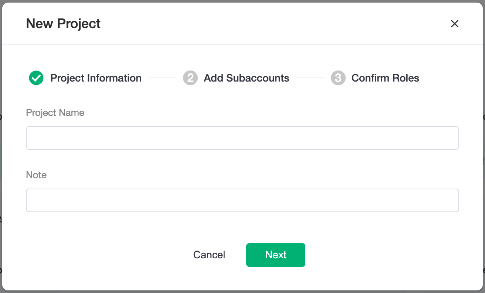
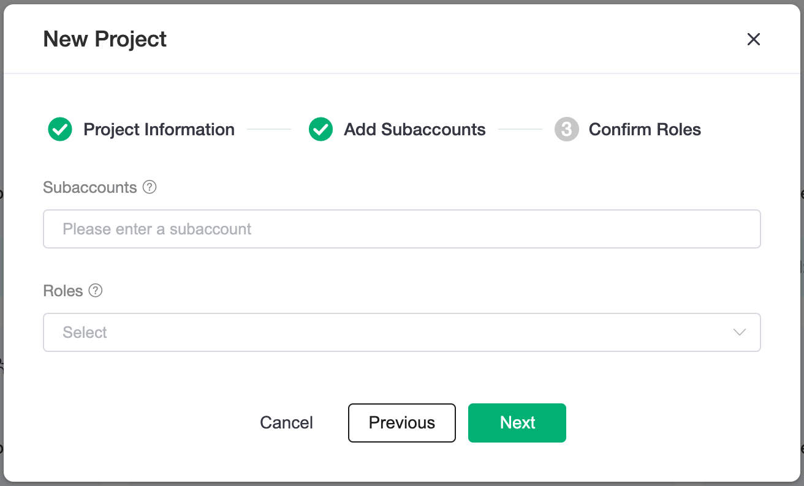
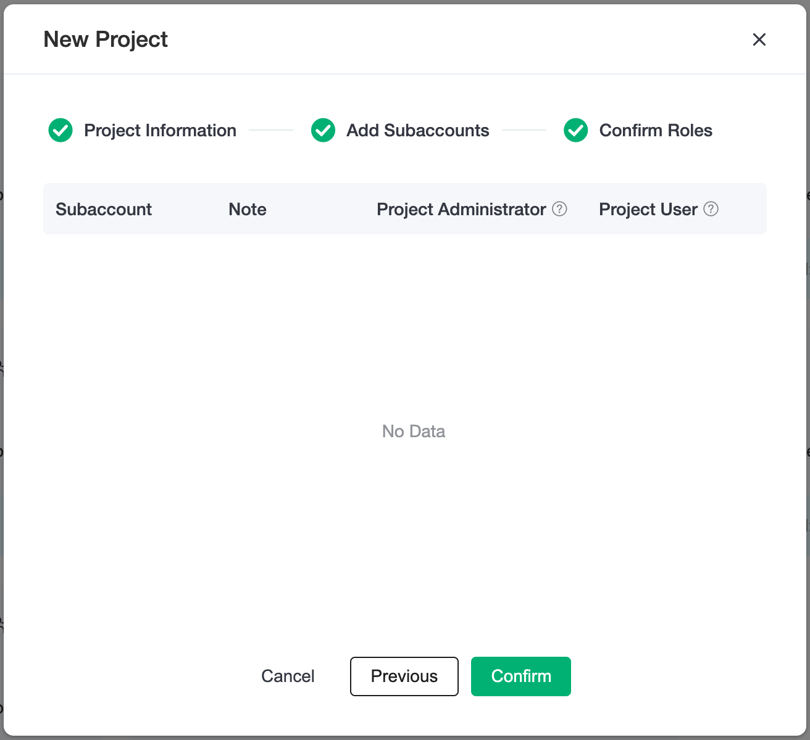
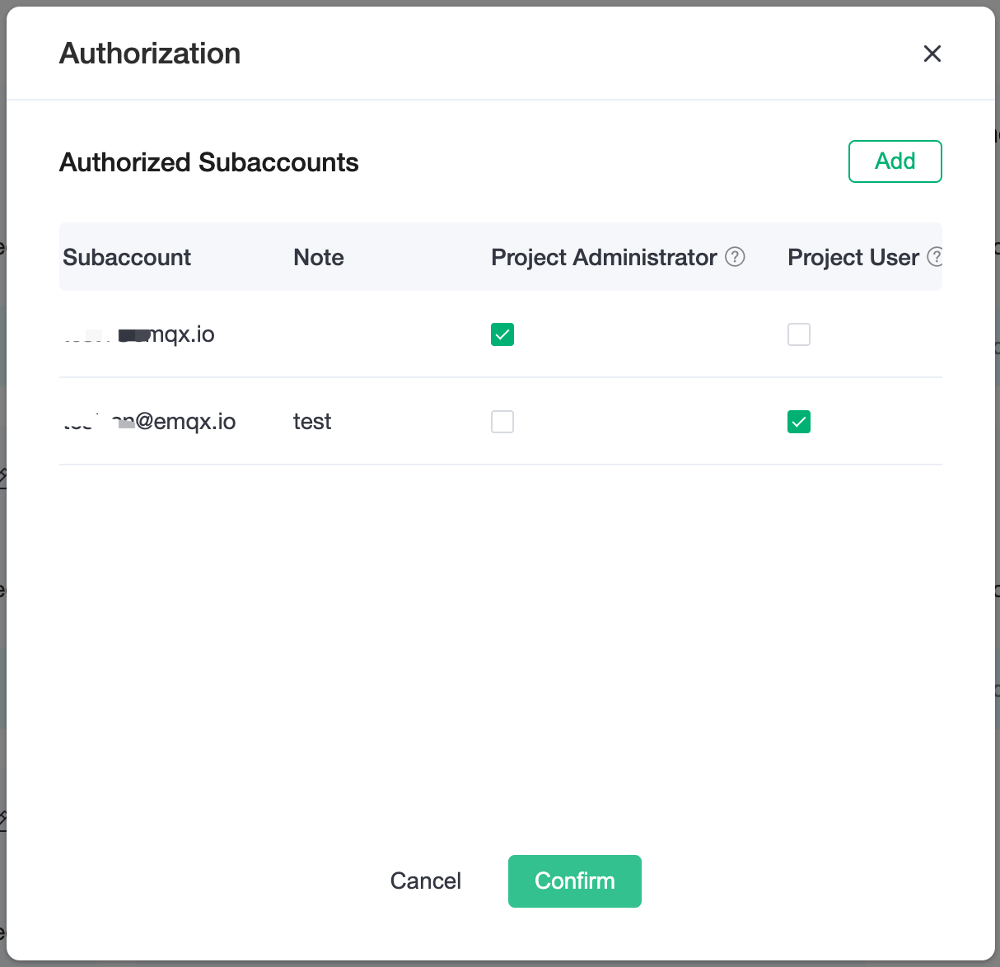
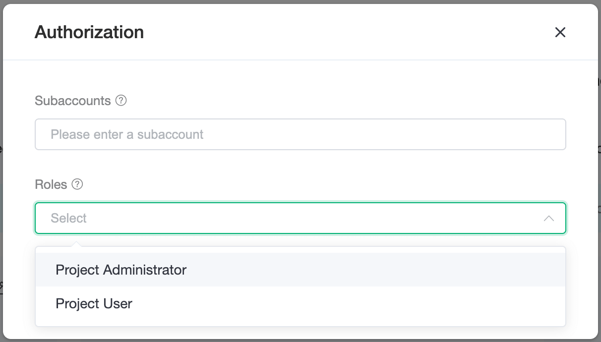
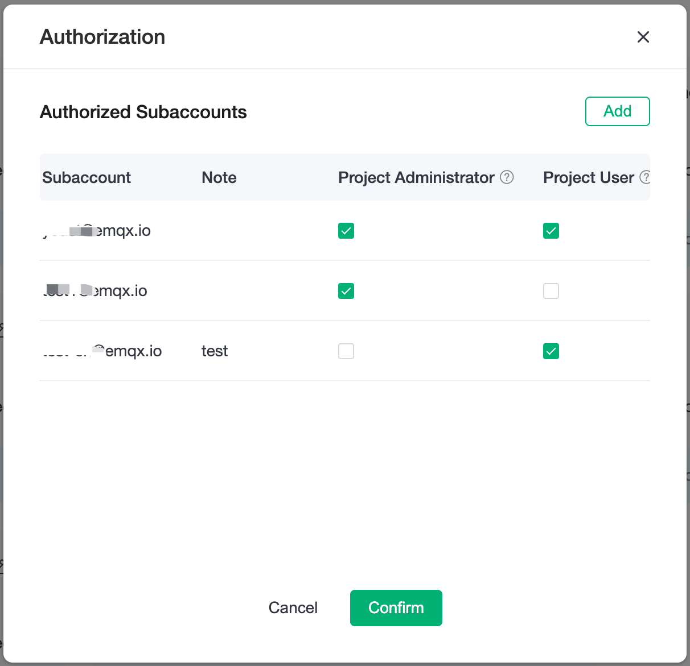

# Project Center

Project Center provides the ability for multiple organizations or departments in an enterprise to independently use and manage MQTT clusters, allowing different roles to be assigned to more granular management of the platform's capabilities. Based on the Project Center, each organization or department can manage its MQTT clusters separately and can account for them independently. In a multi-project mechanism, deployments need to be built under projects and deployment can only belong to one project.

## Create new projects

Click the `New Project` button in the upper right corner to start the new project, which is divided into three steps:

1. Fill in the name of the project and the descriptions.

2. Search and select a subaccount. When searching, you need to enter the full account name and set the role for the subaccount. If you haven't created a subaccount yet, you can create a sub-account in the user management. [Learn more about role related information](./user.md). Here we give the subaccount `subuser1@emqx.io` the role of project administrator. You can add multiple subaccounts in the subaccount input box.
> If you do not need to set up a subaccount you can click Next to skip the settings.

3. Then confirm that the list allows you to modify the account's role again or remove the account's authorization, and click Confirm. This completes the creation of a project.
> Canceling all roles of a subaccount is equivalent to deleting the project authorizations for that subaccount.

## Project list

In the Project Center panel, you can see the number of running deployments and the number of deployments that have been stopped for each project.

Subaccounts with project management permissions can display buttons to add an subaccount, edit a project and delete a project when mousing over the project block.

### Project Subaccount Authorization
In the project authorization list you can see the currently authorized subaccounts, you can modify the role of the subaccount with the project dimension, and the roles that can be selected are:

**Project Administrator**：Have permission to view, modify the projects and modify, delete the deployments

**Project User**：Have permission to view the project and permission to view and edit the deployment

[Click to see the permission distinction of roles](./role.md)

Click `Add` to bind a new subaccount, search and add a subaccount, click OK to return to the subaccounts list.

### Edit project
You can edit and modify the name and notes of the project.

### Delete project
You cannot restore a project after deleting it. **You must clear the deployment under the project before deleting it**.
