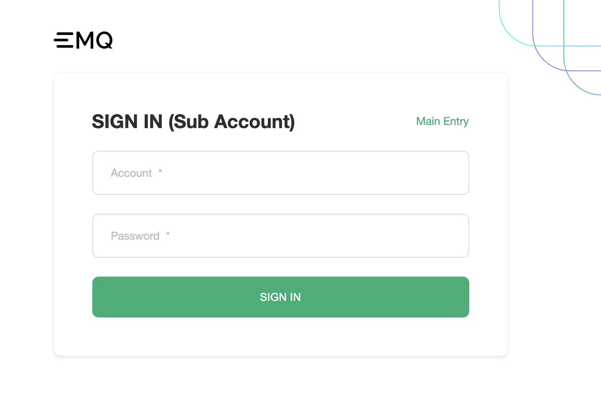

# Introduction

Accounts management fulfils enterprise users' multi-role management requirements, by assigning different permissions and projects to different roles. Different personnel can be invited within the enterprise to do detailed management of resources.

## Subaccounts System

A subaccount is an account created by an EMQX Cloud user. Subaccounts will be activated after email authentication. An EMQX Cloud user account currently cannot be registered as a subaccount. On the contrary, subaccount email can be registered as an EMQX Cloud user. Additionally, it can be registered as a subaccount under other EMQX Cloud user account.

Here is the login page for subaccounts (for subaccounts login only)

## Accounts Categories

**Administrator**：Same as the platform account, Administrator have all the access to the platform and is the super administrator in the subaccount system. It is important to note that although functionally equivalent to the platform account, the administrator still belongs to the system of subaccount.

**Project Administrator**：Project Administrators have permission to view and modify projects and to modify and delete deployments. Project administrator is mainly used for project deployment-related management. For example, an organization needs to have separate cluster management and designate a person as administrator for a certain project. Assigning the project administrators will give them sufficient access instead of full access to the project.

**Project User**：Project users have permission to view the project, and the permission to view and edit the deployment. Project users are usually business developers. In addition to viewing projects and deployment permissions, they can also view deployment details, use Data Integrations and monitoring, and further process-related business requirements.

**Accountant**：Accountants have financial management permissions and can view projects and deployments. They can manage the billing, balance, invoices, etc.

**Auditor**：Auditors can view projects, deployments,  accounts, and Accountants. The audit role addresses the need for internal company audits and can have viewing permissions to various features of the platform.
Role list

<table>
   <tr>
      <th colspan="2">Permissions</th>
      <th>Project Administrator</th>
      <th>Project User</th>
      <th>Accountant</th>
      <th>Auditor</th>
   </tr>
   <tr>
      <td rowspan="20">Deployment</td>
      <td>View deployment list</td>
      <td>&#10003</td>
      <td>&#10003</td>
      <td>&#10003</td>
      <td>&#10003</td>
   </tr>
   <tr>
   	  <td>Create new project in the deployment list</td>
      <td>&#10007</td>
      <td>&#10007</td>
      <td>&#10007</td>
      <td>&#10007</td>
   </tr>
   <tr>
   	  <td>Edit project in the deployment list</td>
      <td>&#10003</td>
      <td>&#10007</td>
      <td>&#10007</td>
      <td>&#10007</td>
   </tr>
   <tr>
   	  <td>Delete project in the deployment list</td>
      <td>&#10007</td>
      <td>&#10007</td>
      <td>&#10007</td>
      <td>&#10007</td>
   </tr>
   <tr>
   	<td>Create new deployments</td>
      <td>&#10003</td>
      <td>&#10007</td>
      <td>&#10007</td>
      <td>&#10007</td>
   </tr>
   <tr>
   	  <td>Move deployments to other project</td>
      <td>&#10003</td>
      <td>&#10007</td>
      <td>&#10007</td>
      <td>&#10007</td>
   </tr>
   <tr>
   	<td>Start/Stop the deployment</td>
      <td>&#10003</td>
      <td>&#10007</td>
      <td>&#10007</td>
      <td>&#10007</td>
   </tr>
   <tr>
   	<td>Delete deployment</td>
      <td>&#10003</td>
      <td>&#10007</td>
      <td>&#10007</td>
      <td>&#10007</td>
   </tr>
   <tr>
   	<td>Change deployment's name</td>
      <td>&#10003</td>
      <td>&#10003</td>
      <td>&#10007</td>
      <td>&#10007</td>
   </tr>
	<tr>
   	  <td>Change to annual plan</td>
      <td>&#10003</td>
      <td>&#10007</td>
      <td>&#10007</td>
      <td>&#10007</td>
   </tr>
    <tr>
   	<td>TLS/SSL Configuration</td>
      <td>&#10003</td>
      <td>&#10003</td>
      <td>Read only</td>
      <td>Read only</td>
   </tr>
   <tr>
   	<td>VPC Connection Configuration</td>
      <td>&#10003</td>
      <td>&#10003</td>
      <td>Read only</td>
      <td>Read only</td>
   </tr>
   <tr>
   	<td>REST API Configuration</td>
      <td>&#10003</td>
      <td>&#10003</td>
      <td>Read only</td>
      <td>Read only</td>
   </tr>
   <tr>
   	<td>Certification Authentication Configuration</td>
      <td>&#10003</td>
      <td>&#10003</td>
      <td>Read only</td>
      <td>Read only</td>
   </tr>
   <tr>
   	<td>Data Integrations Configuration</td>
      <td>&#10003</td>
      <td>&#10003</td>
      <td>Read only</td>
      <td>Read only</td>
   </tr>
   <tr>
   <td>Monitoring</td>
      <td>&#10003</td>
      <td>&#10003</td>
      <td>Read only</td>
      <td>Read only</td>
   </tr>
   <tr>
   <td>Metrics</td>
      <td>&#10003</td>
      <td>&#10003</td>
      <td>&#10003</td>
      <td>&#10003</td>
   </tr>
   <tr>
   <td>Logs</td>
      <td>&#10003</td>
      <td>&#10003</td>
      <td>&#10003</td>
      <td>&#10003</td>
   </tr>
   <tr>
   <td>Alerts</td>
      <td>&#10003</td>
      <td>&#10003</td>
      <td>Read only</td>
      <td>Read only</td>
   </tr>
   <tr>
   <td>Online Debugging</td>
      <td>&#10003</td>
      <td>&#10003</td>
      <td>&#10007</td>
      <td>&#10007</td>
   </tr>
   <tr>
      <td rowspan="2">Account Management</td>
      <td>View Account List</td>
      <td>&#10007</td>
      <td>&#10007</td>
      <td>&#10007</td>
      <td>&#10003</td>
   </tr>
   <tr>
      <td>Account Management Operation</td>
      <td>&#10007</td>
      <td>&#10007</td>
      <td>&#10007</td>
      <td>&#10007</td>
   </tr>
   <tr>
      <td rowspan="5">Project Center</td>
      <td>View project list</td>
      <td>&#10003</td>
      <td>&#10003</td>
      <td>&#10003</td>
      <td>&#10003</td>
   </tr>
   <tr>
   	<td>Create new projects</td>
      <td>&#10007</td>
      <td>&#10007</td>
      <td>&#10007</td>
      <td>&#10007</td>
   </tr>
   <tr>
   	  <td>Delete the project</td>
      <td>&#10007</td>
      <td>&#10007</td>
      <td>&#10007</td>
      <td>&#10007</td>
   </tr>
   <tr>
      <td>Edit the project</td>
      <td>&#10003</td>
      <td>&#10007</td>
      <td>&#10007</td>
      <td>&#10007</td>
   </tr>
   <tr>
      <td>Project bind subaccounts</td>
      <td>&#10007</td>
      <td>&#10007</td>
      <td>&#10007</td>
      <td>&#10007</td>
   </tr>
	<tr>
      <td rowspan="7">Billing</td>
      <td>Billing Overview</td>
      <td>&#10007</td>
      <td>&#10007</td>
      <td>&#10003</td>
      <td>&#10003</td>
   	</tr>
   	<tr>
      <td>Change credit card info</td>
      <td>&#10007</td>
      <td>&#10007</td>
      <td>&#10003</td>
      <td>&#10007</td>
   	</tr>
   	<tr>
      <td>View Bills page</td>
      <td>&#10007</td>
      <td>&#10007</td>
      <td>&#10003</td>
      <td>&#10003</td>
   	</tr>
   	<tr>
      <td>View Charges by Services page</td>
      <td>&#10007</td>
      <td>&#10007</td>
      <td>&#10003</td>
      <td>&#10003</td>
   	</tr>
   	<tr>
      <td>View Coupons</td>
      <td>&#10007</td>
      <td>&#10007</td>
      <td>&#10003</td>
      <td>&#10003</td>
   	</tr>
   	<tr>
      <td>View Invoices</td>
      <td>&#10007</td>
      <td>&#10007</td>
      <td>&#10003</td>
      <td>&#10003</td>
   	</tr>
   	<tr>
      <td>Download Invoices</td>
      <td>&#10007</td>
      <td>&#10007</td>
      <td>&#10003</td>
      <td>&#10007</td>
   	</tr>
      <tr>
      <td rowspan="3">Value Added Services</td>
      <td>View VAS List</td>
      <td>&#10003</td>
      <td>&#10003</td>
      <td>&#10007</td>
      <td>&#10007</td>
      </tr>
      <tr>
      <td>Enable a Service</td>
      <td>&#10003</td>
      <td>&#10007</td>
      <td>&#10007</td>
      <td>&#10007</td>
      </tr>
      <tr>
      <td>Delete a Service</td>
      <td>&#10007</td>
      <td>&#10007</td>
      <td>&#10007</td>
      <td>&#10007</td>
      </tr>
   <tr>
      <td colspan="2">Events</td>
      <td>&#10003</td>
      <td>&#10003</td>
      <td>&#10003</td>
      <td>&#10007</td>
   </tr>
   	<tr>
      <td colspan="2">Tickets</td>
      <td>&#10003</td>
      <td>&#10003</td>
      <td>&#10003</td>
      <td>&#10003</td>
   </tr>
</table>

