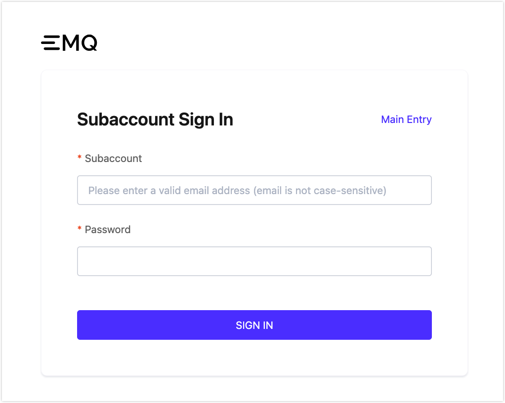

# Roles and Permissions

Accounts management fulfills enterprise users' multi-role management requirements, by assigning different permissions and projects to different roles. Different personnel can be invited within the enterprise to do detailed management of resources.

## Subaccounts System

A subaccount is an account created by an EMQX Platform user. Subaccounts will be activated after email authentication. An EMQX Platform user account currently cannot be registered as a subaccount. On the contrary, subaccount email can be registered as an EMQX Platform user. Additionally, it can be registered as a subaccount under other EMQX Platform user account.

Subaccounts get a separate login page for subaccounts only.

## Accounts Categories

**Administrator**: Same as the platform account; Administrators have all the access to the platform and is the super administrator in the subaccount system. It is important to note that although functionally equivalent to the platform account, the administrator still belongs to the system of subaccount.

**Project Administrator**: Project Administrators have permission to view and modify projects and to modify and delete deployments. Project administrator is mainly used for project deployment-related management. For example, an organization needs to have separate cluster management and designate a person as administrator for a certain project. Assigning the project administrators will give them sufficient access instead of full access to the project.

**Project User**: Project users have permission to view the project, and the permission to view and edit the deployment. Project users are usually business developers. In addition to viewing projects and deployment permissions, they can also view deployment details, use Data Integrations and monitoring, and further process-related business requirements.

**Accountant**: Accountants have financial management permissions and can view projects and deployments. They can manage the billing, balance, invoices, etc.

**Auditor**: Auditors can view projects, deployments,  accounts, and Accountants. The audit role addresses the need for internal company audits and can have viewing permissions to various features of the platform.

## Role Permission List

<table>
   <tr>
      <th colspan="2">Permissions</th>
      <th>Project Administrator</th>
      <th>Project User</th>
      <th>Accountant</th>
      <th>Auditor</th>
   </tr>
   <tr>
      <td rowspan="19">Deployment</td>
      <td>View deployment list</td>
      <td>&#10003</td>
      <td>&#10003</td>
      <td>&#10003</td>
      <td>&#10003</td>
   </tr>
  <tr>
   	  <td>View deployment details (all features within deployments)</td>
      <td>&#10003</td>
      <td>&#10003</td>
      <td>&#10003</td>
      <td>&#10003</td>
   </tr>
   <tr>
   	<td>Create new deployments</td>
      <td>&#10003</td>
      <td>&#10007</td>
      <td>&#10007</td>
      <td>&#10007</td>
   </tr>
   <tr>
   	<td>Move deployments to other projects</td>
      <td>&#10003</td>
      <td>&#10007</td>
      <td>&#10007</td>
      <td>&#10007</td>
   </tr>
   <tr>
   	<td>Start/Stop the deployment</td>
      <td>&#10003</td>
      <td>&#10007</td>
      <td>&#10007</td>
      <td>&#10007</td>
   </tr>
   <tr>
   	<td>Delete deployment</td>
      <td>&#10003</td>
      <td>&#10007</td>
      <td>&#10007</td>
      <td>&#10007</td>
   </tr>
   <tr>
   	<td>Change deployment's name</td>
      <td>&#10003</td>
      <td>&#10003</td>
      <td>&#10007</td>
      <td>&#10007</td>
   </tr>
   <tr>
   	<td>Change deployment tiers</td>
      <td>&#10003</td>
      <td>&#10007</td>
      <td>&#10007</td>
      <td>&#10007</td>
   </tr>
   <tr>
   	<td>Change spend limit for Serverless</td>
      <td>&#10003</td>
      <td>&#10007</td>
      <td>&#10007</td>
      <td>&#10007</td>
   </tr>
   <tr>
   	<td>Update BYOC License</td>
      <td>&#10003</td>
      <td>&#10007</td>
      <td>&#10007</td>
      <td>&#10007</td>
   </tr>
   <tr>
   	<td>TLS/SSL configuration</td>
      <td>&#10003</td>
      <td>&#10003</td>
      <td>Read only</td>
      <td>Read only</td>
   </tr>
   <tr>
   	<td>VPC Connection configuration</td>
      <td>&#10003</td>
      <td>&#10003</td>
      <td>Read only</td>
      <td>Read only</td>
   </tr>
   <tr>
   	<td>Deployment API</td>
      <td>&#10003</td>
      <td>&#10003</td>
      <td>Read only</td>
      <td>Read only</td>
   </tr>
   <tr>
   	<td>Certification authentication configuration</td>
      <td>&#10003</td>
      <td>&#10003</td>
      <td>Read only</td>
      <td>Read only</td>
   </tr>
   <tr>
   	<td>Data integrations configuration</td>
      <td>&#10003</td>
      <td>&#10003</td>
      <td>Read only</td>
      <td>Read only</td>
   </tr>
   <tr>
      <td>Update gateway configurations</td>
      <td>&#10003</td>
      <td>&#10003</td>
      <td>Read only</td>
      <td>Read only</td>
   </tr>
   <tr>
      <td>Monitor menu</td>
      <td>&#10003</td>
      <td>&#10003</td>
      <td>Read only</td>
      <td>Read only</td>
   </tr>
   <tr>
      <td>Logs</td>
      <td>&#10003</td>
      <td>&#10003</td>
      <td>&#10003</td>
      <td>&#10003</td>
   </tr>
   <tr>
      <td>Online debugging</td>
      <td>&#10003</td>
      <td>&#10003</td>
      <td>&#10007</td>
      <td>&#10007</td>
   </tr>
   <tr>
      <td rowspan="2">Subaccounts</td>
      <td>View subaccounts list</td>
      <td>&#10007</td>
      <td>&#10007</td>
      <td>&#10007</td>
      <td>&#10003</td>
   </tr>
   <tr>
      <td>Subaccounts operation</td>
      <td>&#10007</td>
      <td>&#10007</td>
      <td>&#10007</td>
      <td>&#10007</td>
   </tr>
   <tr>
      <td rowspan="5">Project Management</td>
      <td>View project list</td>
      <td>&#10003 (authorized projects only)</td>
      <td>&#10003 (authorized projects only)</td>
      <td>&#10003</td>
      <td>&#10003</td>
   </tr>
   <tr>
   	<td>Create new projects</td>
      <td>&#10007</td>
      <td>&#10007</td>
      <td>&#10007</td>
      <td>&#10007</td>
   </tr>
   <tr>
   	<td>Delete project</td>
      <td>&#10007</td>
      <td>&#10007</td>
      <td>&#10007</td>
      <td>&#10007</td>
   </tr>
   <tr>
      <td>Edit project name and note</td>
      <td>&#10003</td>
      <td>&#10007</td>
      <td>&#10007</td>
      <td>&#10007</td>
   </tr>
   <tr>
      <td>Project bind subaccounts</td>
      <td>&#10007</td>
      <td>&#10007</td>
      <td>&#10007</td>
      <td>&#10007</td>
   </tr>
	<tr>
      <td rowspan="8">Billing</td>
      <td>Billing Overview</td>
      <td>&#10007</td>
      <td>&#10007</td>
      <td>&#10003</td>
      <td>&#10003</td>
   </tr>
   <tr>
      <td>Change credit card info</td>
      <td>&#10007</td>
      <td>&#10007</td>
      <td>&#10003</td>
      <td>&#10007</td>
   </tr>
   <tr>
      <td>View Bills page</td>
      <td>&#10007</td>
      <td>&#10007</td>
      <td>&#10003</td>
      <td>&#10003</td>
   </tr>
   <tr>
      <td>View charges by services page</td>
      <td>&#10007</td>
      <td>&#10007</td>
      <td>&#10003</td>
      <td>&#10003</td>
   </tr>
   <tr>
      <td>View coupons</td>
      <td>&#10007</td>
      <td>&#10007</td>
      <td>&#10003</td>
      <td>&#10003</td>
   </tr>
   <tr>
      <td>View invoices</td>
      <td>&#10007</td>
      <td>&#10007</td>
      <td>&#10003</td>
      <td>&#10003</td>
   </tr>
   <tr>
      <td>Download invoices</td>
      <td>&#10007</td>
      <td>&#10007</td>
      <td>&#10003</td>
      <td>&#10007</td>
   </tr>
   <tr>
      <td>Subscription renewal</td>
      <td>&#10003</td>
      <td>&#10007</td>
      <td>&#10007</td>
      <td>&#10007</td>
   </tr>
   <tr>
      <td rowspan="4">Network Management</td>
      <td>Create/Delete VPC/PrivateLink</td>
      <td>&#10003</td>
      <td>&#10003</td>
      <td>&#10007</td>
      <td>&#10007</td>
   </tr>
   <tr>
      <td>View VPC/PrivateLink</td>
      <td>&#10003</td>
      <td>&#10003</td>
      <td>&#10003</td>
      <td>&#10003</td>
   </tr>
   <tr>
      <td>Create/Delete NAT/Internal Endpoint</td>
      <td>&#10003</td>
      <td>&#10007</td>
      <td>&#10007</td>
      <td>&#10007</td>
   </tr>
   <tr>
      <td>View NAT/Internal Endpoint</td>
      <td>&#10003</td>
      <td>&#10003</td>
      <td>&#10003</td>
      <td>&#10003</td>
   </tr>
   <tr>
      <td colspan="2">Audit Log</td>
      <td>&#10007</td>
      <td>&#10007</td>
      <td>&#10007</td>
      <td>&#10003</td>
   </tr>
   <tr>
      <td colspan="2">View platform API key</td>
      <td>&#10007</td>
      <td>&#10007</td>
      <td>&#10007</td>
      <td>&#10003</td>
   </tr>
   <tr>
      <td colspan="2">Manage platform API key</td>
      <td>&#10007</td>
      <td>&#10007</td>
      <td>&#10007</td>
      <td>&#10007</td>
   </tr>
   <tr>
      <td colspan="2">Tickets</td>
      <td>&#10003</td>
      <td>&#10003</td>
      <td>&#10003</td>
      <td>&#10003</td>
   </tr>
</table>
