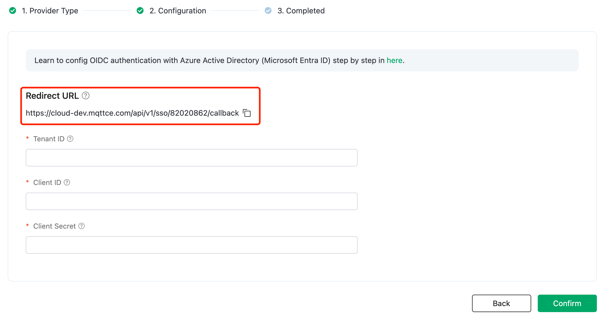
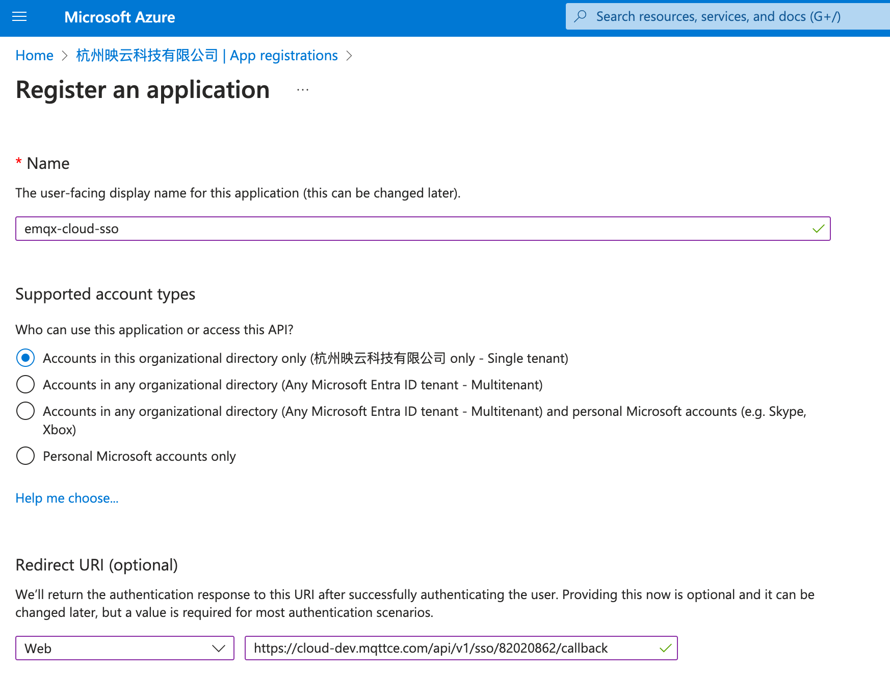
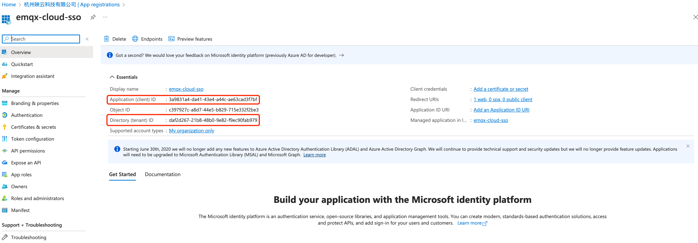
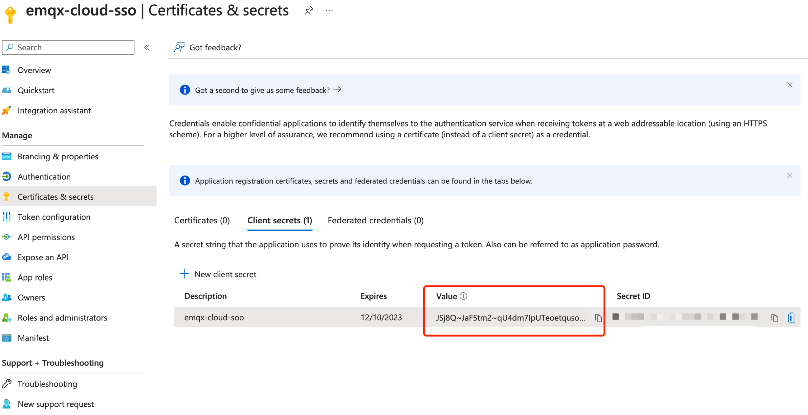
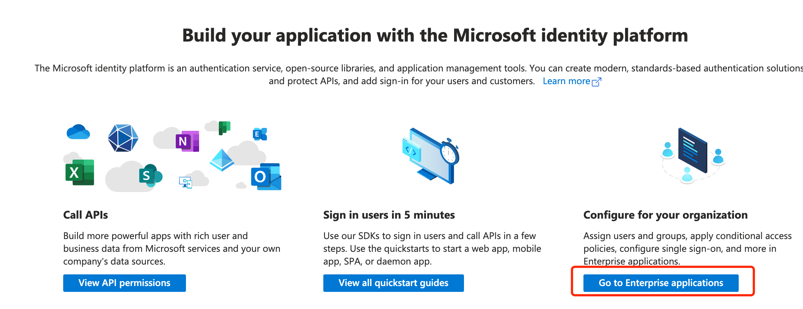
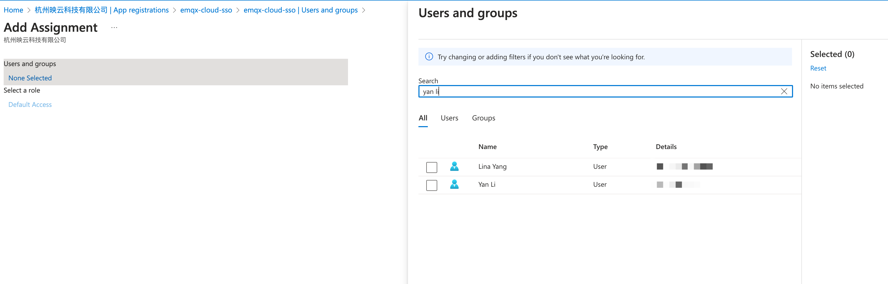
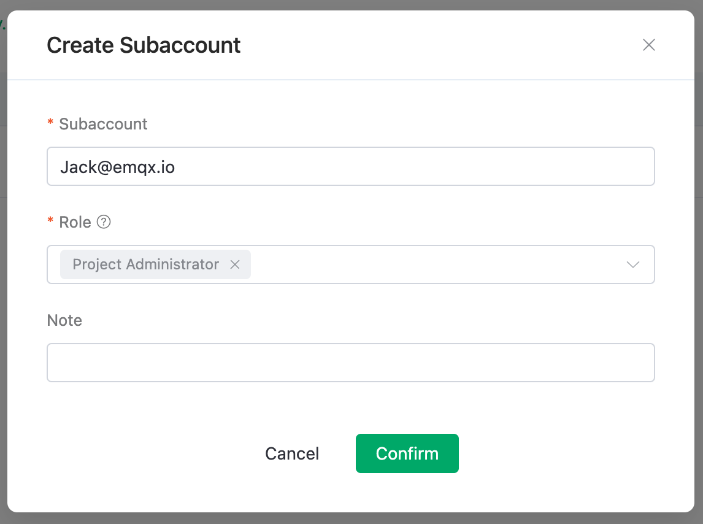
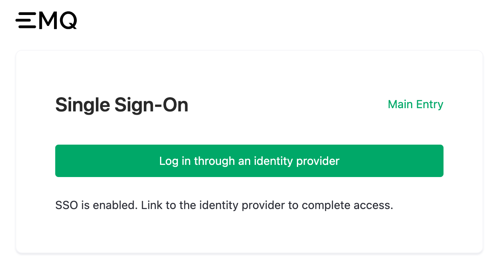

# Configure SSO with Azure AD Authorization

If you manage your enterprise accounts using Azure Active Directory (Microsoft Enterprise ID, referred to as Azure AD), you can choose Azure AD as the authorization server for EMQX Cloud and enable Single Sign-On (SSO). Additionally, you need to configure OpenID Connect (OIDC) settings in Azure AD. This page provides examples of OIDC configurations in both EMQX and Azure AD to help you understand the end-to-end configuration process for connecting an Enterprise Identity Provider (IdP) with EMQX Cloud to enable SSO.

## Prerequisites

- An EMQX Cloud Root account.
- An Azure AD tenant, and an administrator user within the Azure AD tenant.
- You need to perform Azure AD operations using an administrator user (with global admin privileges). For guidance on creating users and authorizing users in Azure AD, refer to [Azure AD documentation](https://learn.microsoft.com/zh-cn/azure/active-directory/fundamentals/).

## Step 1: Enable SSO in EMQX Cloud

1. Log in to Cloud Console using your EMQX Cloud Root account.
2. Click on the user icon in the upper right corner and select **SSO** from the dropdown menu.
3. Enter the SSO configuration flow and click **Enable SSO**.
4. Select`Azure AD` as the OIDC Identity Provider and click **Next**.
5. You can now view the **Redirect URL** on the page; this address will be used in the subsequent configuration.

## Step 2: Register a New Application in Azure AD

1. Log in to [Azure Portal](https://portal.azure.com/#home) using your administrator user account.

2. Click the icon in the upper-left corner to navigate to the Azure Active Directory product page.

3. Click **App registrations** in the left menu.

4. On the main page, select **New registration**. Fill in or select the following information:

   - Enter the name of the application you want to register, for example, `emqx-cloud-sso`.

   - Select the Azure tenant that will use this application.

   - In the Redirect URI (optional) dropdown, select `Web` and enter the redirect URI from **Step 1**.

     

5. After filling out the information, click **Register** to access the Overview page for the newly registered application `emqx-cloud-sso`.

## Step 3: Configure SSO Information in EMQX Cloud

Go to the **Configure SSO** page in EMQX Cloud and follow these steps:

1. On the **Configure SSO** page in EMQX Cloud, configure the following information:

   - **Tenant ID**: Enter the Directory (tenant) ID from the `emqx-cloud-sso` application Overview page in Azure Portal.

   - **Client ID**: Enter the Application (client) ID from the `emqx-cloud-sso` application Overview page Azure Portal.

     

2. Select **Certificates & secrets** from the left navigation menu in Microsoft Azure. 

3. Select **Client secrets** on the main page and click **+ New client secret**. Fill in the description and expiration date to generate a Client secret. Copy the **Value**.

     

4. Paste the Value into the **Client Secret** field on the EMQX Cloud **Configure SSO** page.

5. Click **Confirm** to complete the configuration.

6. If configured successfully, you will reach a page confirming that SSO has been successfully enabled, and you will get the SSO login URL.

## Step 4: Create Users and Authorize the Application in Azure AD

1. On the `emqx-cloud-sso` application Overview page in Azure Portal, click **Go to Enterprise applications** in the lower-right corner.
    

2. In the left navigation menu, click **Users and groups**.

3. On the main page, select **+ Add user/group**, and select the users you want to authorize, such as [Jack@emqx.io](mailto:Jack@emqx.io). You can also authorize user groups.

  

4. After selecting users, click **Assign** to complete user authorization.

## Step 5: Create Subaccount in EMQX Cloud

1. Using your EMQX Cloud Root account, go to the user management page in the Cloud Console.

2. Click **+ New User** in the upper right corner.

3. In the Create Subaccount popup, enter the same email account that was authorized in Azure AD: [Jack@emqx.io](mailto:Jack@emqx.io). Assign a role to this account. Refer to [Role and Authentication](./role.md) for setting different roles.

    

4. Use the login URL for subaccounts from the user management page to log in. Click **Log in through an identity provider**, and the browser will redirect to the Microsoft login page.
  

5. Complete the login process on the Microsoft login page, and the browser will automatically return to EMQX Cloud to complete the SSO login.

