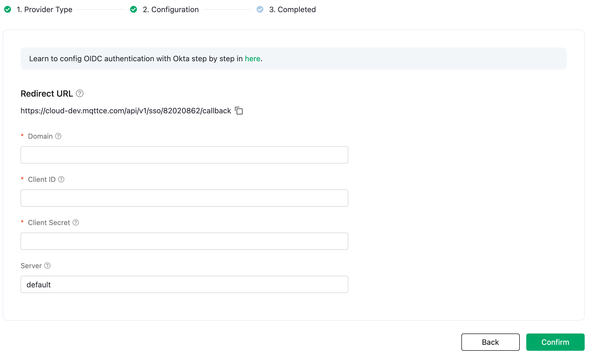
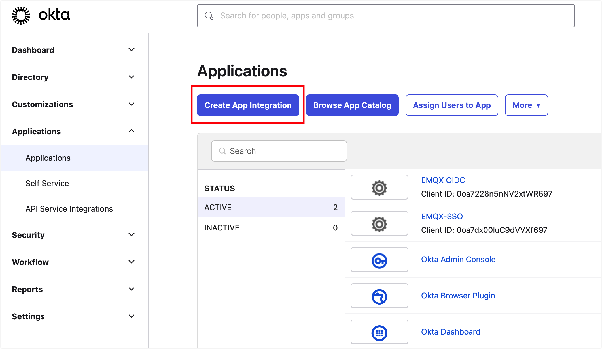
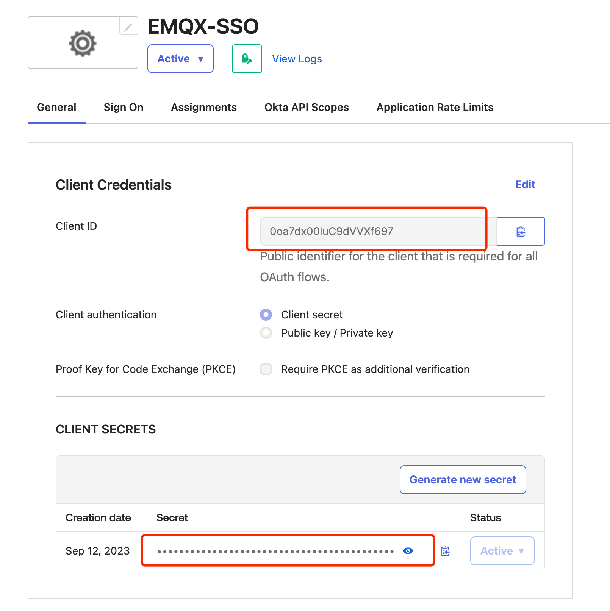
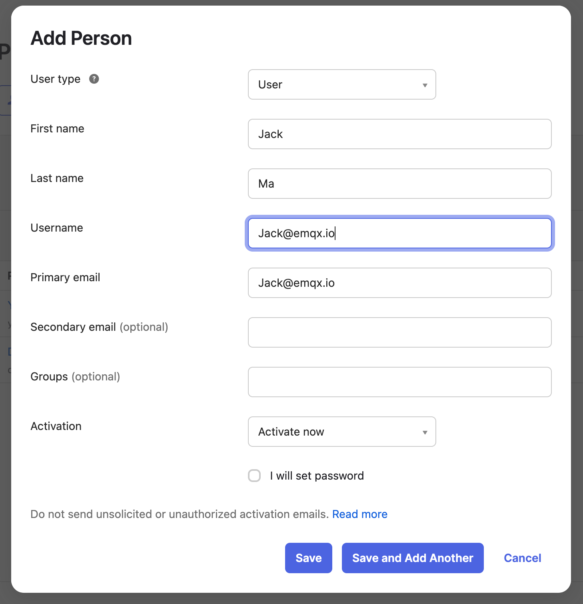

# Configure SSO with Okta Authorization

If you manage your enterprise accounts using Okta, you can choose Okta as the authorization server for EMQX Cloud and enable Single Sign-On (SSO). Additionally, you need to configure OpenID Connect (OIDC) settings in Okta. This page provides examples of OIDC configurations in both EMQX and Okta to help you understand the end-to-end configuration process for connecting an Enterprise Identity Provider (IdP) with EMQX Cloud to enable SSO.

## Prerequisites

- An EMQX Cloud Root account.
- An administrator account for Okta Workforce Identity.
- Be familiarity with Okta's enterprise account management. Refer to [Okta documentation](https://help.okta.com/oie/en-us/content/topics/identity-engine/oie-get-started.htm) for guidance.

## Step 1: Enable SSO in EMQX Cloud

1. Log in to Cloud Console using your EMQX Cloud Root account.

2. Click on the user icon in the upper right corner and select **SSO** from the dropdown menu.

3. Enter the SSO configuration flow and click **Enable SSO**.

4. Select `Okta` as the OIDC Identity Provider and click **Next**.

5. You can now view the **Redirect URL** on the page; this address will be used in the subsequent configuration.

   

## Step 2: Create an Application in Okta

1. Log in to [Okta Workforce Identity](https://www.okta.com/workforce-identity/) using your administrator account.

   ::: tip

   You may need to click the **Admin** button to access the administrator interface.

   :::

2. In the administrator interface, go to **Applications** -> **Applications** in the left menu.

3. Click **Create App Integration** on the main page.

   

4. In the pop-up, choose **OIDC - OpenID Connect** as the **Sign-in method**, and select **Web Application** as the **Application type**, then click **Next** to enter the configuration page.

5. In the **New Web App Integration** configuration page, fill in the following configuration information:

   - **App integration name**: Enter the app name, for example, `EMQX-SSO`.
   - **Sign-in redirect URIs**: Enter the redirect URL from step 1.
   - **Controlled access**: You can fill this in based on your requirements; in this example, select `Skip group assignment for now`.

6. After completing the configuration, click **Save** to access the General page of the created application.

## Step 3: Configure SSO Information in EMQX Cloud

Go to the **Configure SSO** page in EMQX Cloud and follow these steps:

1. On the **Configure SSO** page in EMQX Cloud, configure the following information:

   - **Domain**: Enter `trial-9021952.okta.com` as the Okta domain. The Domain field format is `{YourOktasubdomain}.okta.com`.
   - **Client ID**: Enter the Client ID obtained from the Okta application overview page.
   - **Client Secret**: Enter the Client Secret obtained from the Okta application overview page.
   - **Server**: If you don't have your own authentication server, it defaults to `default`. If you have your own authentication server, please enter `authorizationServerId`. For more Okta authentication settings, refer to the [relevant documentation](https://developer.okta.com/docs/concepts/auth-servers/).

   

2. Click **Confirm** to complete the configuration.

3. If configured successfully, you will reach a page confirming that SSO has been successfully enabled, and you will get the SSO login URL.

## Step 4: Add Users and Authorize the Application in Okta

1. In the Okta administrator interface, select **Directory** -> **People** from the left menu.

2. Click **Add Person** on the main page.

3. Fill in user information, such as [Jack@emqx.io](mailto:Jack@emqx.io). You can also authorize user groups.

4. Click **Save** to return to the People page.

   

5. Click the user's name to access their user information, then click **Assign Applications** to authorize the `EMQX-SSO` application created in step 2. Click **Assign** and provide additional user information as needed, then click **Save and Go Back**.

6. You can see that the application has been authorized (**Assigned**). Click **Done** to complete the application authorization for the user.

## Step 5: Create Subaccount in EMQX Cloud

1. Using your EMQX Cloud Root account, go to the user management page in the Cloud Console.

2. Click **+ New User** in the upper right corner.

3. In the account popup, enter the same email account that was authorized in Okta: [Jack@emqx.io](mailto:Jack@emqx.io). Assign a role to this account. Refer to [Role and Authentication](./role.md) for setting different roles.

   

4. Use the login URL for subaccounts from the user management page to log in. Click **Log in through an identity provider**, and the browser will redirect to the Okta login page.

   

5. Complete the login process on the Okta login page, and the browser will automatically return to EMQX Cloud to complete the SSO login.
