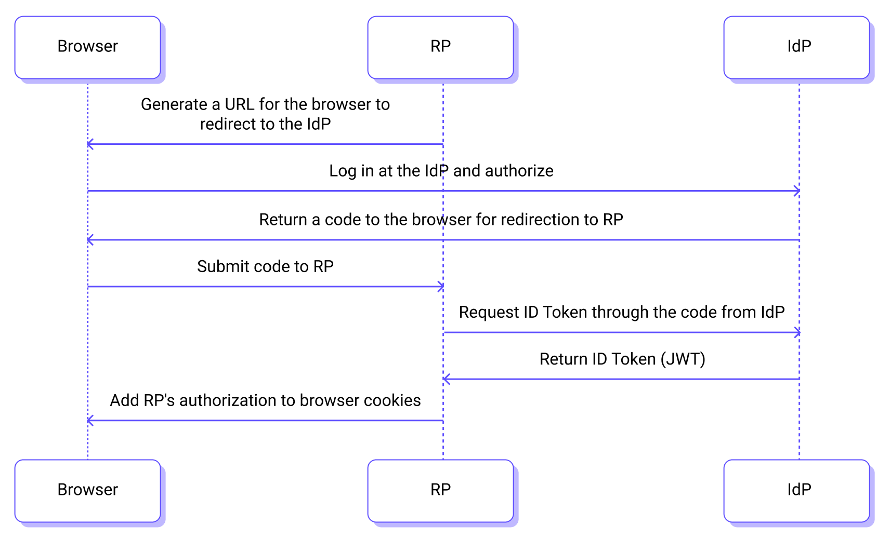

# Single Sign-On (SSO) Overview

Single Sign-On (SSO) is an authentication service that allows users to access multiple different applications or systems associated with the same authentication service using a single set of usernames and passwords. When SSO is enabled in EMQX Cloud, users can conveniently log in to the EMQX Cloud deployment console using their enterprise account credentials.

EMQX Cloud implements the SSO feature based on the [OpenID Connect (OIDC)](https://openid.net/developers/how-connect-works/) standard. When users perform a single sign-on with their enterprise account, EMQX Cloud, acting as the application server (also known as the "Relying Party," RP), can obtain the user's basic identity information from an authorized identity provider (the enterprise's own identity management server). Users can then log in to EMQX Cloud with a single click using their enterprise account.

## Key Concepts

Before using into the Single Sign-On feature, you need to understand several key concepts:

- **OpenID Provider (OP)** or **Identity Provider (IdP)**: The authorized identity provider or authorization server. Common enterprise IdPs include Okta and Azure Active Directory (AAD).
- **RP**: Relying Party, which is the application server or website that outsources its user authentication to the IdP (Identity Provider). EMQX Cloud, as the provider of single sign-on services, is also referred to as the Service Provider (SP).
- **ID Token**: After successful authentication, the identity provider returns an identity identifier known as the ID Token. It is a JWT-format string used to obtain the user's basic information.

## Authorization Flow

The basic workflow for users to log in to EMQX Cloud using SSO is illustrated in the following diagram: 

1. The user logs in to the application server, which is EMQX Cloud, using a web browser.
2. EMQX Cloud redirects to the IdP for authentication and authorization.
3. The IdP returns an (authorization) code to the browser and redirects it back to EMQX Cloud.
4. EMQX Cloud retrieves the ID Token using the code provided by the IdP and sends it to the IdP for verification.
5. The IdP returns the ID Token to EMQX Cloud.
6. EMQX Cloud grants authorization to the browser and completes the login process.

## Configuration Steps

Before you enable the SSO feature, OIDC configurations are required for both EMQX Cloud and the enterprise IdP to establish trust between the two. The general csteps are as follows:

1. Configure EMQX Cloud metadata information in the enterprise IdP.
2. Obtain the metadata information generated by the enterprise IdP and input the relevant details in EMQX Cloud to complete the SSO configuration.
3. Create users and grant authorization for the EMQX Cloud application in the enterprise IdP.
4. Create corresponding sub-accounts in EMQX Cloud.
5. Use the dedicated SSO login URL to complete the login process.

## Configuration Examples

The following pages provide configuration examples for enabling SSO iwith authorization from common enterprise IdPs (Okta and Azure AD):

- [Configure SSO with Okta Authorization](./sso_okta.md) 
- [Configure SSO with Azure AD Authorization](./sso_azure.md)
