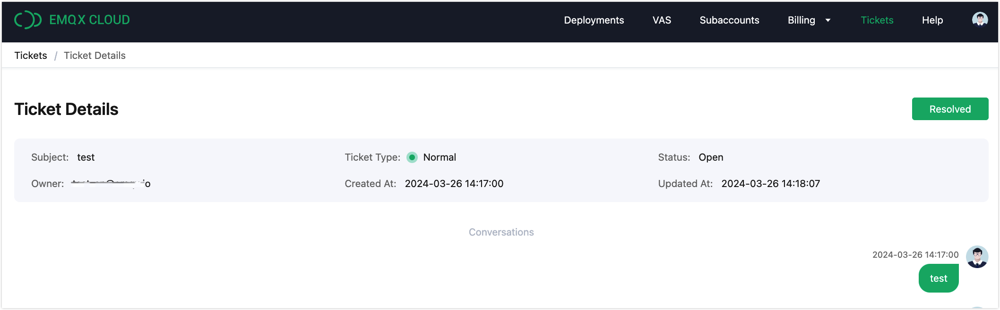

# Tickets

You can enter the ticket system by following the steps below:

1. Login into the [EMQX Platform console](https://cloud-intl.emqx.com/console/).
2. Click **Tickets** in the top right corner.

## View Ticket Details

You can click on the subject name in the ticket list to enter the corresponding ticket detail page.

## Create a Ticket

1. Click the **New** button in the top right corner.
2. Enter the following information in the pop-up dialog, items marked with an asterisk are required.
   - Enter the subject of the ticket.
   - Select between **Normal Ticket** or **Urgent Ticket** based on the urgency of the issue.
   - Select the associated deployment from the dropdown list as appropriate.
   - Describe the issue in the **Description**.
3. Click **Confirm** to submit the ticket.

