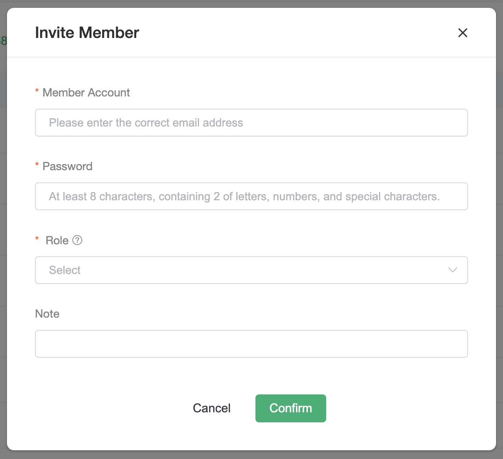
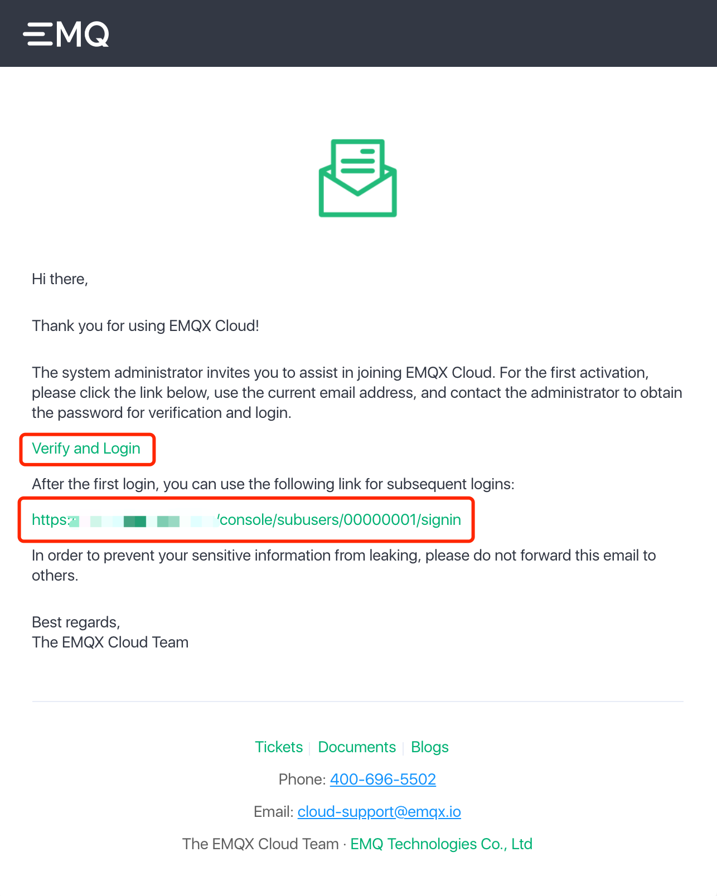
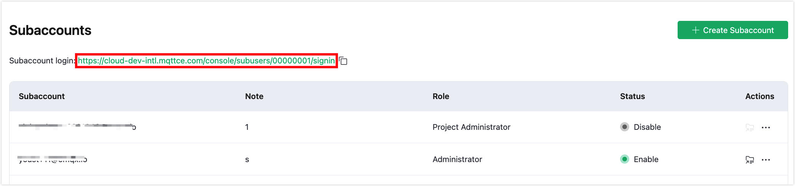
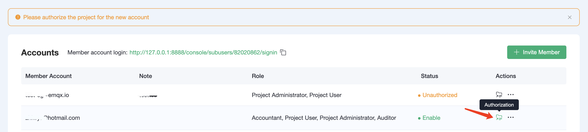
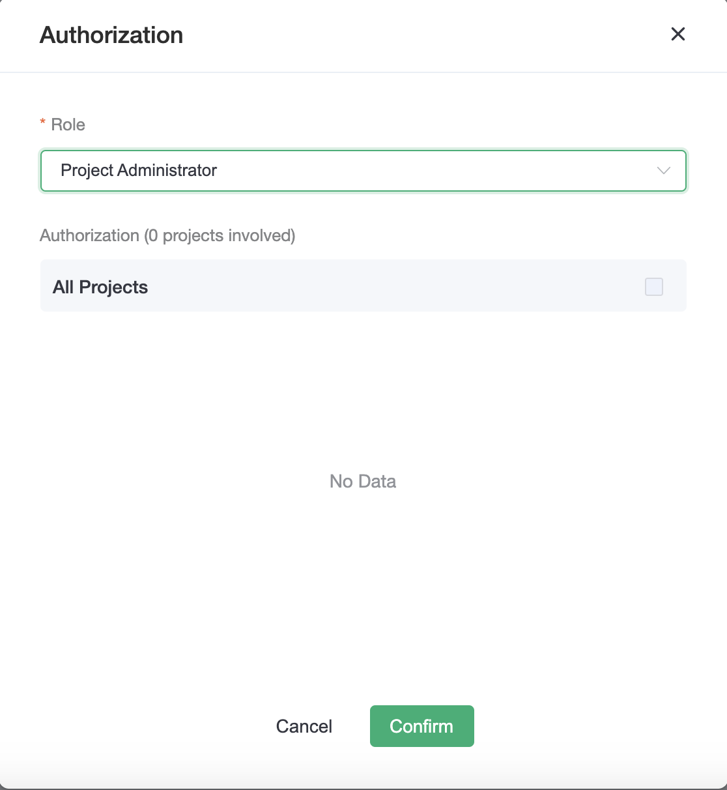
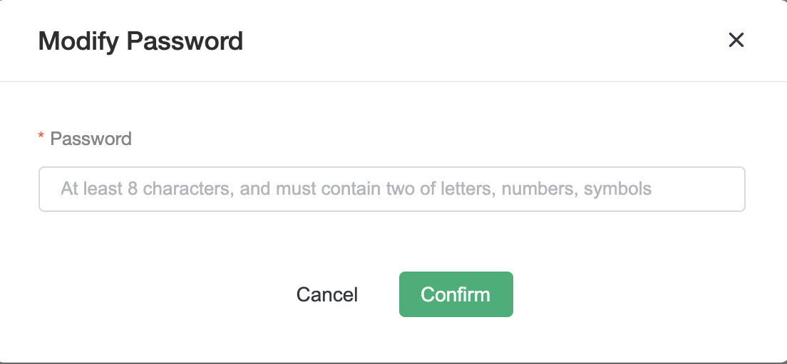
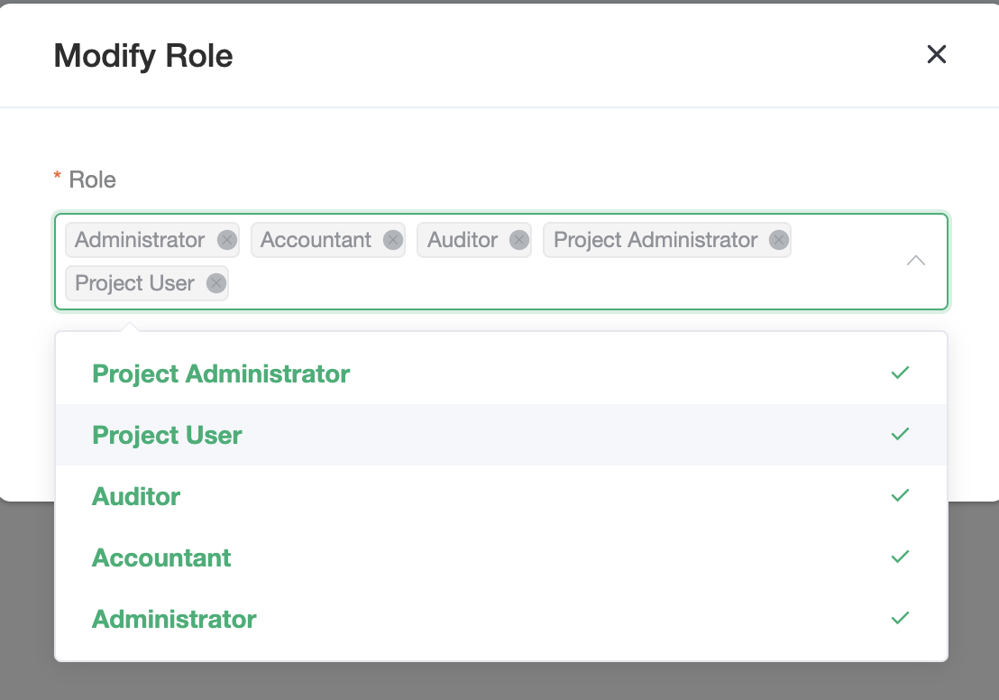

# Member Account Management

## Create a Member Account
1. Click on the `+ Invite Member` button in the `Accounts` page
	* Fill in the email address of the inviter
	* Fill in the password, which can be changed by the administrator later
	* Associate roles, you can select one or more roles
	* Remarks are optional

1. Login to the invitee email to receive the invitation email and use the link to verify and activate the account. Note that there are two addresses in the invitation email, one for the first activation and login, and the other is the usual login address for subsequent logins. The password for the member account should be issued by the administrator who activated the account (or get it from the administrator).

 > Link 1 in the picture is the link for first time activation of login, link 2 is the link for the subsequent login, please don't get confused.

3. After member login, you can manage the platform according to the permissions set by the system. If you need the permissions of a certain project, please contact the administrator.

## Accounts Management

The Accounts function is only open to members with two roles: the administrator has full operational privileges and the auditors can view the accounts list.

The member account login address is distinguished from the regular login page and is used exclusively for member account login. It can be sent when the login address is forgotten.

The account list shows the current member accounts information, and the status will be changed to enabled only if the member account has passed the email authentication. When a new user is created as project administrator or project user role, it will prompt to authorize the project for that user, otherwise the member account will not have any project and deployment permissions after logging in.

It is important to note that the project authorization function is disabled when the role of the account is changed to Accountant, Auditor, or Administrator. That's because the Administrator has all project permissions by default, and Accountant and Auditor have all project read-only permissions by default.

 > When an account has both project administrator and project user roles, remember to switch between roles for authorization

More Operating Options

**Change Password**：Currently, only the administrator can change passwords for member accounts.

**Change Role**：Modifying or reassigning roles for member accounts.

**Disable / Enable**：After deactivating a member account, the member account cannot log in until the account is re-enabled
> * When the role is deactivated
> * Roles cannot be associated with projects
> * Roles do not appear in the Project Center associated list
	

**Delete**：Deleted accounts cannot be recovered