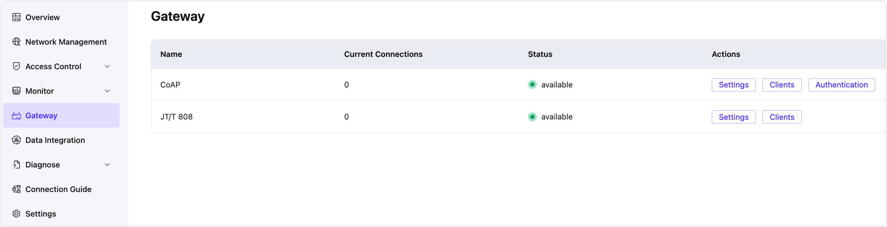

# Gateway

::: tip Note

Gateways are features available in the EMQX Dedicated and Premium editions.

:::

Gateways in the EMQX Platform are responsible for efficiently converting and integrating various protocols with MQTT. They provide flexible protocol adaptation capabilities for device connectivity to the EMQX platform, supporting seamless integration across multiple protocols to meet the demands of complex IoT scenarios. With gateways, users can enable seamless device data access, ensure data quality, and simplify the complexities of protocol conversion.

The currently supported protocols include:

- **CoAP Protocol**: A lightweight protocol for resource-constrained devices and networks, suitable for low-power and low-bandwidth scenarios.
- **JT/T 808 Protocol**: A Chinese national standard for vehicle networking, widely used for vehicle positioning and management, supporting vehicle status monitoring and data interaction.

Additional protocol support can be extended based on user requirements in the future.

## Enabling Gateway Services

Users must submit a [ticket](../feature/tickets.md) to request the activation of required gateway services. Currently, the platform supports **[CoAP](./coap.md)** and **[JT/T 808](./jt808.md)** gateway services. For other protocol gateway services, users can also contact us by submitting a ticket. Once the service is successfully activated, the **Gateway** menu will appear in the left-side menu of the deployment details page.

