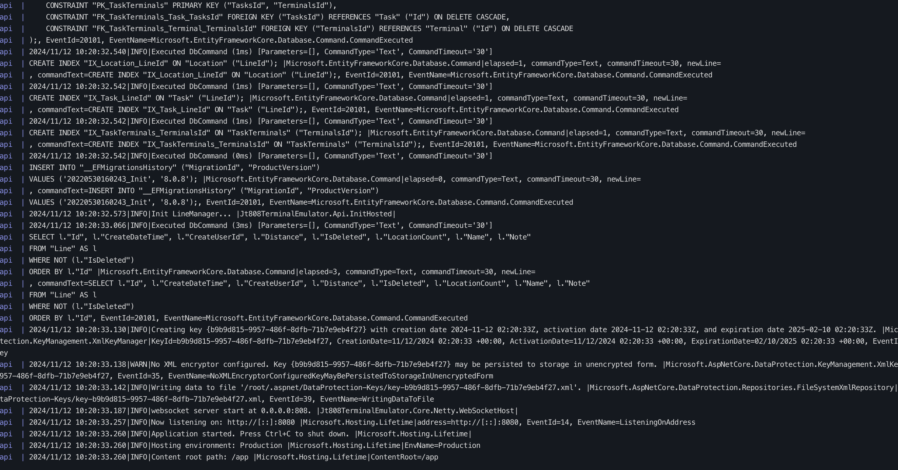
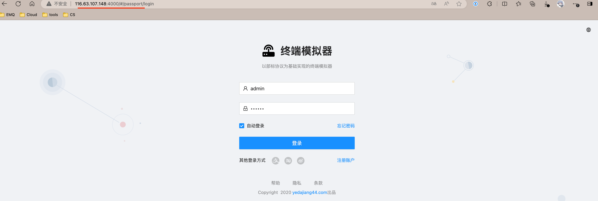
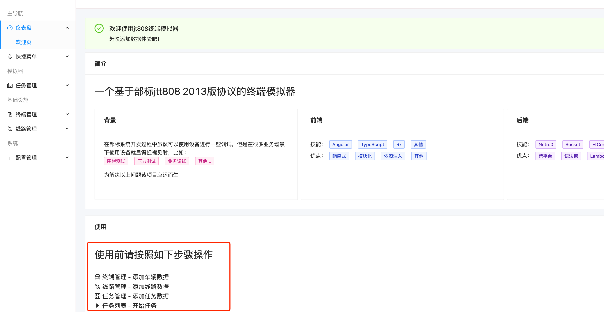
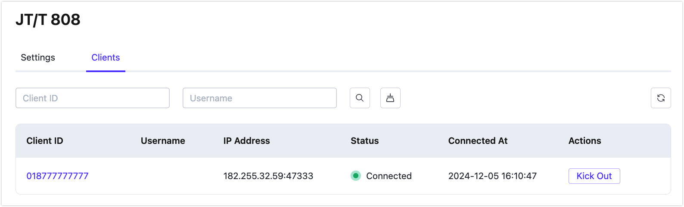

# JT/T 808 Gateway

The JT/T 808 Gateway is a protocol adaptation component designed by EMQX for the Internet of Vehicles (IoV) scenario. It supports vehicle positioning, status monitoring, data exchange, and other functions, widely used for communication between vehicle-mounted terminals and monitoring platforms.

## Basic Settings

Click the **Settings** button in the **Actions** column of the JT/T 808 Gateway to configure its basic settings:

- **MountPoint**: Set a string as the prefix for all topics during publishing or subscribing, providing a method to achieve message routing isolation between different protocols. For example: `jt808/${clientid}/`. This topic prefix is managed by the gateway, so clients do not need to explicitly add this prefix when publishing or subscribing.
- **Max Length of Frame**: The maximum size of frames that the gateway can handle. The default value is `8192`, allowing the gateway to accommodate various packet sizes.
- **Retry Interval**: The time interval between retries when message delivery fails. The default value is `8 seconds`.
- **Max Retry Times**: The maximum number of retry attempts the gateway will make when trying to send a message. After this value is exceeded, the message will be discarded if it cannot be sent. The default value is `3`.
- **Max Message Queue Length**: The maximum length of the message queue for downstream messages. The default value is `10`.
- **Idle Timeout**: The duration (in seconds) of client inactivity before it is considered disconnected. The default value is `30 seconds`.
- **Up Topic**: The MQTT topic pattern used for publishing messages from the gateway to the EMQX Platform. This defines how JT/T 808 client messages are mapped to MQTT topics for uplink communication. The default topic is: `jt808/${clientid}/${phone}/up`.
- **Down Topic**: The MQTT topic pattern used for sending messages from the EMQX Platform to the gateway and then to the JT/T 808 client. This defines how MQTT messages are routed to the JT/T 808 client for downlink communication. The default topic is: `jt808/${clientid}/${phone}/dn`.
- **Allow Anonymous**: This setting determines whether the gateway allows clients to connect without authentication. If set to `true`, clients can connect without providing authentication credentials.

## Clients

In the **Clients** tab of the JT/T 808 page, you can view the basic information of clients connected to the deployment. In the **Actions** column, you can choose to kick a client off.

### Test Connection Using Client Tool

You can use a simulated JT/T 808 protocol gateway client to test the connection by following these steps.

1. Access the JT/T 808 terminal simulator repository: [yedajiang44/GpsTerminalEmulator](https://gitee.com/yedajiang44/GpsTerminalEmulator/tree/master). Follow the instructions in the README file to install and run it using Docker.

   ```bash
   ## Install Docker Compose
   sudo curl -L "https://github.com/docker/compose/releases/download/$(curl -s https://api.github.com/repos/docker/compose/releases/latest | grep tag_name | cut -d '"' -f 4)/docker-compose-$(uname -s)-$(uname -m)" -o /usr/local/bin/docker-compose
   sudo chmod +x /usr/local/bin/docker-compose
   
   ## Create directory
   mkdir jt808terminalemulator
   cd jt808terminalemulator
   mkdir data
   
   ## Copy and paste the following into docker-compose.yml
   nano docker-compose.yml
   
   ## Start the service
   sudo docker-compose up -d
   
   ## Check the service status. After startup, use the following command to check the service status:
   sudo docker-compose ps
   
   ## Check logs if any issues arise
   sudo docker-compose logs -f
   ```

   If the following content is returned, the service is running successfully:

   

2. Access the terminal emulator management page via `server-ip:4000`.

   

3. Follow the provided steps to add vehicle data and route data.

   

   When adding task data, fill in the deployment connection address for the server and use port `8090`. Refer to the connection address displayed on the deployment overview page. Click **保存** to start the task by default.

   

After completing these steps, you can see the connected client in the JT/T 808 gateway's client list.

 You can click on the client ID in the client list to view more detailed information about the client. Clicking the **Kick Out** button will disconnect the client.

## Configure Access Authentication/Authorization

For detailed configuration, refer to [Access Authentication/Authorization](https://docs.emqx.com/zh/emqx/latest/gateway/jt808.html#配置接入认证-鉴权). Users should complete the authentication configuration according to the requirements of the IoV terminal.

## Data Exchange Format

Refer to the EMQX documentation for [JT/T 808 2013 Data Exchange Format](https://docs.emqx.com/en/emqx/latest/gateway/jt808_data_exchange.html).
