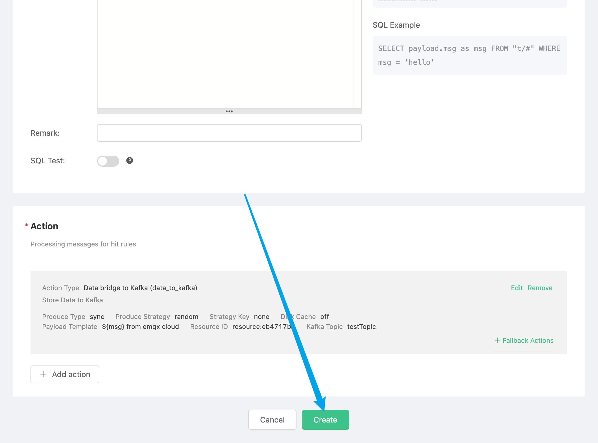

---
title: Use EMQ X Cloud rule engine to connect to Kafka
---

# Use EMQ X Cloud rule engine to connect to Kafka

[Kafka](https://kafka.apache.org/) is an open source stream processing platform developed by the Apache Software Foundation. The goal of this project is to provide a unified, high-throughput and low-latency platform for processing real-time data. It is a "large-scale publish/subscribe message queue based on a distributed transaction log architecture", which makes it an enterprise-level infrastructure for processing valuable streaming data.

Through the EMQ X Cloud rule engine, you can bridge data to Kafka services, and you can also set message templates to produce specific messages in Kafka services.

This guide will complete the creation of a Kafka rule engine to achieve the following functions:

* When a message "hello" is sent to the greet topic, the rule engine will be triggered to produce a message of "hello from emqx cloud"  on the Kafka server.


In order to achieve this function, we will complete the following 4 tasks:

1. Set up Kafka service
2. Set the filter conditions of the rule engine
3. Create a resource and an action
4. Complete the rule engine creation and test

::: tip Tip
Before using the rule engine, create a deployment first.
For dedicated deployment users: Please complete [Peering Connection](../../deployments/vpc_peering.md) first, and ensure that the following resources involved are established in the VPC under the peering connection. The IP mentioned below refer to the intranet IP of the resource
For free trial and shared deployment users: There is no need to complete peering connection, and the IP mentioned below refers to the public IP of the resource
:::

### 1. Set up Kafka service

Firstly, create a new server in the VPC where the peering connection is completed. Then,create a Kafka service, open port 9092, and create a topic named `testTopic`.

```sh
# Install zookeeper
docker run -d --restart=always \
    --name zookeeper -p 2181:2181 zookeeper
# Install Kafka，and open 9092 port
docker run -d  --restart=always --name mykafka \
    -p 9092:9092 \
    -e HOST_IP=localhost \
    -e KAFKA_ADVERTISED_PORT=9092 \
    -e KAFKA_ADVERTISED_HOST_NAME=<Server IP> \
    -e KAFKA_BROKER_ID=1 \
    -e KAFKA_LOG_RETENTION_HOURS=12 \
    -e KAFKA_LOG_FLUSH_INTERVAL_MESSAGES=100000 \
    -e KAFKA_ZOOKEEPER_CONNECT=<Server IP>:2181 \
    -e ZK=<Server IP> \
    wurstmeister/kafka
    
# Enter Kafka instance and create testTopic topic
$ docker exec -it mykafka /bin/bash
$ kafka-topics.sh --zookeeper <Server IP>:2181 --replication-factor 1 --partitions 1 --topic testTopic --create
```

### 2. Set the filter criteria of the rule engine

Go to [EMQ X Cloud Console](https://cloud.emqx.io/console/), and click to enter the deployment to bridge to Kafka.

On the deployment page, select the rule engine and click Create.


Our goal is to trigger the engine when the topic of greet receives msg as hello. Certain SQL processing is required here:

* Target the greet topic, that is,'greet/#'
* Match the msg in the payload, and execute the rule engine when it is a string of 'hello'

According to the above principles, the SQL we finally get should be as follows:

```sql
SELECT
  payload.msg as msg
FROM
  "greet/#"
```

You can click SQL test under the SQL input box to fill in the data:

* topic: greet
* payload:
```json
{
  "msg":"hello"
}
```

Click Test to view the obtained data results. If the settings are correct, the test output box should get the complete JSON data as follows:
```json
{
  "msg":"hello"
}
```

::: tip Tip
If test fails, please check whether the SQL is compliant, and whether the topic in the test is consistent with the SQL filled in.
:::

### 3. Create resources and actions

Click Add Action. On the Select Action page, select Bridge Data to Kafka, click Next, and on the Configure Action page, click Create Resource.


On the Create Resource page, select Kafka as the resource type, and fill in the server's IP and corresponding port `<ip>:<port>` in the Kafka server box. Here, the port number we use is 9092. Click Test and  it indicates that the test is successful if "Resources Available" returns.


::: tip Tip
If the test fails, please check whether the [VPC peering connection](../../deployments/vpc_peering.md) is completed and whether the IP address is correct. 
:::

Click OK to return to the configuration action page, fill in the testTopic topic just created in Kafka topic, fill in "hello from emqx cloud" in the message content template, select the default resource ID, and click OK.


The created action will be displayed in the response action column. After confirming that the information is correct, click Confirm in the lower right corner to complete the configuration of the rule engine.



### 4. Test

>If you are using EMQ X Cloud for the first time, you can go to [Deployment Connection Guide](../../connect_to_deployments/README.md) to view the MQTT client connection and test guide

We try to send the following data to the topic of greet/a

```json
{
  "msg":"hello"
}
```
On the rule engine page, click Monitor and you can see that the number of successes becomes 1.


In the Kafka instance, you can see the messages forwarded by EMQ X Cloud.

```sh
# Enter the kafka instance and view the testTopic topic
$ docker exec -it mykafka /bin/bas
$ kafka-console-consumer.sh --bootstrap-server 127.0.0.1:9092  --topic testTopic --from-beginning
```


