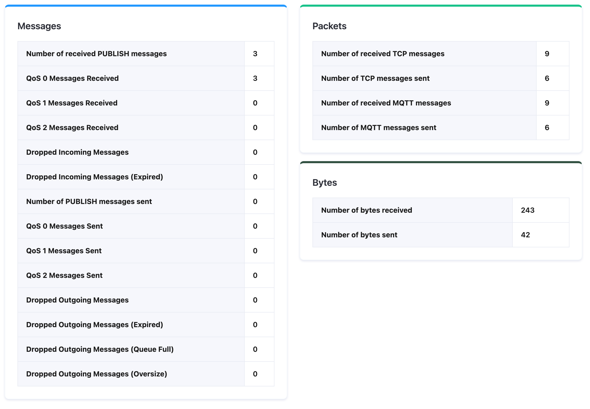
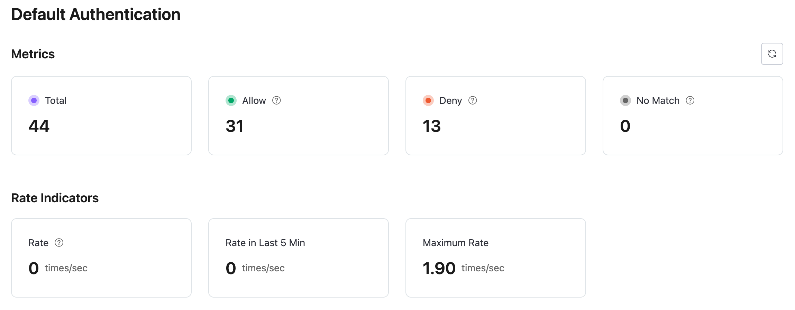
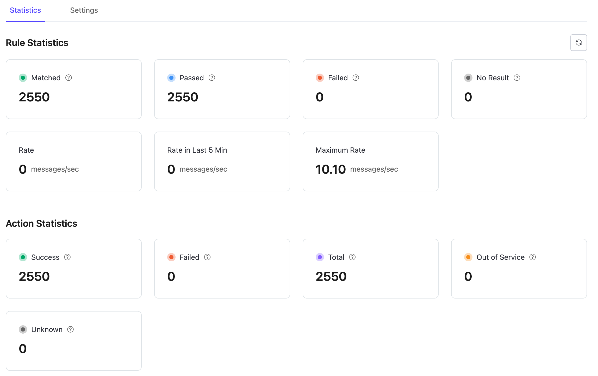
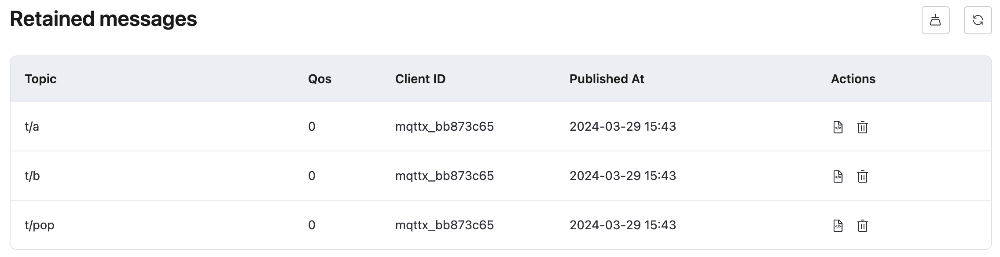
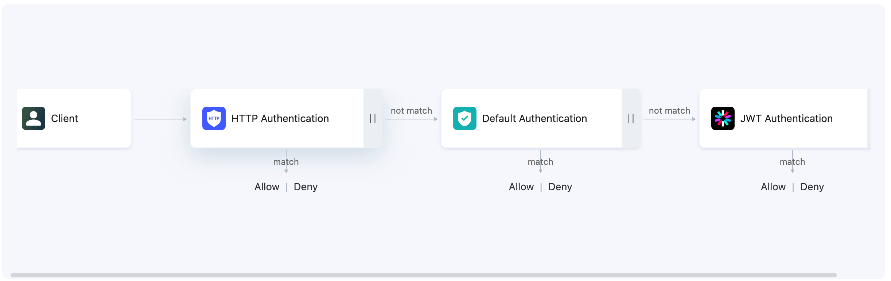

# What's New

## EMQX Platform Premium Plan Released

We are excited to announce the release of the **EMQX Platform Premium Plan**, a comprehensive solution designed to meet the demands of complex enterprise applications.

### Key Features of the Premium Plan

Building on the strengths of our Dedicated Plan, the Premium Plan offers an array of advanced features that provide enhanced performance, security, and reliability.

#### Dedicated Storage Layer

The Premium Plan introduces a **dedicated storage layer** for each deployment, specifically designed to support advanced features like durable sessions and event history. By isolating storage for each deployment, this feature significantly enhances data security, ensuring that your data is managed with the highest levels of efficiency and protection.

Deployed within the same Virtual Private Cloud (VPC) as your EMQX deployment, the dedicated storage layer leverages multiple Availability Zones to provide high availability and best performance. This setup not only boosts reliability but also enhances data protection and performance consistency.

#### Durable Sessions

**Durable Sessions** provides enhanced storage capacity for persistent client sessions. It allows your applications to maintain continuity, reducing disruptions and ensuring that client session data is retained even after the server restarts. This feature improves the user experience through reliable session management.

#### Event History

With **Event History**, the Premium Plan captures and stores client events, providing the foundation for detailed monitoring and in-depth analysis. This feature empowers users with valuable insights into client interactions and overall system performance.

### Future Enhancements

We are committed to continuously improving the Premium Plan with additional enterprise-grade features. Stay tuned for upcoming updates.

### Upgrade to the Premium Plan

The EMQX Platform Premium Plan is designed to meet the demands of complex enterprise applications with its robust new features. Contact our [Sales](https://www.emqx.com/en/contact?product=cloud&productEdition=Premium) team now to upgrade and start leveraging these powerful new features to enhance your business operations.

## New Features in Dedicated v5

EMQX Dedicated, renowned for hosting MQTT clusters in an exclusive cloud environment, remains a cornerstone among EMQX's suite of products. It’s our pleasure to announce an upgrade to the latest version of EMQX Dedicated, introducing a wide array of new features and capabilities designed to support mission-critical IoT applications across various industries.

### Enhanced Metrics and Observability
The upgraded monitoring system provides a comprehensive and sophisticated display of metrics, offering deeper insights into client connections, authentication, authorization, and data integration metrics.

#### Client Metrics
The Dedicated v5 console organizes a wide array of metrics under categories such as Messages, Packets, and Bytes for each client connected to the service. This detailed segmentation facilitates an in-depth analysis of client activities, presenting all relevant metrics in an intuitive chart format below.

#### Authentication / Authorization Metrics
With EMQX Dedicated v5, we introduce detailed metrics that shed light on authentication and authorization processes, helping identify potential issues early on. The incorporation of new APIs for authentication enhances the management of authentication processes seamlessly and effectively, making them more seamless and effective.

#### Data Integration Metrics
Previously, v4 offered limited metrics, providing little information for troubleshooting. V5 significantly expands the range of metrics related to rules and actions, broadening the scope of observable aspects and ensuring a comprehensive understanding of data processing activities.

### Usability Enhancements

The usability upgrades in EMQX Dedicated v5 include an advanced system for managing retained messages with detailed insights and easy deletion and a user-friendly interface for sorting authentication/authorization data sources for clear execution order visualization.

#### Retained Messages Management

V5 introduces an advanced retained message management system in the console, a significant step up from v4, which only displays the number of retained messages. This new system allows for detailed views of message topics, QoS, publish times, and payloads, offering options to delete individual messages or clear all retained messages simultaneously. This method offers a distinct improvement over the previous practice of sending empty messages to topics for removal.

#### Authentication / Authorization Data Source Sorting
V5 enables the configuration and sorting of extended authentication/authorization data sources, including the default ones. Users can now easily adjust the execution order of the authentication chain through a simple drag-and-drop interface, providing a clear and intuitive visualization of the authentication logic.

### Advanced Features

This section delves into some high-level capabilities in v5 Dedicated.

#### MQTT over QUIC
Leveraging QUIC, the transport protocol underpinning the next-generation Internet protocol HTTP/3, v5 offers enhanced connectivity for the modern mobile Internet. This technology reduces connection overhead and message latency when compared to traditional TCP/TLS protocols., positioning EMQX Dedicated as a pioneer in utilizing this cutting-edge technology for MQTT communication.

#### Certificate Revocation List (CRL)
CRL is a list maintained by Certificate Authorities (CA), detailing revoked certificates with their serial numbers and revocation dates. With this feature, EMQX Dedicated checks during the SSL/TLS handshake phase if a client’s certificate has been revoked, ensuring secure connections.

#### Online Certificate Status Protocol (OCSP) Stapling
This method offers another layer of certificate revocation checking. After enabling OCSP Stapling, EMQX Dedicated queries the OCSP server for certificate statuses and caches the results. During an SSL handshake, EMQX presents the OCSP data along with the certificate chain to the client for verification.

Elevate your IoT solutions with the power of EMQX Dedicated v5 and unlock the full potential of your IoT data management.

