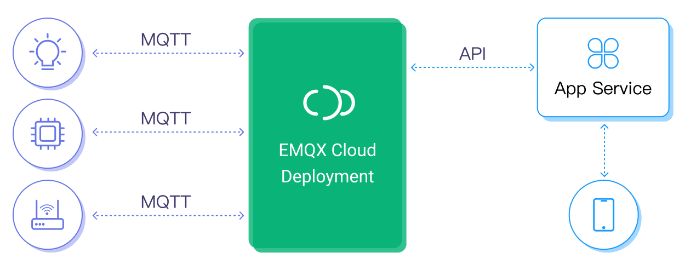
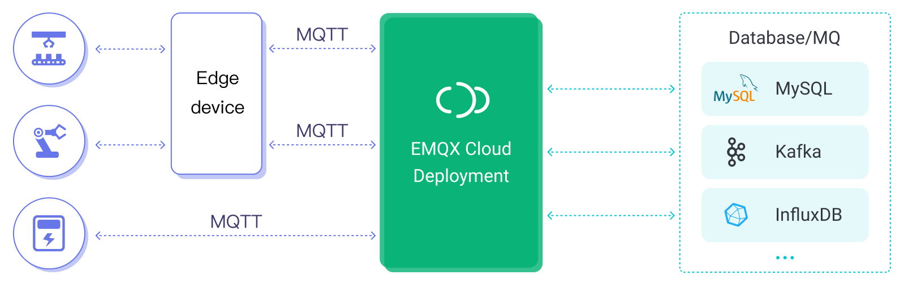
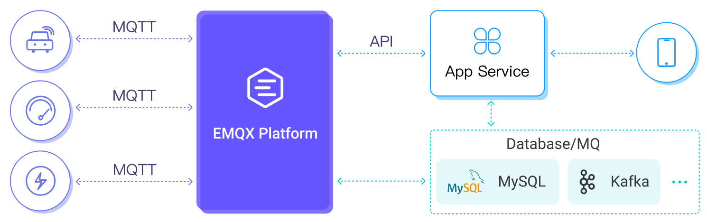
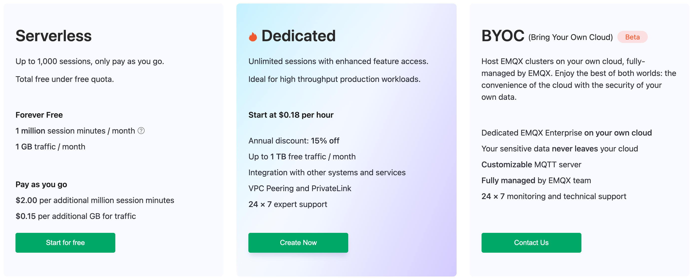

# Product Overview

EMQX Platform is an IoT messaging middleware product that helps you easily collect, transmit, computer, and persist IoT data. As the world's first fully managed MQTT 5.0 cloud messaging service, EMQX Platform provides a one-stop O&M collocation and a unique isolated environment for MQTT messaging services. In the era of the Internet of Everything, EMQX Platform can help you quickly build industry applications for the IoT domain quickly and securely.

## Key Features

With the infrastructure provided by cloud providers, EMQX Platform serves dozens of countries and regions around the world, providing low-cost, secure, and reliable cloud services for 5G and Internet of Everything applications.

EMQX Platform provides various solutions tailored to different business needs, and there are three primary models available:

### Two-Way Communication

EMQX Platform supports massive devices and application-side connectivity, providing secure and reliable two-way communication for applications and IoT devices:

#### Use Cases

This model is suitable for IoT applications with instant communication requirements, such as the smart home scenario, where the cell phone app gets the status information of smart devices. Users can send control commands to smart devices through app. 

### Data Collection

EMQX Platform supports device data on the cloud. With the support of massive topics and data integration, data collection, filtering, transformation, calculation, and persistence can be achieved with low code.

#### Use Case

The model described is an excellent fit for IoT applications where reliable data collection and persistence are essential. For example in Smart Industry scenarios, IoT sensors generate real-time data, which is collected by the edge gateway and sent to EMQX Platform. EMQX Platform will then filter, transform, and perform basic calculations on the data with our data integration capability before storing the data in a database or forwarding it to other services.  EMQX Platform offers flexible access solutions for different network conditions, industries, and edge devices, supporting over 70 industrial protocols to provide efficient data management and reliable analysis.

### Hybrid Model

EMQX Platform provides MQTT services to support hybrid applications with two-way communication and data collection models. Through capabilities such as shared subscriptions and data integrations, data is persisted while flowing from object to object and from object to application.

#### Use Case

The model described can be used in Connected Cars, where the data collected by the vehicle's sensors is transmitted to the cloud. The cloud then processes this data using a computation model and provides instant feedback to the vehicle. An intelligent app can also send commands to the vehicle. Additionally, a copy of the data can be persistently in a database for other Connected Car applications.

## Product Advantages

When choosing EMQX Platform as your messaging middleware for building IoT applications, you can enjoy the following benefits:

### Comprehensive Protocol Support

EMQX Platform provides developers with extensive protocol support, enabling them to easily create various IoT applications with MQTT v3.1, v3.1.1, and v5.0 protocols, as well as MQTT over WebSocket. It offers complete support for MQTT message levels of QoS0, QoS1, and QoS2. Additionally, EMQX Platform supports multiple communication protocols such as MQTT-SN, CoAP, and private TCP protocols, making it suitable for various industrial applications. Customizable private features are also available, allowing you to tailor the platform to meet the unique demands of your business.

### Fast Deployment, Fully Managed

EMQX Platform allows you to easily create a fully managed MQTT cloud service within minutes. By registering and logging in and selecting your preferred deployment area, you can instantly access your service without the hassle of traditional operational setups. Our global service support team and EMQ experts will provide 24/7 uninterrupted technical support and operation services throughout the entire use cycle of EMQX Platform. You can contact us anytime via tickets, emails, or phone calls for a quick response.

### Flexible Billing and Scalability for Effective Cost Control

EMQX Platform offers flexible billing methods to provide effective cost control. For businesses with low throughput and concurrency, a pay-as-you-go Serverless deployment is available, which only charges for actual resource usage. As your business scales, a proprietary deployment option is available, which charges according to cluster instance and message traffic, ensuring clear and controllable costs. Additionally, deployment capacity can be automatically estimated by connection and message throughput, and scalable plans can be made through close monitoring to smoothly adjust the cluster size with business growth.

### High Availability and Data Security

EMQX Platform's Dedicated Plan and BYOC Plan utilizes a high-redundancy cluster architecture to ensure high service availability. It also provides a unique isolation environment that guarantees the security of your data and the stability of your business. Each deployment cluster has its own public IP address, dedicated VPC network, independent EMQX servers, and database servers, making it highly secure and reliable.

### Flexible Data Integration Solutions

EMQX Platform's Dedicated Plan and BYOC Plan enables real-time pre-processing of device events and message data, which can be stored in over 40 cloud services and enterprise systems such as MySQL, Kafka, and InfluxDB, all hosted on the cloud.

## Product Plans

EMQX Platform offers three different product plans, allowing you to deploy your fully managed MQTT service on popular public clouds worldwide. Whether you're an independent developer or a global industry leader, you can find the perfect EMQX Platform product to suit your needs.

For detailed feature descriptions and pricing of each product plan, see [Product Plans](./price/plans.md).

