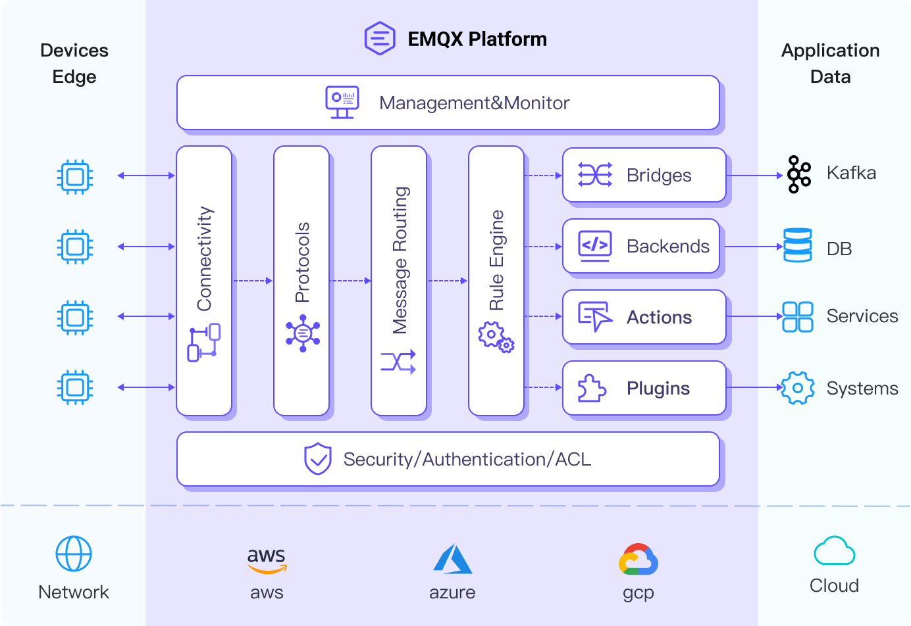
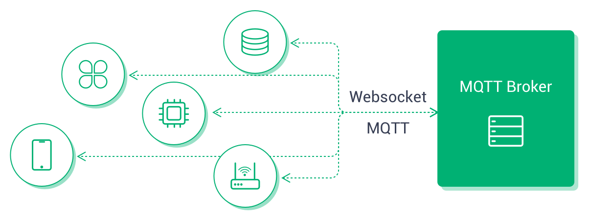
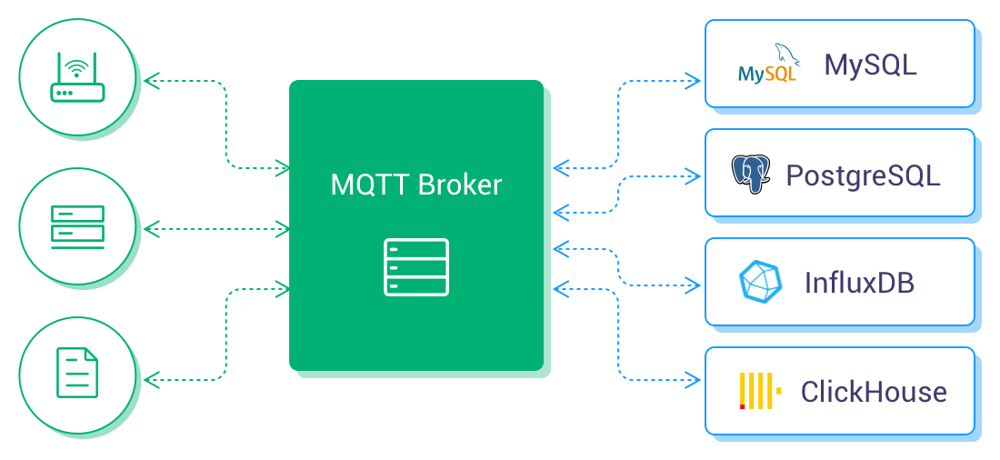
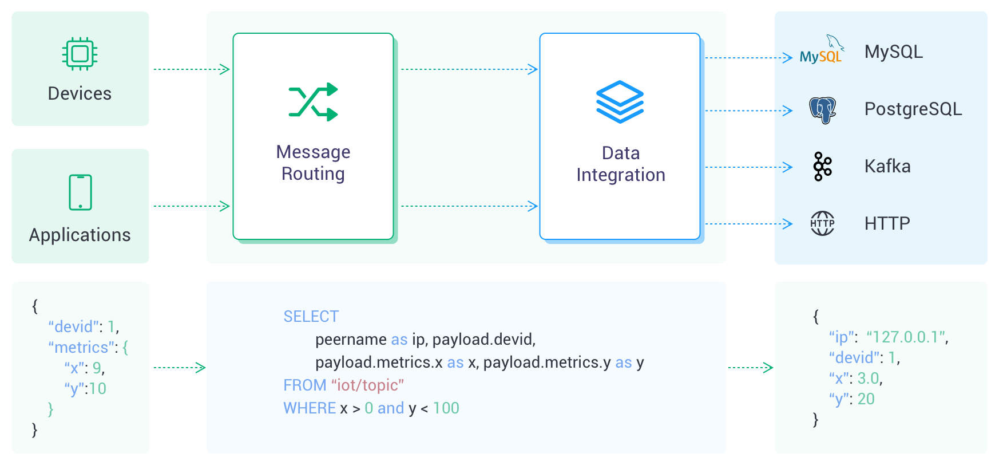

# EMQX Cloud Product Description

EMQX Cloud is an MQTT messaging middleware product for the IoT domain from EMQ. As the world's first fully managed MQTT 5.0 cloud messaging service, EMQX Cloud provides a one-stop O&M colocation and a unique isolated environment for MQTT messaging services. In the era of the Internet of Everything, EMQX Cloud can help you quickly build industry applications for the IoT domain and easily collect, transmit, compute, and persist IoT data.

With the infrastructure provided by cloud providers, EMQX Cloud serves dozens of countries and regions around the world, providing low-cost, secure, and reliable cloud services for 5G and Internet of Everything applications.

## IoT Messaging Model

### *Two-way communication*

EMQX Cloud supports massive devices and application-side connectivity, providing secure and reliable two-way communication for applications and IoT devices:

In this model, EMQX Cloud provides MQTT services to connect massive devices and applications. It supports application-device and device-device two-way communication. This model is suitable for IoT applications with instant communication requirements, such as the smart home scenario, where the cell phone app gets the status information of smart devices. Users can send control commands to smart devices through app. Another example, in industrial scenarios, AGV robots communicate with each other instantly via the MQTT protocol to achieve multi-robot collaboration. The MQTT service supports not only the standard MQTT protocol, but also MQTT over WebSocket, CoAP, MQTT-SN, LwM2M, JT, /T808, etc.

### *Data Collection*

EMQX Cloud supports device data on the cloud. With the support of massive topics and data integration, data collection, filtering, transformation, calculation, and persistence can be achieved with low code.

In this model, the MQTT service provided by EMQX Cloud enables data collection, computation, and persistence. This model is suitable for IoT applications with data collection and persistence requirements, such as: in industrial scenarios, each IoT sensor collects real-time data to the edge gateway, uploads the data to the MQTT server through the edge gateway, and then the Data Integrations triggers data filtering, transformation, and simple calculation, and forwards the final result to other services or persists to the target database. EMQX Cloud provides a variety of access solutions for different functionalities of the network, industrial, and edge devices, and supports more than 70 industrial protocols.

### *Hybrid Model*

EMQX Cloud provides MQTT services to support hybrid applications with two-way communication and data collection models. Through capabilities such as shared subscriptions and data integrations, data is persisted while flowing from object to object and from object to application.

In this model, the MQTT service provided by EMQX Cloud not only bridges the device-device and device-application gaps, but also persists the required data so that non-real-time applications can subsequently make use of the acquired data. Typical of these applications are artificial intelligence applications where the data acquired by the terminal needs to be sent to the cloud, where the computational model running in the cloud is calculated and fed back to the terminal, such as item or face recognition applications. At the same time, a copy of the data needs to be persisted in the database for subsequent offline training and improvement of the AI computational model.

## Product Plans

EMQX Cloud comes in three plans, each with multiple specifications, and we support the deployment of your own fully managed MQTT service on the world's leading public clouds.

TODO PIC

1. **Serverless**: Shared cluster MQTT Service, up to 1,000 sessions, only pay as you go.
2. **Dedicated**: Independent cluster MQTT Service. 
  a. **Standard**: An independent MQTT service for applications with standard throughput. 
  b. **Professional**: A dedicated MQTT cluster for building mission-critical IoT applications. Supporting advanced features like data persistence, bridging, VPC peering, etc. Your best way to get a production-ready MQTT service.
3. **BYOC**: Bring Your Own Cloud. Run EMQX Cluster in your own cloud, managed by EMQX. Keep your data safe and secure in your own data center.For enterprise-reliable cloud environment. Coming soon.

## Product Capabilities

EMQX Cloud, a fully managed EMQX access platform service, provides device access, device management, and other capabilities.

### Device Access

Supports a massive number of device connections to the cloud, providing stable and reliable device-device and device-application two-way communication capabilities.

- Supports standard MQTT protocol (including MQTT over WebSocket), using the standard MQTT client library to connect to the cloud.
- Supports CoAP, MQTT-SN, LwM2M protocol, and private TCP protocol access to meet the needs of various systems access to the cloud.
- Provides different network devices and industrial/edge devices to access the cloud.
- Open source multi-lingual/platform access sample code, providing cross-platform migration guidance.
- Perfectly fits EMQ [edge computing](https://github.com/lf-edge/ekuiper), [edge industrial IoT](https://www.emqx.com/en/products/neuron) product ecology, supports dozens of industrial protocols to access the cloud.

:::tip
Multi-protocol and private protocol support, please contact us by [ticket](feature/tickets.md) for opening.
:::

### Device Management

EMQX Cloud Dedicated plans provide rich REST APIs that allow users to integrate with their device management systems and IoT platforms through APIs and Data Integrations. 

- **Device authentication information management**: The platform could add, delete, search, and update authentication information via REST API

- **Device online status view**:

  - The platform gets the list of online devices through REST API and queries whether the devices are online.
  - The platform rewrites the status of devices in the private database or sends it to the self-built service (Web service) when the devices are online or offline through the Data Integrations
  - Device offline alarm: Notify the platform when the device is offline and determine whether it needs to be alarmed

- **Device up/down history**:

  - The platform writes the up/down information to the private database or sends it to the self-built service (Web service) when the device is online or offline through the data integrations.
  - ACL Permission Management: The platform adds, deletes, checks, and changes ACL permissions through REST API.

- **Online device kick-off**: The platform kicks off the online device.

- **Proxy subscription**: The platform subscribes or unsubscribes topics for online devices through the REST API.

- **Publishing messages to devices**: The platform publishes messages to specified topics through REST API or MQTT access and supports batch operation.

- **Business statistics such as messages sent and received and number of connections**: Get the relevant statistics through REST API.

**Professional only**

- **Bridging/storage of device messages**: Store device events (up/down, subscribe/unsubscribe, message publishing) and message data to private databases (mainstream relational/non-relational, various temporal databases), message queues Kafka, and self-built web services via data integrations.

### Data Integrations

EMQX Cloud use data integrations to configure rules for processing and responding to devise messages and events.

Data integrations not only provides a clear and flexible "configuration-based" business integration solution, but also simplifies the business development process, improves user ease of use, and reduces the coupling between business systems and EMQX.

::: tip Tip
Only **Dedicated** deployment has data integration. See [Data Integration](./rule_engine/introduction.md) to find more details.
:::
