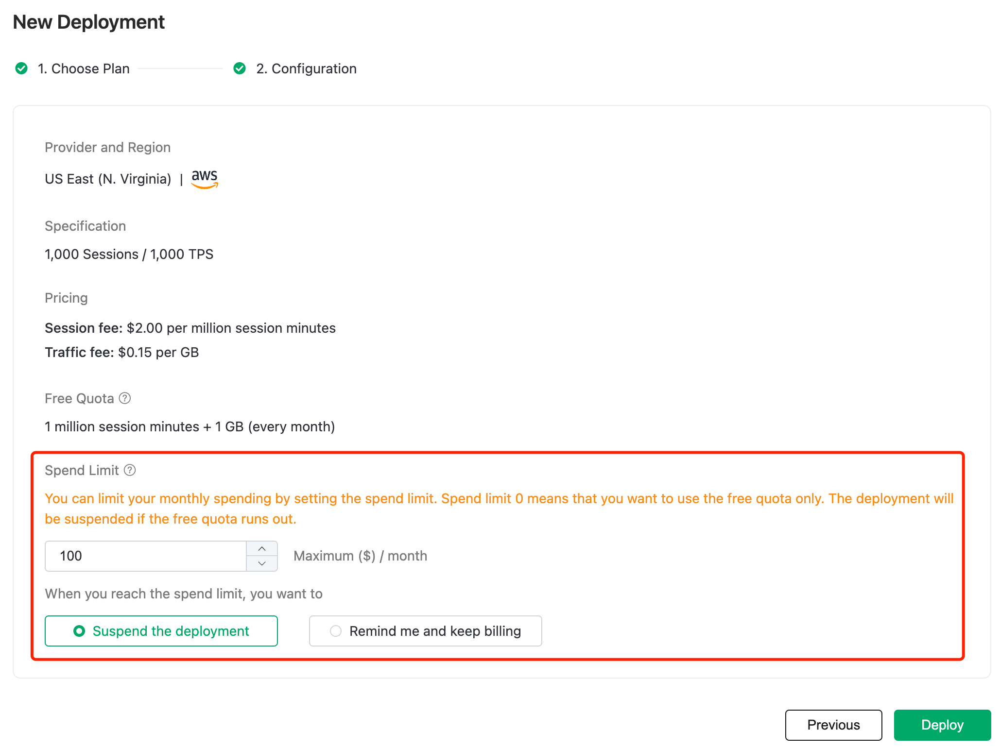

# Billing

## Serverless

### Billing items

EMQX Cloud Serverless is billed as per the usage of the deployment, which are the **session minutes** of the clients and **traffic** generated by the message. You will be granted with a free quota at the beginning of each month and only have to pay after the free quota runs out. 

### Billing method

The bill is calculated based on the fees accumulated in the previous 24 hours, with collections taking place at 0:00 daily. You can go to the [Billings](../billing/overview.md) page in EMQX cloud console to find the details.

::: tip Tip

Assume in a 24-hour billing period,  a user has 120 sessions for 10 hours, 20 sessions for 10 hours, and 0 sessions for 4 hours, the total session minutes are: 120 * 60 * 10 + 20 * 60 * 10 + 0 = 84,000, and the session fee is 0 if this falls within the free quota. If the free quota has run out, the session fee will be 84,000 / 1,000,000 * 2 = 0.168, rounded up to $ 0.17.
The traffic is calculated in the same way as the session.
:::

### Spend limit
After the launch of EMQX Cloud Serverless, **Spend Limit** will be added. Spend limit can control the monthly consumption of Serverless deployment within the set value or give reminders when it is reached. Spend limit can be set when creating deployments and can be modified afterwards.

- When the spend limit is set to 0, Serverless deployment will **only consume the free quota**, which is 1 million session minutes and 1 GB traffic per month.
- You can set the spend limit to an integer between 1 and 10,000, and you can choose the action triggered when the consumption reaches the spend limit for the current month. You can choose to stop the deployment or to receive a reminder and continue billing. If you choose the latter, we will send a reminder via email, and the deployment will continue to run and be billed.
- When you set the spend limit greater than 0, you will need to provide a payment method if there is none currently.
- Notice: If there is an overdue bill, Serverless deployment will still be stopped even if the spend limit has not been reached.

::: warning
If you have already created a Serverless (Beta) deployment, it will be automatically updated on April 1, 2023, and the maximum number of sessions will be scaled to 1000. At the same time, the spend limit will be set to 0 by default. This means that no additional charges will be incurred for the Serverless deployment until you make any changes to the spend limit by yourself.
:::

## Dedicated

EMQX Cloud Dedicated Edition is charged based on product version, instance specifications, and network traffic for message transmission. There is no limit on the number of messages, API calls, or data integrations used. You can choose the appropriate product and specifications based on your business needs, ensuring that costs remain clear and controllable even as your business expands.

The billing plan consists of two parts:

| Item         | Description                                                  |
| ----------- | ----------------------------------------------------------- |
| Base Fee    | The base cost of the instance is calculated based on the hourly unit price corresponding to the product plan and instance specifications (maximum connections, message TPS) selected at the time of deployment. In practice, this part of the cost is only related to the length of time, and will not change due to changes in usage (number of connections, message TPS).
| Traffic Fee | Each instance specification includes a certain amount of free traffic. The free traffic is valid for the month and will be automatically emptied at the end of the month if there is any remaining traffic. When the device traffic exceeds the amount of free traffic, the excess will be charged. |

When you create a deployment, the deployment will estimate the usage cost based on your selected instance specifications. You can check the estimated price on the confirmation page before you deploy.

::: tip Note
When you create a deployment, EMQX Cloud will estimate the usage cost based on your instance specification selection, and you can see the estimated price on the confirmation page before the deployment.
:::

## Billing Period

EMQX Cloud deployments are charged hourly and on the 1st of each month, your credit card will be charged for the previous month's deployment usage. You can go to the [Billing Page](<https://cloud-intl.emqx.com/console/billing/overview>) of the console to see the detailed information.

## Overdue Bills

When the balance is insufficient, EMQX Cloud will send a balance shortage reminder email to the registered email address. You can continue to work with your deployment after you pay the bill. Note: EMQX will stop and delete the deployment instance (after confirming ) after the bill is overdue. To avoid an impact on business, please pay attention to the billing information.
