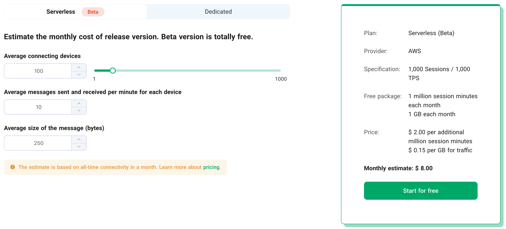
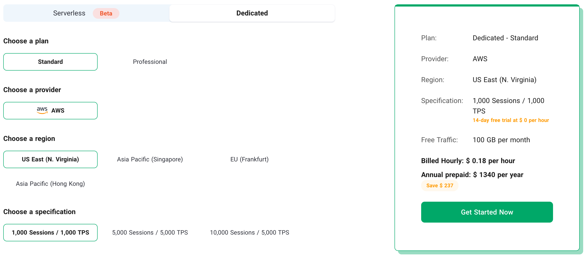
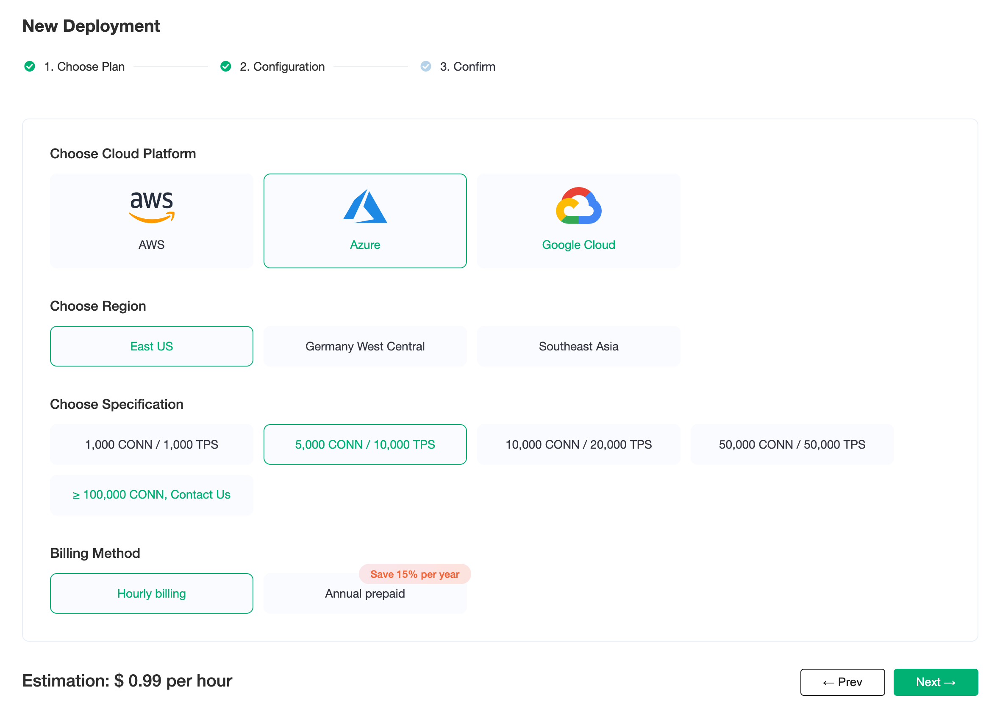

# Price Estimation

EMQX Cloud pricing calculator allows you to estimate the cost of deployments based on actual business requirements. EMQX Cloud pricing calculator is useful for customers who have never used EMQX Cloud before and who want to scale the specifications.

## Visit EMQX Cloud pricing details

You can check the EMQX Cloud [pricing page](https://www.emqx.com/en/cloud/pricing) to check the available plans.

We offer a Serverless price calculator so you can estimate your approximate monthly spending based on your business.

You can check the price of Dedicated plans by selecting the specification.

After logging in, you can reconfirm the pricing information after clicking [Create Deployment](https://cloud-intl.emqx.com/console/deployments/0?oper=new) and selecting the plan. 

## Serverless price equation
Session fee = sessions * connection span (measured per minute or part thereof) / 1,000,000 * 2  
Traffic fee = Inbound and outbound traffic（byte）/ 1024 / 1024 / 1024 * 0.15

::: warning
There may be a difference between the estimation and the actual price. Please refer to the bill for the actual invoice numbers. 
:::

## Get an hourly price for deployment

EMQX also offers an hourly pricing mode. On EMQX Cloud console, select the cloud provider, region, and specifications to get the hourly price of deployment.

  

> Standard Plan: Choose Azure Platform, US East (N. Virginia) area, the maximum number of connections is 1000, the message upstream and downstream TPS is 1000, the hourly price is 0.99, and the monthly cost is: 0.99 * 730 = 722.7

## Supported cloud service providers and regions

EMQX Cloud now supports cloud service providers including AWS Cloud, Azure and GCP. If you need other cloud service providers or regions, you can submit [tickets](../feature/tickets.md) or email(cloud-support@emqx.io) to contact us.

| Provider | Region                                                       |
| -------- | ------------------------------------------------------------ |
| AWS      | us-east-1 (US East, N. Virginia), us-west-2 (US West, Oregon), eu-west-1 (EU, Ireland), ap-southeast-1 (Asia Pacific, Singapore), ap-south-1 (Asia Pacific, Mumbai), Asia Pacific (Hong Kong), us-west-1 (US West, N. California), Asia Pacific (Tokyo) |
| Azure    | East US, Germany West Central, Southeast Asia |
| GCP      | us-east1 (South Carolina), us-west1 (Oregon), europe-west3 (Frankfurt), europe-north1 (Finland), asia-south1 (Mumbai), asia-southeast1 (Singapore), asia-east1 (Taiwan) |