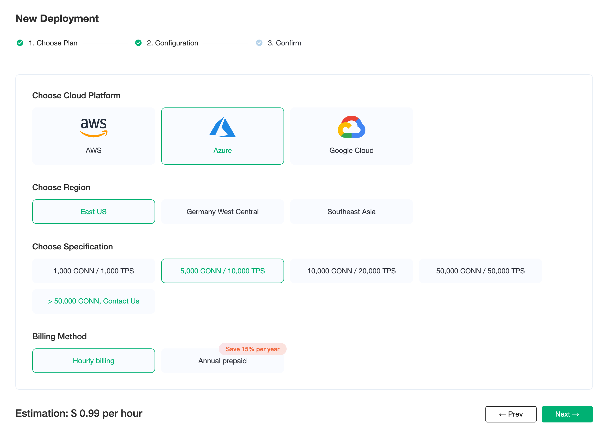

# Price Estimation

EMQX Cloud pricing calculator allows you to estimate the cost of creating deployments on the EMQX Cloud based on actual business requirements. EMQX Cloud pricing calculator is useful for customers who have never used EMQX Cloud before and who want to reorganize or extend the EMQX Cloud deployment specifications.

## Visit EMQX Cloud Pricing Details

- For users who are **unregistered** with EMQX Cloud, you can go to [Pricing](https://cloud-intl.emqx.com/pricing) page to check the available plans.

  

- For users who are **registered** to EMQX Cloud, you can go to [Price Estimate](https://cloud-intl.emqx.com/console/deployments/0?oper=new) to select plan, use price estimation and create a deployment.

  

## Get the Hourly Price for Deployment

You can select cloud platform, region, and specifications to get the hourly price of deployment.

> Standard Plan: Choose Azure Platform, US East (N. Virginia) area, the maximum number of connections is 1000, the message upstream and downstream TPS is 1000, the hourly price is 0.99, and the monthly cost is: 0.99 * 730 = 722.7
  
  

## Supported Cloud Service Providers and Regions

EMQX Cloud now supports cloud service providers including AWS Cloud, Azure and GCP. If you need other cloud service providers or regions, you can submit [tickets](../feature/tickets.md) or email(cloud@emqx.io) to contact us.

| Platform | Region                                                       |
| -------- | ------------------------------------------------------------ |
| AWS      | us-east-1 (US East, N. Virginia), us-west-2 (US West, Oregon), eu-west-1 (EU, Ireland), ap-southeast-1 (Asia Pacific, Singapore), ap-south-1 (Asia Pacific, Mumbai) |
| Azure    | East US, Germany West Central, Southeast Asia |
| GCP      | us-east1 (South Carolina), us-west1 (Oregon), europe-west3 (Frankfurt), europe-north1 (Finland), asia-south1 (Mumbai), asia-southeast1 (Singapore) |