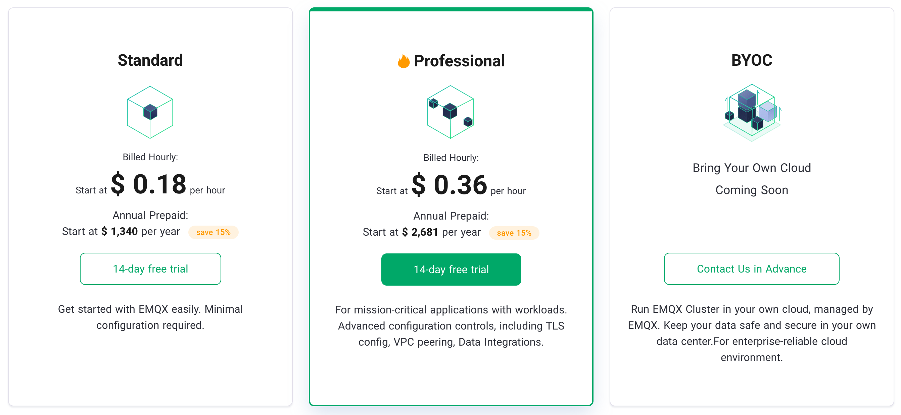

# Product Pricing

We offer a variety of flexible product specifications to support the deployment of fully managed MQTT services exclusively for you on the world's leading public clouds.

## Product Plans

EMQX Cloud is available in three plans: Standard, Professional, and Premium.

- Standard: Get started with EMQX easily. Minimal configuration required. The Standard plan offers a 14-day free trial.
- Professional: For mission-critical applications with workloads. Advanced configuration controls, including TLS config, VPC peering, Data Integrations. The Professional plan is available for a 14-day free trial.
- Premium: For building enterprise-grade IoT platforms. Supports industrial protocols, edge computing, and data persistence. Deployments can be customized to your needs.

## Price Details

<table>
   <tr>
      <th>Plan</th>
      <th>Specification</th>
      <th>Base Fee</th>
      <th>Free Traffic</th>
      <th>Overage Unit Price</th>
   </tr>
   <tr>
      <td rowspan="3">Standard</td>
      <td>1,000 connections / Up to 1,000 TPS</td>
      <td>from $ 0.18/hr</td>
      <td rowspan="3">100G/month</td>
      <td rowspan="9">$ 0.15/GB</td>
   </tr>
   <tr>
      <td>5,000 connections / Up to 5,000 TPS</td>
      <td>from $ 0.5/hr</td>
   </tr>
   <tr>
      <td>1,0000 connections / Up to 5,000 TPS</td>
      <td>from $ 0.88/hr </td>
   </tr>
   <tr>
      <td rowspan="4">Professional</td>
      <td>5,000 connections / Up to 10,000 TPS</td>
      <td>from $ 0.99/hr </td>
      <td rowspan="2">100G/month</td>
   </tr>
   <tr>
      <td>10,000 connections / Up to 20,000 TPS</td>
      <td>from $ 1.49/hr</td>
   </tr>
   <tr>
      <td>50,000 connections / Up to 50,000 TPS</td>
      <td>from $ 3.99/hr</td>
      <td rowspan="2">1T/month</td>
   </tr>
   <tr>
      <td>100,000 connections / Up to 100,000 TPS</td>
      <td>from $ 7.19/hr</td>
   </tr>
   <tr>
      <td>>100,000 connections</td>
      <td>from $ 7.19/hr</td>
      <td colspan="2" align="center">Contact sales</td>
   </tr>
   <tr>
      <td>Premium</td>
      <td>Unlimited</td>
      <td colspan="3" align="center">Contact sales</td>
   </tr>
</table>

::: danger
Note: Prices may vary depending on the public cloud platform selected and the deployment region. The actual price is based on the price displayed on the deployment page.
:::

## Feature Details

<table>
  <tr>
      <th></th>
      <th>Standard</th>
      <th>Professional</th>
      <th>Premium</th>
    </tr>
   <tr>
      <td>Fully MQTT support</td>
      <td></td>
      <td></td>
      <td></td>
   </tr>
   <tr>
      <td style="text-indent: 2em;">support MQTT v3.1, v3.1.1, v5.0 protocol version</td>
      <td>&#10003</td>
      <td>&#10003</td>
      <td>&#10003</td>
   </tr>
   <tr>
      <td style="text-indent: 2em;">support MQTT over WebSocket</td>
      <td>&#10003</td>
      <td>&#10003</td>
      <td>&#10003</td>
   </tr>
   <tr>
      <td>MQTT QoS level</td>
      <td>QoS 0, 1, 2</td>
      <td>QoS 0, 1, 2</td>
      <td>QoS 0, 1, 2</td>
   </tr>
   <tr>
      <td>Enterprise SSL Certificate</td>
      <td>&#10007</td>
      <td>&#10003</td>
      <td>&#10003</td>
   </tr>
   <tr>
      <td>MQTT username and password authentication certification</td>
      <td>&#10003</td>
      <td>&#10003</td>
      <td>&#10003</td>
   </tr>
   <tr>
      <td>Client and topic level ACL settings</td>
      <td>&#10003</td>
      <td>&#10003</td>
      <td>&#10003</td>
   </tr>
   <tr>
      <td>Message distribution</td>
      <td></td>
      <td></td>
      <td></td>
   </tr>
   <tr>
      <td style="text-indent: 2em;">Message republish</td>
      <td>&#10003</td>
      <td>&#10003</td>
      <td>&#10003</td>
   </tr>
   <tr>
      <td style="text-indent: 2em;">Message bridging</td>
      <td>&#10003</td>
      <td>&#10003</td>
      <td>&#10003</td>
   </tr>
   <tr>
      <td style="text-indent: 2em;">Webhook</td>
      <td>&#10003</td>
      <td>&#10003</td>
      <td>&#10003</td>
   </tr>
   <tr>
      <td style="text-indent: 2em;">Kafka</td>
      <td>&#10007</td>
      <td>&#10003</td>
      <td>&#10003</td>
   </tr>
   <tr>
      <td style="text-indent: 2em;">RabbitMQ</td>
      <td>&#10007</td>
      <td>&#10003</td>
      <td>&#10003</td>
   </tr>
   <tr>
      <td style="text-indent: 2em;">RocketMQ</td>
      <td>&#10007</td>
      <td>&#10003</td>
      <td>&#10003</td>
   </tr>
   <tr>
      <td style="text-indent: 2em;">Pulsar</td>
      <td>&#10007</td>
      <td>&#10003</td>
      <td>&#10003</td>
   </tr>
   <tr>
      <td>Data persistence</td>
      <td></td>
      <td></td>
      <td></td>
   </tr>
   <tr>
      <td style="text-indent: 2em;">MySQL</td>
      <td>&#10007</td>
      <td>&#10003</td>
      <td>&#10003</td>
   </tr>
   <tr>
      <td style="text-indent: 2em;">PostgreSQL</td>
      <td>&#10007</td>
      <td>&#10003</td>
      <td>&#10003</td>
   </tr>
   <tr>
      <td style="text-indent: 2em;">MongoDB</td>
      <td>&#10007</td>
      <td>&#10003</td>
      <td>&#10003</td>
   </tr>
   <tr>
      <td style="text-indent: 2em;">Redis</td>
      <td>&#10007</td>
      <td>&#10003</td>
      <td>&#10003</td>
   </tr>
   <tr>
      <td style="text-indent: 2em;">Cassandra</td>
      <td>&#10007</td>
      <td>&#10003</td>
      <td>&#10003</td>
   </tr>
   <tr>
      <td style="text-indent: 2em;">DynamoDB</td>
      <td>&#10007</td>
      <td>&#10003</td>
      <td>&#10003</td>
   </tr>
   <tr>
      <td style="text-indent: 2em;">ClickHouse</td>
      <td>&#10007</td>
      <td>&#10003</td>
      <td>&#10003</td>
   </tr>
   <tr>
      <td style="text-indent: 2em;">OpenTSDB</td>
      <td>&#10007</td>
      <td>&#10003</td>
      <td>&#10003</td>
   </tr>
   <tr>
      <td style="text-indent: 2em;">InfluxDB</td>
      <td>&#10007</td>
      <td>&#10003</td>
      <td>&#10003</td>
   </tr>
   <tr>
      <td style="text-indent: 2em;">TimescaleDB</td>
      <td>&#10007</td>
      <td>&#10003</td>
      <td>&#10003</td>
   </tr>
   <tr>
      <td style="text-indent: 2em;">Oracle DB</td>
      <td>&#10007</td>
      <td>&#10003</td>
      <td>&#10003</td>
   </tr>
   <tr>
      <td style="text-indent: 2em;">SQL Server</td>
      <td>&#10007</td>
      <td>&#10003</td>
      <td>&#10003</td>
   </tr>
   <tr>
      <td style="text-indent: 2em;">DolphinDB</td>
      <td>&#10007</td>
      <td>&#10003</td>
      <td>&#10003</td>
   </tr>
   <tr>
      <td style="text-indent: 2em;">TDengine</td>
      <td>&#10007</td>
      <td>&#10003</td>
      <td>&#10003</td>
   </tr>
   <tr>
      <td>Architecture Design Consulting</td>
      <td>&#10007</td>
      <td>&#10003</td>
      <td>&#10003</td>
   </tr>
   <tr>
      <td>Project Integration Consulting</td>
      <td>&#10007</td>
      <td>&#10003</td>
      <td>&#10003</td>
   </tr>
   <tr>
      <td>Device management</td>
      <td>&#10007</td>
      <td>&#10007</td>
      <td>&#10003</td>
   </tr>
   <tr>
      <td>Device shadowing</td>
      <td>&#10007</td>
      <td>&#10007</td>
      <td>&#10003</td>
   </tr>
   <tr>
      <td>Edge device management</td>
      <td>&#10007</td>
      <td>&#10007</td>
      <td>&#10003</td>
   </tr>
   <tr>
      <td>Cluster</td>
      <td>&#10007</td>
      <td>Single region cluster</td>
      <td>Multi-region clusters</td>
   </tr>
   <tr>
      <td>Maximum number of connections</td>
      <td>10,000</td>
      <td>100,000</td>
      <td>Unlimited</td>
   </tr>
   <tr>
      <td>Support bare metal servers</td>
      <td>&#10007</td>
      <td>&#10007</td>
      <td>&#10003</td>
   </tr>
   <tr>
      <td>VPC Peering Connections</td>
      <td>&#10007</td>
      <td>&#10003</td>
      <td>&#10003</td>
   </tr>
   <tr>
      <td>SLA</td>
      <td>99%</td>
      <td>99.99%</td>
      <td>99.99%</td>
   </tr>
   <tr>
      <td>Client support</td>
      <td>8/5</td>
      <td>24/7</td>
      <td>24/7</td>
   </tr>
</table>