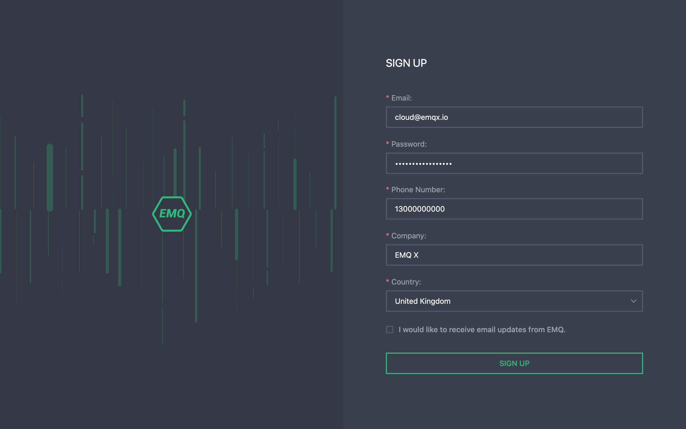
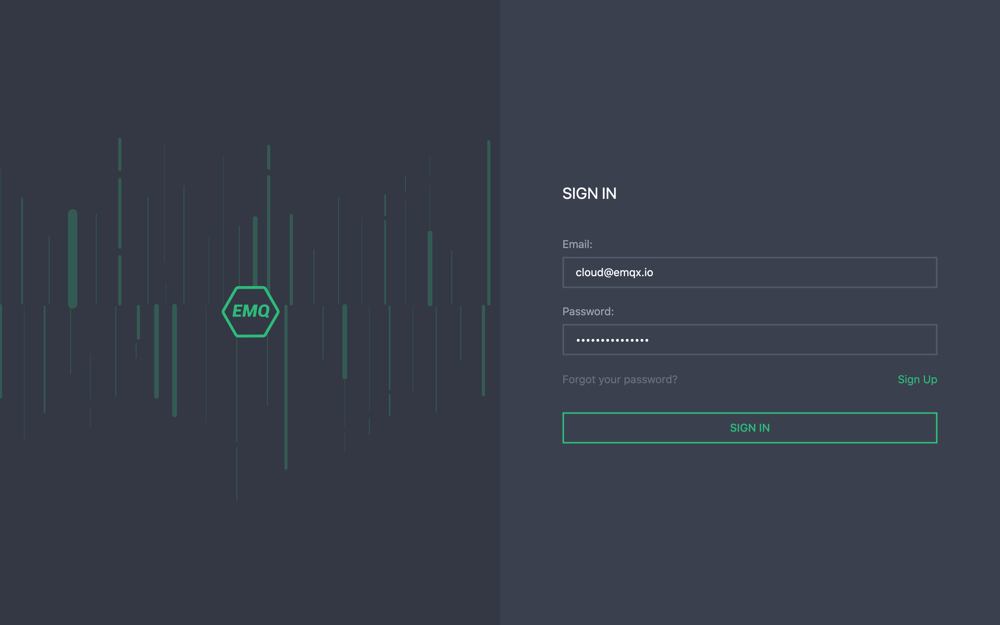
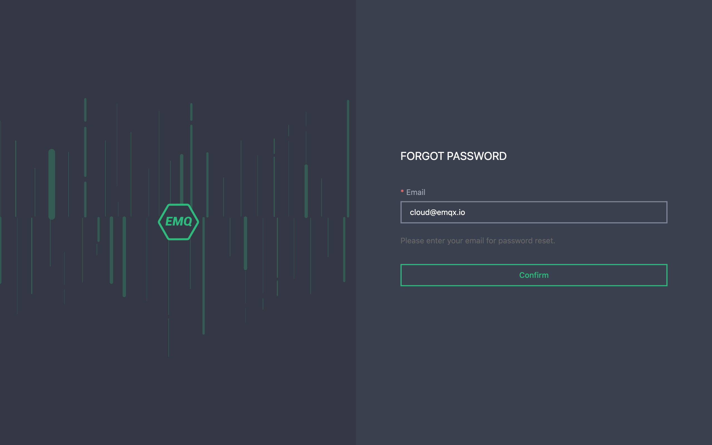

# Create an EMQ X Cloud accoun

You can create an EMQ X Cloud account using your email address

## [Register an account](https://accounts.emqx.io/cn/signup?continue=https://cloud.emqx.io/)

1. Enter your personal information: email, password, mobile phone number, company name, country
2. Click register, EMQ X Cloud will automatically send a confirmation email to the email address you provided
3. To verify your new account, click on the link in the confirmation email. The link will verify your account and return to the login page
4. Log in to EMQ X Cloud

## [login to the account](https://accounts.emqx.io/cn/signin?continue=https://cloud.emqx.io/)

Enter your email and password, and then choose to log in and you will be redirected to the EMQ X Cloud page

## [Get back password](https://accounts.emqx.io/cn/forgot_password?continue=https://cloud.emqx.io/)

If you forget your password, we will send a verification email to your mailbox. You can click Get back Password in the verification email to create a new password. You will return to the login page, enter a new password, and select login

