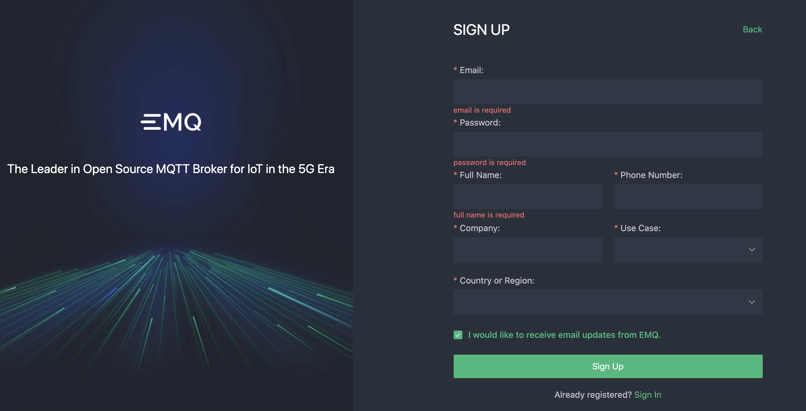
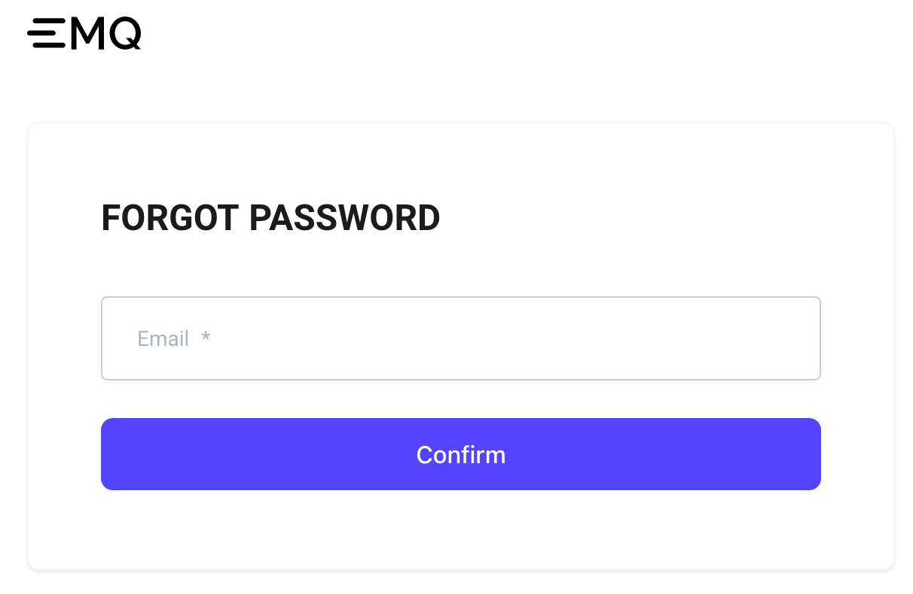

# Register and Log in to the EMQ X Cloud account

## [Register an account](https://accounts.emqx.io/signup?continue=https://cloud.emqx.io/)

Start at the EMQ X Cloud sign up page

1. Enter your personal information:
   
   * Email
   * Password 
   * Full name
   * Phone number
   * Company 
   * Use case
   * Country/Region

2. Click `Sign Up` to register to create your account.
   EMQ X Cloud will automatically send a confirmation email to the email address you provided.
3. Click on the link in the confirmation email to verify your new account. The link will verify your account
   and redirect you to the login page.
4. Now you are ready to log in to EMQ X Cloud.

## [Login to the account](https://accounts.emqx.io/signin?continue=https://cloud.emqx.io/)

If you've already registered an account, you could log in by the following steps:

1. Go to EMQ X Cloud login page.
2. Enter your email and password.
3. Click `Sign in` to direct to the EMQ X Cloud page.

## [Forget Password](https://accounts.emqx.io/forgot_password?continue=https://cloud.emqx.io/)

If you forget your password, you could click on `Forget your password` and enter your email address, we will send a verification email to your mailbox.

You can click Get back Password in the verification email to create a new password, 
then you will be redirected to the login page. Enter the new password, and select `Sign in`.
