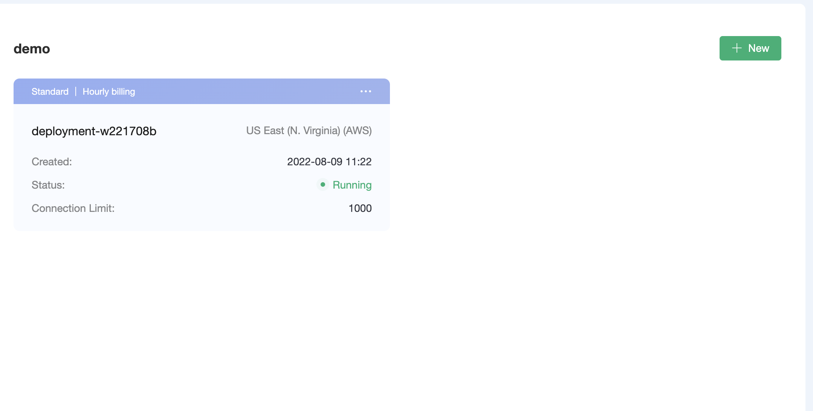

# Create a free trial deployment

For users who use EMQ X Cloud for the first time, we have prepared an opportunity for you to create a free trial deployment for up to **180** days. The free trial deployment is an ideal way for you to learn and explore the features of EMQ X Cloud. Before creating a free trial deployment, you need to understand that the free trial has the following limitations:

* Free trial up to 180 days.

  > If you need to extend the free trial period, you can submit a [ticket](../contact.md) or email (cloud@emqx.io) to get in touch with us

* For ordinary users, it allows up to 25 client connections, and for the university plans, it allows up to 100 client connections.

* 10 GB of free traffic per month.

* Use EMQ X's own functions such as rule engine and monitoring management.

* Only MQTT over TLS/SSL, Websockets over TLS/SSL protocol connections are supported.

* > If you need other protocol support, you can submit a [ticket](../contact.md) or send an email (cloud@emqx.io) to get in touch with us

* Customizing [TLS/SSL](../deployments/tls_ssl.md) and creating [VPC peering connection](../deployments/vpc_peering.md) are not supported.

* Active client connections are deployed within 7 days.

  > If there is no active connection for the deployment within 7 days, we will temporarily stop your free trial deployment. You can log in to the EMQ X Cloud console again to restart your free trial deployment.

## Start creating a free trial deployment

### 1. Login to [EMQ X Cloud Console](https://accounts.emqx.io/signin?continue=https://cloud.emqx.io/console/)

### 2. Click the Create Deployment button

### 3. Choose a free trial cloud platform

### 4. Click to deploy now, and agree to EMQ X standard terms of service and free trial statement

### 5. Wait for 5 ~ 10 minutes until the deployment status is *running*

## Connect to your free trial deployment

Before connecting to your free trial deployment, you need to wait for the free trial deployment status chaning from **pending** to **running**

### 1. Get free trial connection information

Click the free trial deployment to be connected, and you will enter the deployment details page. The free trial of EMQ X Cloud supports TLS and WSS protocol connections. The corresponding ports of the protocol are as follows:

| Protocol   | Port |
| ---------- | ---- |
| MQTT       | 1883 |
| Websockets | 8083 |

### 2. Add client authentication information

Click the EMQ X Dashboard button on the deployment details page, you will enter the EMQ X Dashboard, and click the **Authentication and ACL** menu on the left

### 3.Connect to free trial deployment with MQTT X 

EMQ X Cloud recommends using [MQTT X](https://mqttx.app/cn/) to test the connection to the free trial.

* MQTT connection

  

* Websockets connection

  

### 4. [Use SDK or other tools to connect to the free trial deployments](../connect_to_deployments/README.md)

