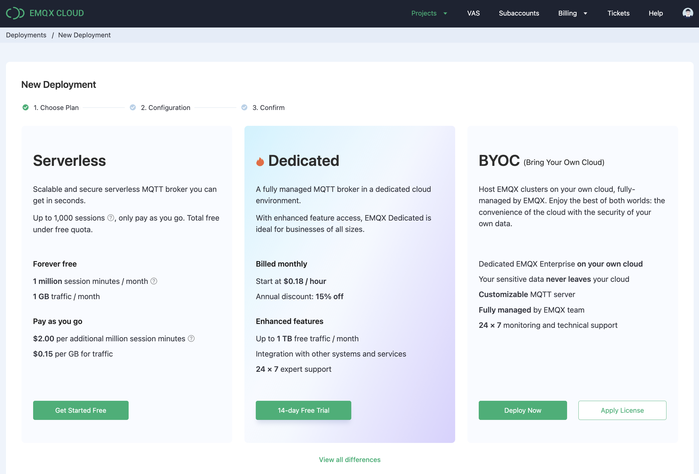
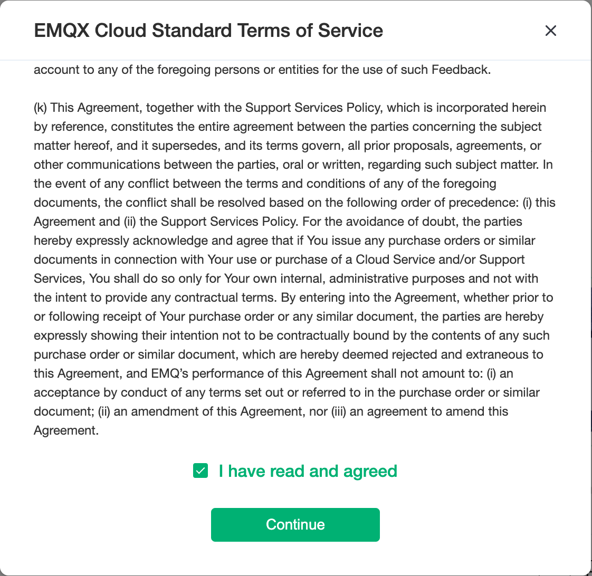

# Create a free trial deployment

For users who use EMQ X Cloud for the first time, we have prepared an opportunity for you to create a free trial deployment for up to **180** days. The free trial deployment is an ideal way for you to learn and explore the features of EMQ X Cloud. Before creating a free trial deployment, you need to understand that the free trial has the following limitations:

- Free trial up to 180 days.

  > If you need to extend the free trial period, you can submit a [ticket](../contact.md) or email (cloud@emqx.io) to get in touch with us

- Allow free trial users to have up to 25 client connections.

- Use all EMQ X features such as rule engine, monitoring and management.

- Supports MQTT, WebSockets, MQTT over TLS, Websockets over TLS protocol connections.

  > If you need other protocol support, you can submit a [ticket](../contact.md) or send an email (cloud@emqx.io) to get in touch with us

- Customizing [TLS/SSL](../deployments/tls_ssl.md) and creating [VPC peering connection](../deployments/vpc_peering.md) are not supported.

- Active client connections are deployments within 7 days.
  
  > If the deployment has no active connections for 7 days we will temporarily stop your free trial deployment and you can start your free trial deployment again by logging into the EMQ X Cloud console.

## Start creating a free trial deployment

1. Login to [EMQ X Cloud Console](https://accounts.emqx.io/signin?continue=https://cloud.emqx.io/console/)

   

2. Click the `Create Deployment` button

   

3. Choose 180 Day Free Trial for step 1. Keep the default settings of other steps and click `Deploy` 
on the right.

   

4. Review the EMQ X Cloud Standard Terms of Service and click `Continue`.

   

5. Review the Free Trial Declaration Terms and click `Get started`.

   
   
6. Wait for 5 ~ 10 minutes until the deployment status is **running**

   

## Connect to your free trial deployment

Before connecting to your free trial deployment, you need to wait for the deployment status changed from **pending** to **running**

1. Get free trial connection information. 
   
    Click the free trial deployment to be connected, and you will enter the deployment details page. The corresponding ports of the protocol are as follows:
    | Protocol            | Port  |
    | ------------------- | ----- |
    | MQTT                | 11xxx |
    | MQTT over TLS       | 11xxx |
    | Websockets          | 8083  |
    | Websockets over TLS | 8084  |
    
    
        
    
2. Add client authentication information.
   
    Click the EMQ X Dashboard button on the deployment details page, you will enter the EMQ X Dashboard, and click the **Users & ACL** menu on the left

    

3. Connect to free trial deployment with MQTT X
   EMQ X Cloud recommends using [MQTT X](https://mqttx.app/) to test the connection.

   - MQTT connection

     

   - Websockets connection
     
     

4. [Use SDK or other tools to connect to the free trial deployments](../connect_to_deployments/introduction.md)