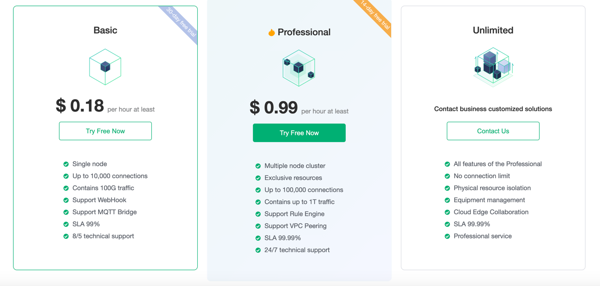
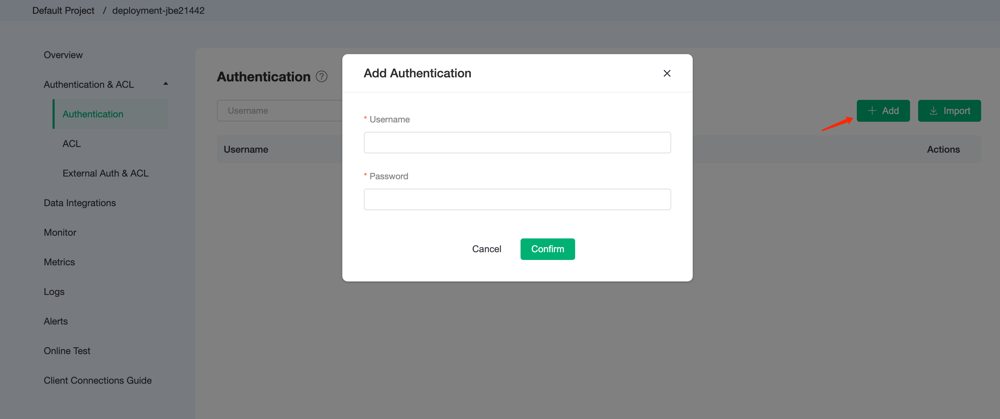
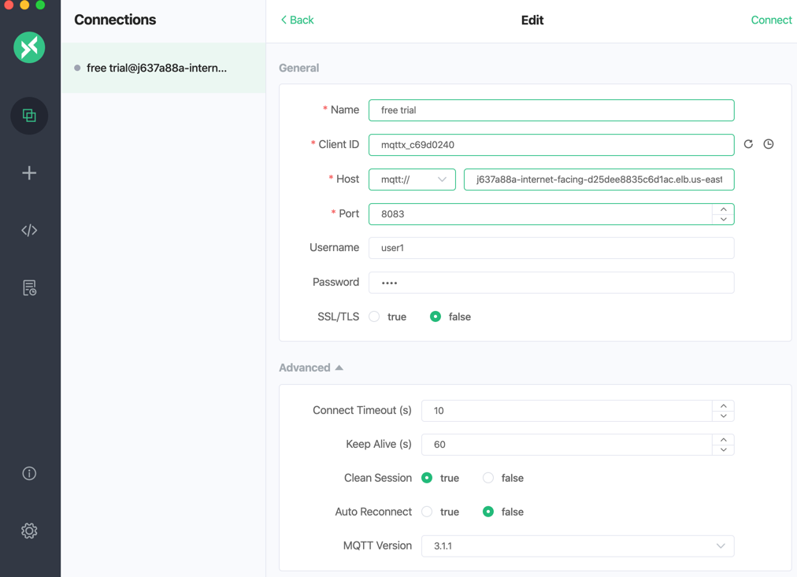

# Create a free trial deployment

For first-time EMQ X Cloud customers, we have an opportunity for you to create a free trial deployment of up to **30** days in length. The free trial deployment is an ideal way for you to learn and explore the features of EMQ X Cloud. Before creating a free trial deployment, you need to understand that the free trial has the following restrictions.

* Free trial up to 30 days.

  > To extend your free trial, you can submit a [ticket](../contact.md) or contact us by email to get in touch with us.

* Maximum 1000 client connections for the basic plan, maximum 5000 client connections for professional plan

* 100 GB free traffic per month.

* Use all EMQ X features such as rule engine, monitoring management, etc.

* Support for MQTT, WebSockets, MQTT over TLS/SSL, Websockets over TLS protocol connections.

  > For additional protocol support, you can submit a [ticket](../contact.md) or send email (cloud@emqx.io) to get in touch with us.

* The basic plan does not support custom [TLS/SSL](../deployments/security_features_and_settings/tls_ssl.md) and [VPC Peering](../deployments/security_features_and_settings/vpc_peering.md).

* Deployment has active client connections within 7 days.

  > If the deployment has no active connections for 7 days we will temporarily stop your free trial deployment. You can start your free trial deployment again by logging into the EMQ X Cloud console.

## Start creating a free trial deployment

1. Login to [EMQ X Cloud Console](https://accounts.emqx.io/signin?continue=https://cloud.emqx.io/console/)

   

2. Click the `Create Deployment` button

   

3. Select `create free trial` under basic plan

   

4. Review the EMQ X Cloud Standard Terms of Service and Free Trial Declaration Terms.

   
   
5. Wait for 5 ~ 10 minutes until the deployment status is **running**

   

## Connect to your free trial deployment

Before connecting to your free trial deployment, you need to wait for the deployment status changed from **pending** to **running**

1. Get free trial connection information. 
   
    Click the free trial deployment to be connected, and you will enter the deployment details page. The corresponding ports of the protocol are as follows:
    | Protocol            | Port  |
    | ------------------- | ----- |
    | MQTT                | 11xxx |
    | MQTT over TLS       | 11xxx |
    | Websockets          | 8083  |
    | Websockets over TLS | 8084  |
    
    
        
    
2. Add client authentication information.
   
    Click the EMQ X Dashboard button on the deployment details page, you will enter the EMQ X Dashboard, and click the **Users & ACL** menu on the left

    

3. Connect to free trial deployment with MQTT X
   EMQ X Cloud recommends using [MQTT X](https://mqttx.app/) to test the connection.

   - MQTT connection

     

   - Websockets connection
     
     

4. [Use SDK or other tools to connect to the free trial deployments](../connect_to_deployments/introduction.md)