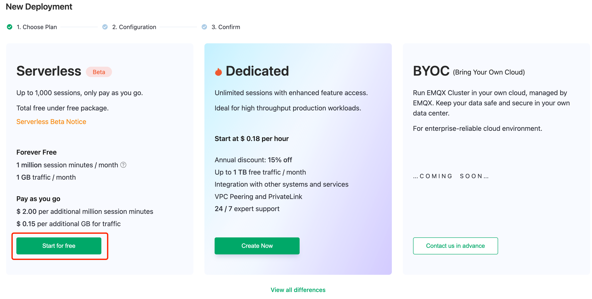
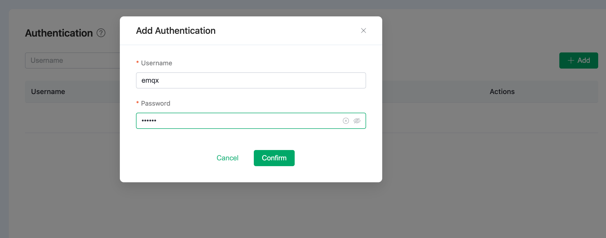
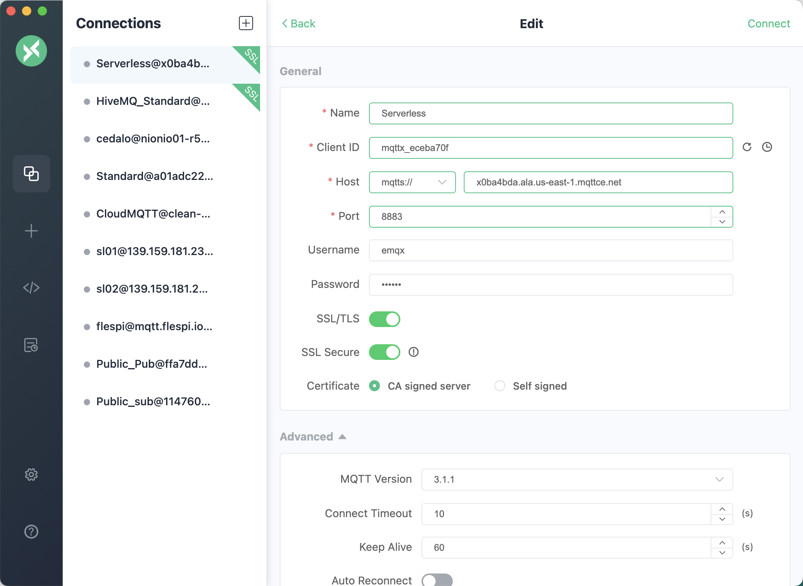
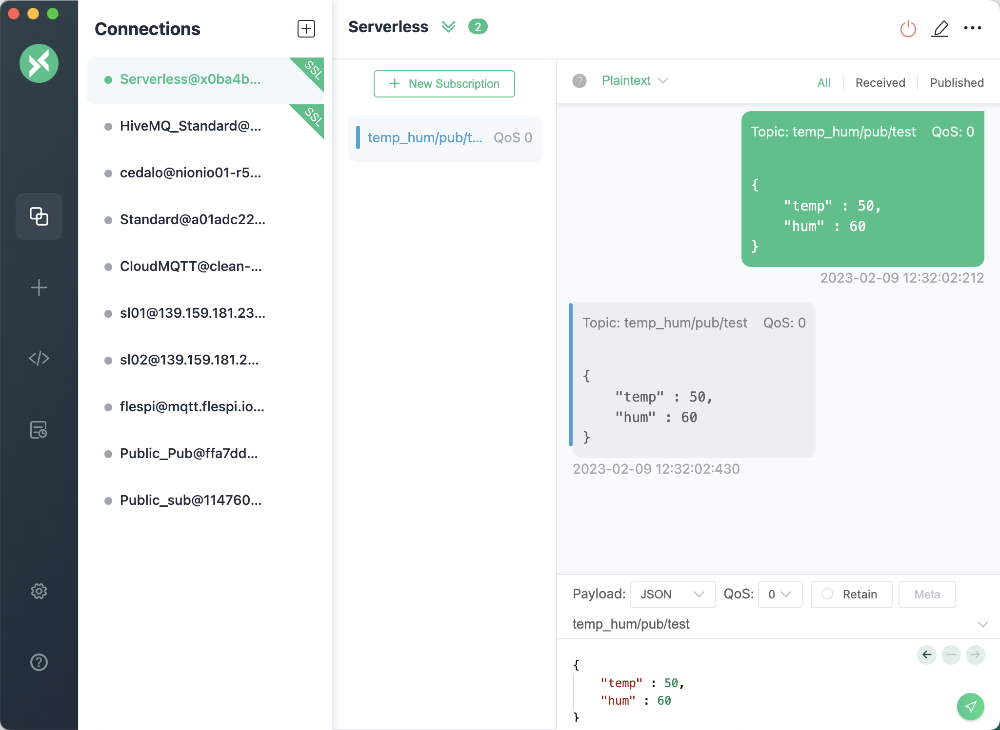

# Create Serverless (Beta)  Deployment

You can create an EMQX Cloud Serverless (Beta) deployment in just a few steps. 

::: tip
EMQX Cloud Serverless is currently under free trial, you can experience the fully-managed MQTT services before 2023.4.1 under zero costs. This trial deployment currently supports up to 100 sessions. 
:::

Precautions:

* Only one serverless (Beta) deployment can be created under each account at the moment.
* Deployment with no active client connections for 30 days will be stopped. To continue the trial, please start it manually in [EMQX Cloud console](https://cloud.emqx.com/console/). 
* Deployment remains disabled for a consecutive 30 days after being stopped will be deleted.

## Create a deployment

1. Log in to [EMQX Cloud Console](https://cloud.emqx.com/console/). 

2. Click **+ New**.

3. Click **Start for free** under **Serverless (Beta)**.

   

4. In the **Configuration** tab, you can view the deployment region, pricing, and your free quota information, or limit your monthly spending with the **Speed Limit** field. Here we will just click **Deploy** to start the deployment. Agree to the *EMQX Cloud Standard Terms of Service* and *Serverless Service Terms of Use*. Then click **Get Start**.

   ::: tip
   Serverless (beta) is under free trial until 03/31/2023. And a maximum of 100 sessions are supported. For a production environment, please choose the Dedicated plan.
   :::

5. Wait until the status is **Running**. 

   

## Connect to Serverless (Beta)

1. View the overall status of the deployment. 

   On the **Overview** page, you can get the overall status of the deployment, for example, the instance status, number of sessions, Pub&Sub TPS, session minutes, and traffic. The page also lists the deployment name, address, and ports, we can use this information to test the connection. 

   

2. Add client authentication. 

   In the deployment detail page, click **Authentication & ACL** -> **Authentication** in the left navigation menu, click the **+ Add** button, enter the username and password and click **Confirm**.

   User **emqx** is created, and it will later be used for testing the connection to the deployment. 

   

3. Test the connection to the deployment. 

   [MQTTX](https://mqttx.app) is recommended to test the connection to the deployment, or you can use [SDK or other tools](../connect_to_deployments/overview.md). Before the testing, you need to get the deployment connection address (Host) and port (Port) from the **Overview** tab.

   * Set up the MQTTX connection configuration as shown below and connect to the deployment. 

     

   * Test a publishing or subscribe services. 

     
