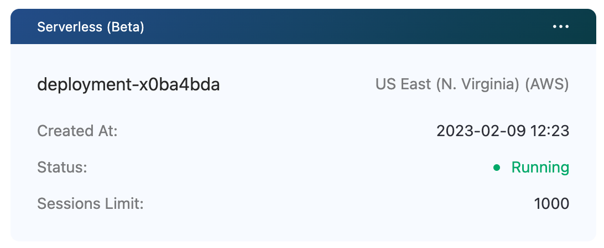
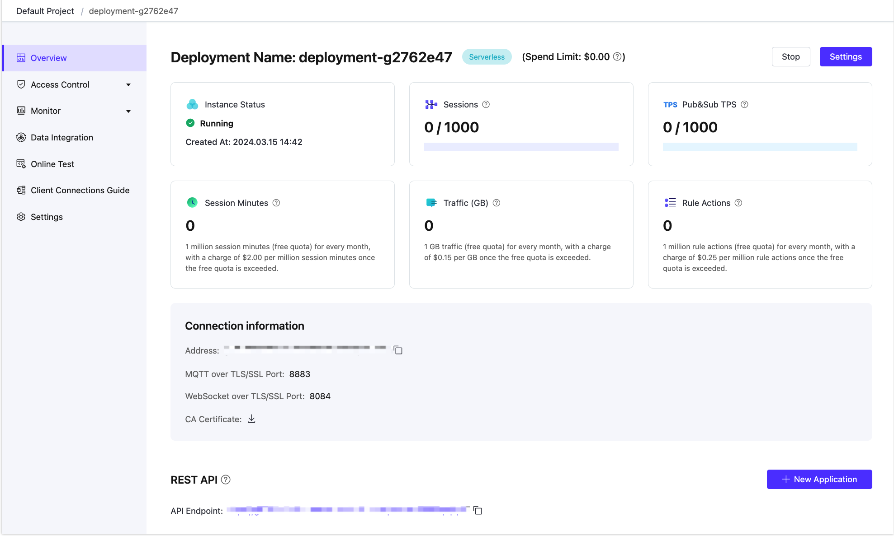

# Create Serverless (Beta) deployment

You can create a Serverless (Beta) deployment in a few easy steps.

Currently only one Serverless (Beta) deployment can be created under each account. Until 2023.4.1, Serverless deployments are limited to a maximum of 100 sessions in Beta testing and are completely free to use.

Notes for Serverless (Beta) deployments.

* If the deployment continues for 30 days without active client connections, the deployment will be stopped. To continue the trial, please start it manually in the console.

* If the deployment is stopped for 30 days without being enabled, we may delete the deployment.

## Create deployment

1. Log in to [EMQX Cloud Console](https://cloud.emqx.com/console/)

2. Click Deploy

3. Choose `Serverless (Beta)`

   

4. Click Deploy Now and agree to the EMQX Cloud Standard Terms of Service and Serverless Service Terms of Use. Note:Serverless beta is free until 03/31/2023. And the maximum number of sessions is 100. Serverless Beta is not ready for production usage. Choose a Dedicated plan for your production environment.

5. Wait until the status is**Running**

   

## Connect to Serverless (Beta)

1. Add client authentication 

   Enter the deployment overview page, click Authentication & ACL -> Authentication menu on the left, click the Add button, enter the username and password and click Confirm.

   

2. Get connection information

   Serverless (Beta) supports 8883(mqtts), 8084(wss) ports by default.

   

3. Connection to the deployment

   We recommends using [MQTT X](https://mqttx.app) to test the connection to the deployment, or you can use [SDK or other tools](../connect_to_deployments/overview.md) as you like. Before you can connect to a deployment using MQTT X you need to get the deployment connection address (Host) and port (Port).

* Set up the MQTT X connection configuration and connect to the deployment 

    

* Publish or subscribe
   
   
