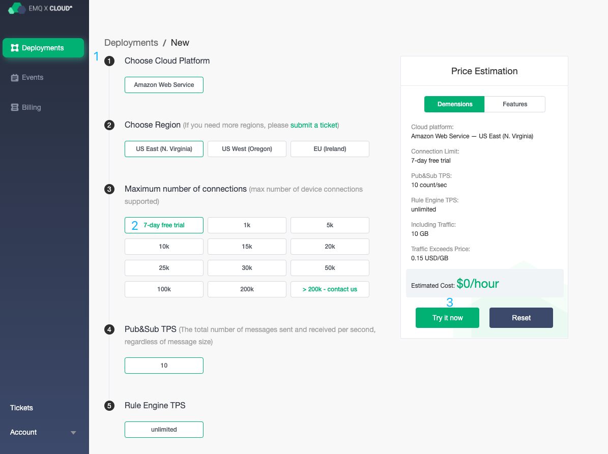

# Free trial

For the customers who register or log in to EMQ X Cloud for the first time, we will provide an opportunity to create a free trial deployment, which is the ideal way for you to explore the features of EMQ X Cloud

The details are as follows:

* We provide each customer with an opportunity to create a 7-day free trial deployment
* The maximum number of connections is: 100
* The maximum number of concurrent messages is: 10/sec
* Up to 10GB of free data traffic and unlimited number of messages
* At the end of the free trial, we will automatically delete the deployment

## Start your free trial

Once you register and log in to EMQ X Cloud, you can start a free trial

### Create a free trial deployment

To create a free trial deployment, you need to enter [EMQ X Cloud Console](https://cloud.emqx.io/console/)

1. Enter the console, click the New button in the upper right corner, and you will enter the deployment creation page.
2. Select the cloud platform and region according to your situation.
3. Select the maximum number of connections as a 7-day free trial.
4. Check the deployment information in the basic information column on the right.
5. Click the Trial Now button, and agree to the EMQ X Cloud Terms of Service and the free trial statement, you will jump to the console deployment page.
6. Wait for the status of deployment to be `running`.
7. You can go to the [Deployment Connection Guide](../deployments/connections.md) to view MQTT client connection and test guide.

