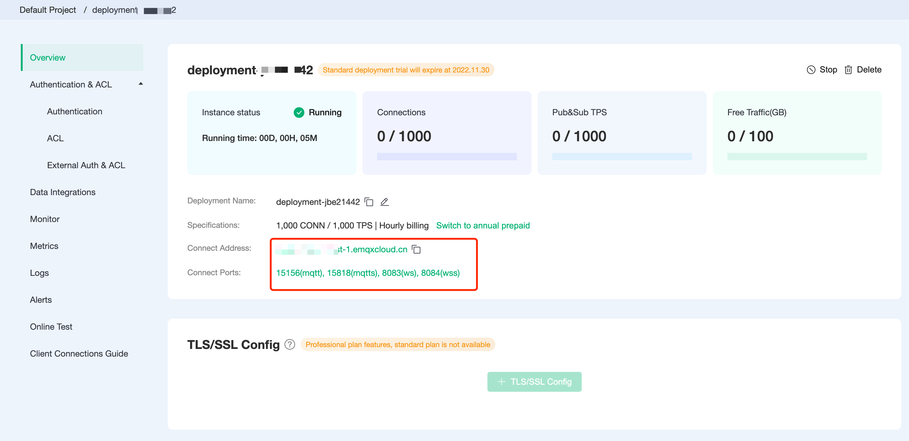

# Get Started

This section guides you through a quick experience of the various functions and features of the EMQX Cloud product, starting from creating an account. If you already have an account, you can skip this step and directly check [Create Deployment](../create/overview.md).

## EMQX Cloud Trial

You can explore and try out EMQX products through our Serverless free quota or proprietary version's 14-day free trial plan.

Free Tier for Serverless Plan includes:

- **1 million** connection minutes per month
- **1GB** of traffic per month
- **1 million** rule actions per month

14 Days Free Trial for Dedicated Plan includes:

* 1000 sessions
* 14 days free trial
* 100 GB free traffic
* Data integration, monitoring management, and other EMQX Cloud proprietary features
* Supports MQTT, WebSockets protocol connections.

Free trial deployment precautions:

- If there are no client connections for 5 consecutive days during the trial period, the trial deployment will be stopped, but your deployment instance will be retained. If you want to continue the trial, please manually enable it in the Cloud Console.
- After the trial expires, if your account has an available balance, the deployment will continue to run and charges will automatically be applied on an hourly basis.
- After the trial expires, if your account has no available balance, the deployment will be preserved for 3 days. After 3 days, the trial deployment will be automatically deleted.

## Create and Log into an EMQX Cloud Account

### [Sign Up](https://accounts.emqx.com/signup?continue=https://www.emqx.com/cn/cloud)

1. Enter the required information such as name, email, password, and mobile number; according to regulatory requirements, registration requires mobile verification for real-name authentication.
2. Click **Start free trial**, and EMQX Cloud will automatically send a confirmation email to the email address you provided.
4. To verify your new account, click the link in the confirmation email, which will verify your account and return you to the login page.

### [Sign In](https://accounts.emqx.com/signin?continue=https%3A%2F%2Fcloud-intl.emqx.com%2Fconsole%2Fdeployments%2F0%3Foper%3Dnew)

Enter your email and password, then click **Sign In** to be redirected to the EMQX Cloud console.

### [Password Recovery](https://accounts.emqx.com/forgot-password?continue=https%3A%2F%2Fwww.emqx.com%2Fcn%2Fcloud)

If you forget your password, you can click **Forgot your password?** on the login page, and we will send a verification email to your mailbox. You can click on the reset password in the verification email to create a new password and log in.

## Create a Deployment

Log into the [EMQX Cloud Console](https://cloud.emqx.com/console/), where you can view the summary information of the current deployment, manage projects and users, etc. Next, we will guide you through the quick process of creating a deployment.

1. On the start page, click **New Deployment** to go to the deployment creation page.

   

   

2. Choose a deployment to create from the existing versions, you can create a [Serverless Deployment](../create/serverless.md) or a  [Dedicated deployment](../create/dedicated.md). If you opt for a free trial of the EMQX Cloud Dedicated version, you will also need to configure the cloud platform, deployment region, connection specifications, billing method, etc. Finally, confirm your deployment information and click **Deploy Now**.

   

3. You have now completed the deployment creation process. You need to wait for the deployment to be created, and then you can access your newly created deployment.  

   

## Configure Authentication

To ensure the security of your data, before officially connecting various clients/applications, you should also add authentication information for this deployment through the **Access Control** module. Go to the deployment's **Access Control** -> **Authentication** page [to add authentication information](../deployments/default_auth.md).

:::tip

Keep this user information safe. Later, when testing MQTTX client connections, you will also need to fill in the **username** and **password** information created at this time.

:::

## Use MQTTX to Verify Connection

EMQX Cloud recommends using [MQTTX](https://mqttx.app) to test the connection to your deployment, but you can also use familiar [SDKs or other tools](../connect_to_deployments/overview.md) to connect to your deployment. Before using MQTTX to connect to your deployment, you need to obtain the deployment's authentication information.

Next, we will introduce how to test the connection using [MQTTX](https://mqttx.app/zh/). For detailed content, refer to [Testing Connection with MQTTX](../connect_to_deployments/mqttx.md).
