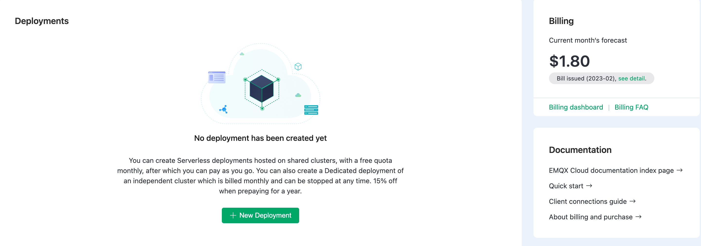

# Get Started

This chapter is designed to help you get started with EMQX Cloud product by providing a step-by-step guide on how to create an account and explore its features and characteristics. If you already have a relevant account, you can skip this section and move on to the next step, which is creating a deployment.

## Trial Policy

You can explore and try out EMQX products through our Serverless free quota or proprietary version's 14-day free trial plan.

Free Tier for Serverless Plan:

- 1 million session minutes / month
- 1 GB traffic / month

14 Days Free Trial for Dedicated Plan:

* 1000 sessions

* 14  day free trial

* 100 GB free traffic

* Data integration and monitoring

* Support MQTT and WebSockets

  > For other prototol support, such as MQTT-SN, Lwm2m, JT/T808, you can submit a request via a [ticket](../feature/tickets.md) or email to [cloud-support@emqx.io](mailto:cloud-support@emqx.io). 

Notes on the free trial deployment:

- If there are no client connections for 5 consecutive days during the trial period, the trial deployment will be stopped, but your deployment instance will be retained. If you want to continue the trial, please manually enable it in the Cloud Console.
- After the trial period, your deployment will continue to run and will be charged hourly if your account has available balance. In case your account balance is insufficient, your deployment will be retained for three days. If you choose not to add funds during this time, the trial deployment will be automatically deleted. 

## Create EMQX Cloud Account

### [Register an Account](https://accounts.emqx.com/signup?continue=https://www.emqx.com/cn/cloud)

1. Please provide the required information, including your name, email, password, and phone number.
2. Click on the **Start free trial** button, and EMQX Cloud will automatically send a confirmation email to the email address you provided.
4. Click the **Verify Email** button in the confirmation email. This link will verify your account and redirect you to the login page.
5. Log in to EMQX Cloud

### [Log in the Cloud Console](https://accounts.emqx.com/signin?continue=https%3A%2F%2Fcloud-intl.emqx.com%2Fconsole%2Fdeployments%2F0%3Foper%3Dnew)

Input your email and password, and click **Sign In**.

### [Password Recovery](https://accounts.emqx.com/forgot-password?continue=https%3A%2F%2Fwww.emqx.com%2Fcn%2Fcloud)

In case you forget your password, you can click on "Forgot your Password?" on the login page, and we will send a verification email to your email address. You can then click on the link in the verification email to create a new password and log in.

## Create Deployment

After logging to [EMQX Cloud Console](https://cloud.emqx.com/console/), you will be directed to the overview page, where you can get a general view of the your current deployment, manage your projects and users, and perform other related tasks. The section below will guide you through the quick deployment creation process.

1. Click **New Deployment**, and you will be directed to the **Project List** page.

   

   

2. Click **+ New**.  You can choose from the available versions such as [creating a Serverless deployment](../create/serverless.md) or [creating a Dedicated deployment](../create/dedicated.md). If you opt for a free trial of the EMQX Cloud Dedicated version, you'll need to configure additional details such as the cloud platform, deployment region, connection specifications, and billing method. Once you've confirmed all the necessary deployment information, you can click on **Deploy Now** to proceed with the deployment process.

   

3. You have now completed the deployment creation process. You just need to wait for the deployment to finish creating, and then you can access your newly created deployment.  

   

:::tip Tip

In this Overview page, you can also get the connection details, please ensure that you save the connection address and port information as we will be using it to test the connection using the MQTTX client. 

:::

## Configure Authentication 

To ensure the security of your data, it is necessary to add authentication information for this deployment by using the **Authentication & ACL** module before formally accessing various clients/applications. You can do this by visiting the [**Authentication**](../deployments/auth_dedicated.md) page under **Authentication & ACL**, and clicking on the Add button. 

## Use MQTTX to Verify the Connection

It is recommended to use [MQTTX](https://mqttx.app) to test the connection to EMQX Cloud deployments. Alternatively, you can use familiar [SDKs or other tools](../connect_to_deployments/overview.md) to connect to the deployment. Prior to using MQTTX to connect to the deployment, you need to obtain the deployment's connection address (Host) and port number (Port).

The next page will explain how to test the connection using [MQTTX](../connect_to_deployments/mqttx.md).
