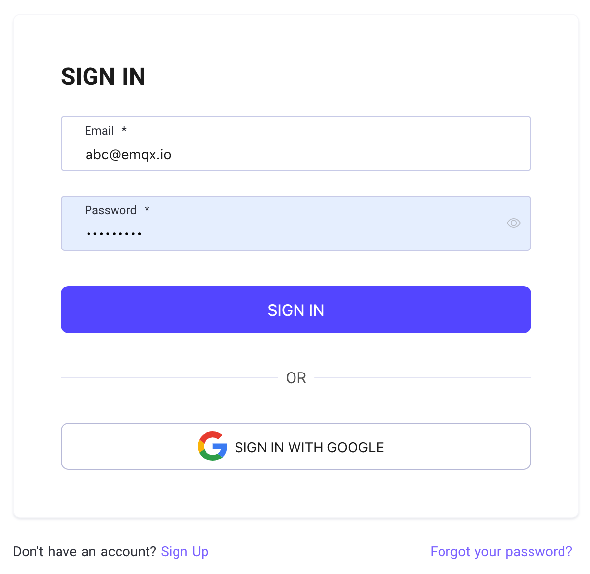
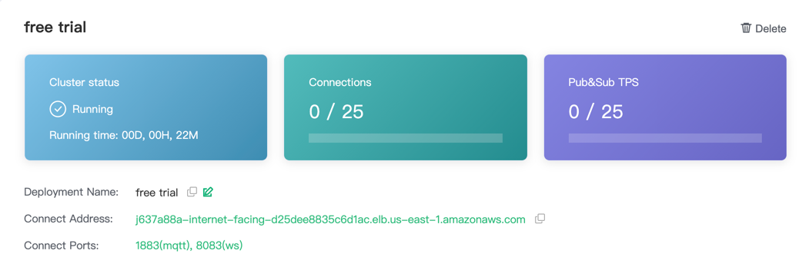
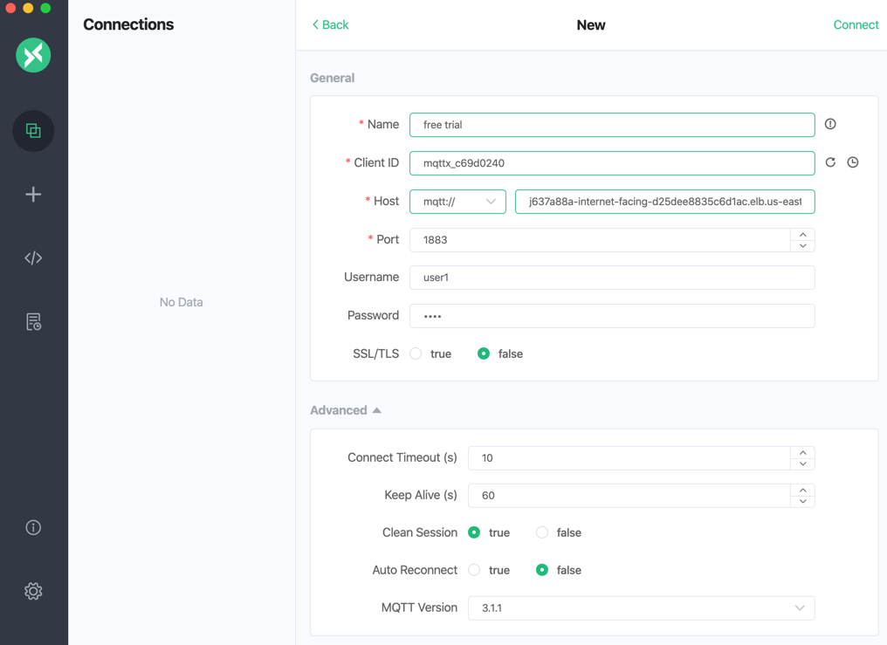

# Get Started with EMQ X Cloud

Welcome to EMQ X Cloud! EMQ X Cloud is the first fully hosted MQTT 5.0 public cloud service in the world. With the support of EMQ X Cloud,
you can create an EMQ X cluster on the cloud and use all the features of EMQ X Enterprise Edition. This allows you to spend more time on business
connections and less time for EMQ X operation, maintenance, and management. This tutorial will guide you through the process of creating and connecting
to EMQ X Cloud deployment. Before starting, let's review some core concepts and phrases:

* Deployment: EMQ X Enterprise cluster hosted on EMQ X Cloud
* Free Trial: Single node version of EMQ X Enterprise
* Exclusive deployment: An EMQ X Enterprise Edition cluster with separate networks, instances, and load balancing

You can follow these steps shown below to quickly complete the EMQ X Cloud QuickStart.

1. [Login/Register](./create_account.md) EMQ X Cloud account

    

2. Visit EMQ X Cloud [console](https://cloud.emqx.io/console/) and create a free trial deployment
   
   

3. Visit Authentication & ACL page to add authentication information

   

4. Click the menu on the left to get the deployment connection information and ports

   
    

5. Use the MQTT client or SDK that you are familiar with to [connect to the deployment](../connect_to_deployments/introduction.md) 
   
   
