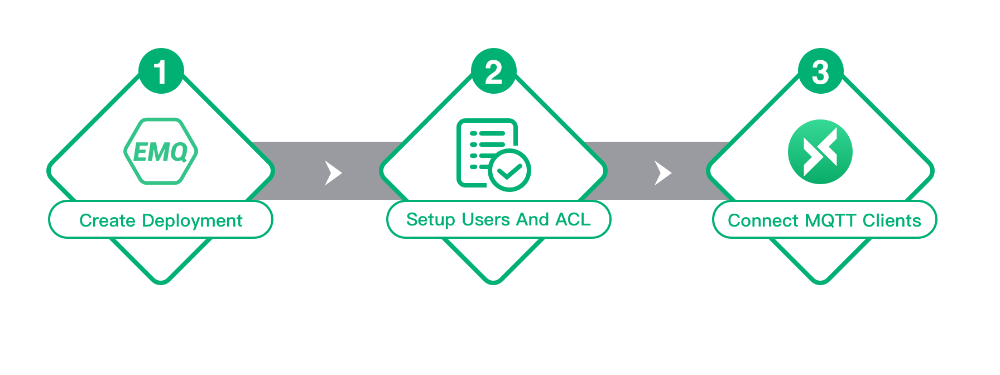

# Quick Start

The Quick Start provides you with instructions on how to set up an EMQ X Cloud account, create a deployment, and connect to the deployment.

## Quick start flowchart

EMQ X Cloud is an IoT MQTT 5.0 cloud service with rapid deployment, easy management, and on-demand expansion. If you are using EMQ X Cloud for the first time, please get to know [Usage Limitation]() and [Cost Estimate]() at first.

Generally, from purchase of EMQX deployment to ready to use, you need to complete the following operations:

