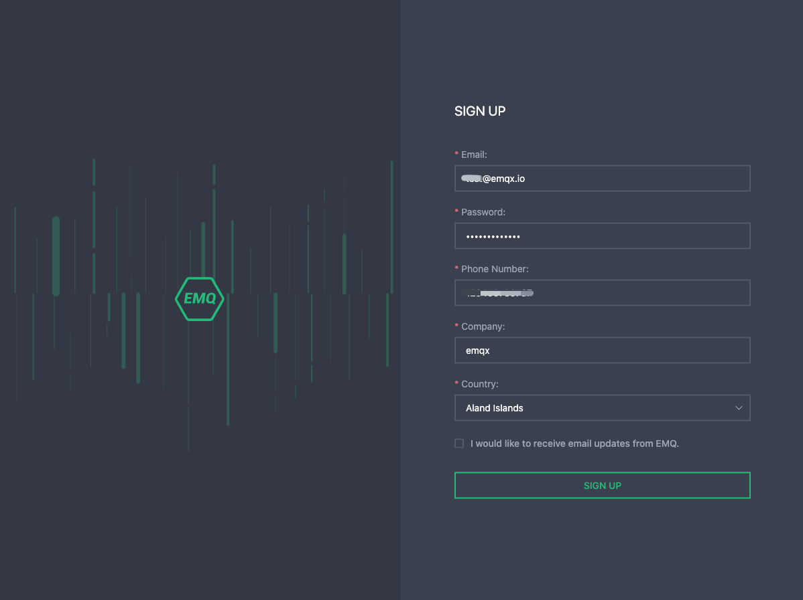
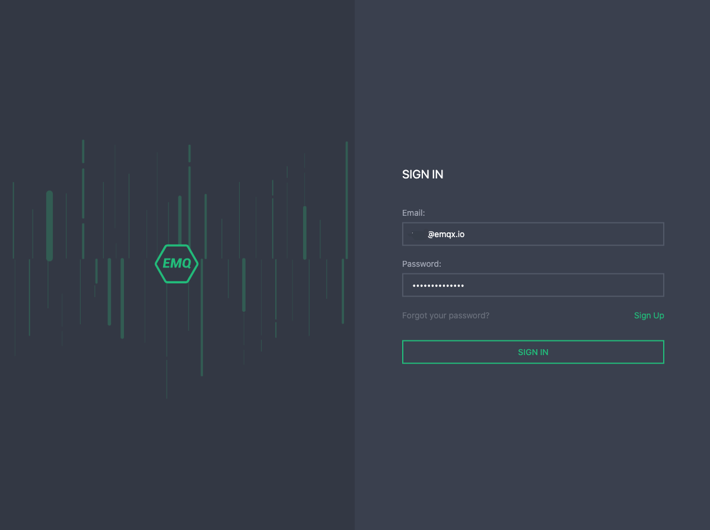

### Signup and login

To start using EMQ X Cloud, please navigate to [EMQ X Cloud official website](https://cloud.emqx.io/cn)

## Register

1. Click the Register button in the upper right corner
2. Enter your personal information: email, password, mobile phone number, company name, country
3. Click Register, and EMQ X Cloud will automatically send a confirmation email to the email address you provided
4. To verify your new account, please click on the link in the confirmation email, which will verify your account and return to the login page
5. Log in to EMQ X Cloud

## Login

1. Click the login button in the upper right corner
2. Enter your email and password, then select login to jump to the EMQ X Cloud Console page

## Recover password

If you have forgotten your password, please click Forgot Password in the lower right corner of the login page, and we will send a verification email to your email address. You can click Recover Password in the verification email to create a new password. Then, you can return to the login page, enter the new password, and log in.

