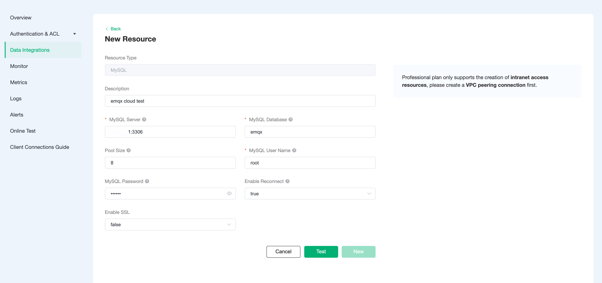
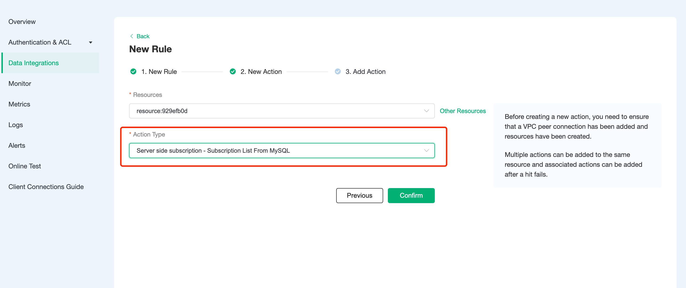
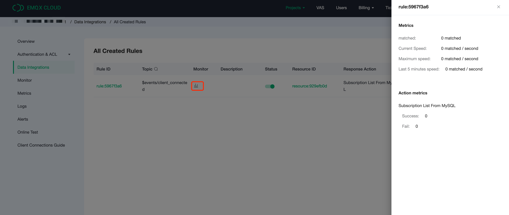
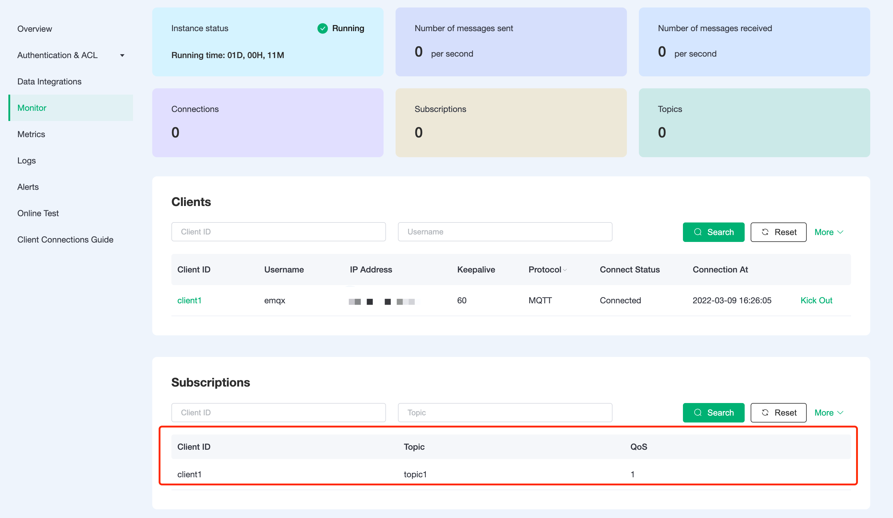

# Get subscription topic information from MySQL using the Rule Engine

In this article, we will use the EMQ X Cloud rules engine to get subscription relationships from MySQL.

Before you start, you need to complete the following operations:
* Deployments have already been created on EMQ X Cloud (EMQ X Cluster).
* For exclusive deployment users: Please complete [Peering Connection Creation](../deployments/Security features and Settings/vpc_peering.md) first, all IPs mentioned below refer to the intranet IP of the resource.
* For free trial and shared deployment users: No peering connection is required, all IPs below refer to the public IP of the resource.

## MySQL configuration

1. Install MySQL

   ```bash
   docker run -d --restart=always \
     --name mysql \
     -p 3306:3306 \
     -e MYSQL_ROOT_PASSWORD=public \
     -d mysql/mysql-server:5.7
   ```

2. New database

   ```sql
   CREATE DATABASE emqx;
   ```


3. New subscription relationship table

   Use the following SQL statement to create `mqtt_sub` table. This table will be used to save the device subscription relationship data.

   ```sql
   DROP TABLE IF EXISTS `mqtt_sub`;
   CREATE TABLE `mqtt_sub` (
       `id` int(11) unsigned NOT NULL AUTO_INCREMENT,
       `clientid` varchar(64) DEFAULT NULL,
       `topic` varchar(180) DEFAULT NULL,
       `qos` tinyint(1) DEFAULT NULL,
       PRIMARY KEY (`id`),
       KEY `mqtt_sub_idx` (`clientid`,`topic`,`qos`),
       UNIQUE KEY `mqtt_sub_key` (`clientid`,`topic`),
       INDEX topic_index(`id`, `topic`)
   ) ENGINE=InnoDB DEFAULT CHARSET=utf8MB4;
   ```
   
   ::: danger
   The subscription relationship table structure cannot be modified, please use the above SQL statement to create
   :::

4. Set the EMQ X cluster IP segment to be allowed to access the database (optional)
   For exclusive deployment, if you want to get deployment segment, you can go to Deployment Details → View Peer Connection Information and copy the deployment VPC segment.
   
   ```sql
   # Exclusive deployment
   GRANT ALL PRIVILEGES ON *.* TO root@'10.11.30.%' IDENTIFIED BY 'public' WITH GRANT OPTION;
   
   # Free trial and shared deployment
   GRANT ALL PRIVILEGES ON *.* TO root@'%' IDENTIFIED BY 'public' WITH GRANT OPTION;
   ```

5. Insert test data and view it
   
   ```sql
   INSERT INTO mqtt_sub(clientid, topic, qos) values("test", "t1", 1);

   select * from mqtt_sub;
   ```

## EMQ X Cloud rules engine configuration

Go to Deployment Details and click on EMQ X Dashbaord to go to Dashbaord.

1. New Resource

   Click on Rules on the left menu bar → Resources, click on New Resource and drop down to select the MySQL resource type. Fill in the mysql database information you have just created and click Test. If you get an error, instantly check that the database configuration is correct.
   
   
2. Fill in rules
   Click on Rules on the left menu bar → Rules, click on Create and enter the following rule to match the SQL statement. 
   
   ```sql
   SELECT * FROM "$events/client_connected"
   ```
   
3. Add a response action

   Click on Add Action in the bottom left corner, drop down and select → Proxy Subscription → Get Subscription List from MySQL, select the resource created in the first step

   

4. Click on New Rule and return to the list of rules
   


5. View rules monitoring
   

## Test

1. Inserting subscription data in MySQL
   Insert the subscription data with client ID client1, subscription topic1 and QoS 1. 
   
   ```sql
   INSERT INTO mqtt_sub(clientid, topic, qos) values("client1", "topic1", 1);
   select * from mqtt_sub;
   ```

   
2. Use [MQTT X](https://mqttx.app/) to connect the deployment 

   You need to replace broker.emqx.io with the created deployment [connection address](../deployments/view_deployment.md), and add [client authentication information](../deployments/auth_and_acl.md) to the EMQ X Dashboard.
   In this case, set the clientID to client1
   

3. View subscription relationships in the Dashboard
   Go to Deployment Details and click on EMQ X Dashbaord to go to Dashbaord and view the client subscription relationship in `Subscriptions`. 
   
