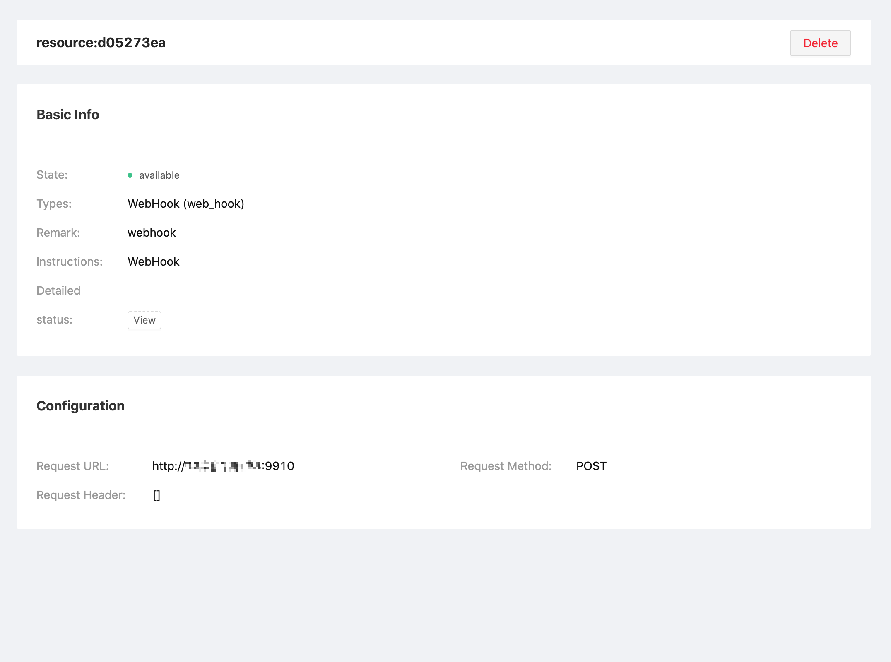
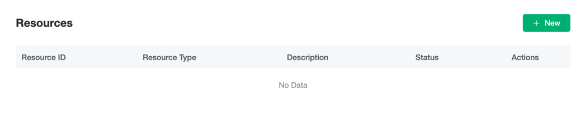
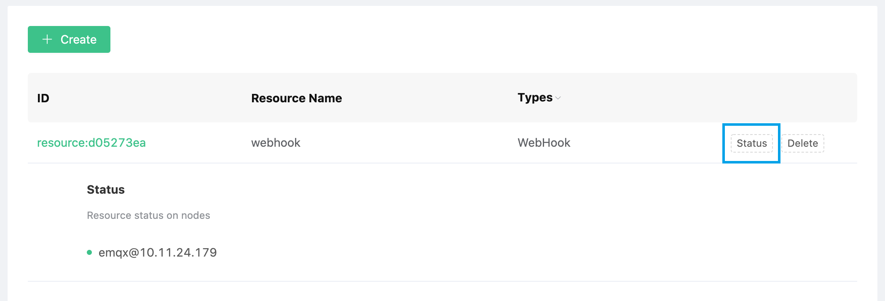
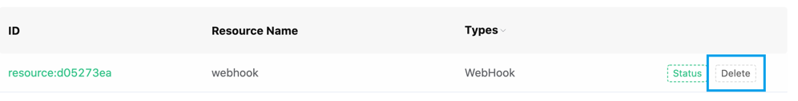

# Resource

EMQX Cloud resources are used for rule engine response actions. Before that, you need to ensure that the deployment status is `running`. You can refer to [EMQX Rule Engine](https://docs.emqx.io/broker/latest/en/rule/rule-engine.html) for more information about resource creation.

## Simple Example

The resource shown in the figure below is a WebHook resource. The request URL is port 9910 of an IP, the request method is POST, and the request header is empty.

## Create Resources

1. Log in to [EMQX Cloud Console](https://cloud-intl.emqx.com/console/)

2. Click on the deployment of the desired connection, and you will enter the deployment details page

3. Click the EMQX Dashboard button on the page, and you will enter the EMQX Dashboard

4. Click `Rule Engine` → `Resources` on the left menu of EMQX Dashboard, and click the resource `Create` button on the resource list page

   

5. Select the corresponding resource type and fill in the corresponding resource configuration information

   

6. Click Test, if there is no error, click Confirm, otherwise please check the resource configuration information carefully

## View Resource Status

1. Log in to [EMQX Cloud Console](https://cloud-intl.emqx.com/console/)

2. Click on the deployment of the desired connection, and you will enter the deployment details page

3. Click the EMQX Dashboard button on the page, and you will enter the EMQX Dashboard

4. Click `Rule Engine` → `Resources` on the left menu of EMQX Dashboard, and click the resource status icon on the resource list page

   

## Delete Resources

1. Log in to [EMQX Cloud Console](https://cloud-intl.emqx.com/console/)

2. Click on the deployment of the desired connection, and you will enter the deployment details page

3. Click the EMQX Dashboard button on the page, and you will enter the EMQX Dashboard

4. Click `Rule Engine` → `Resources` on the left menu of EMQX Dashboard, and click the resource `Delete` button on the resource list page

   