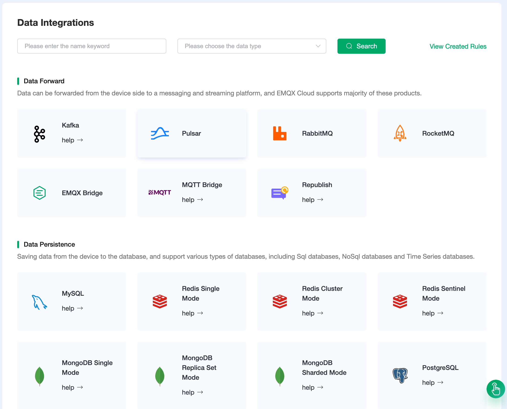
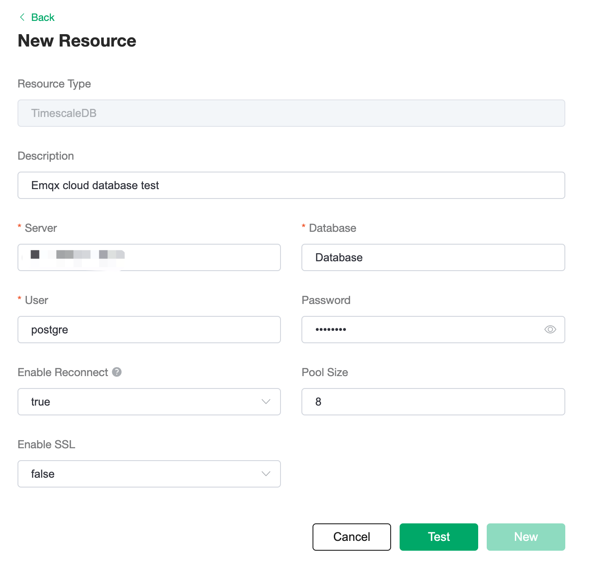
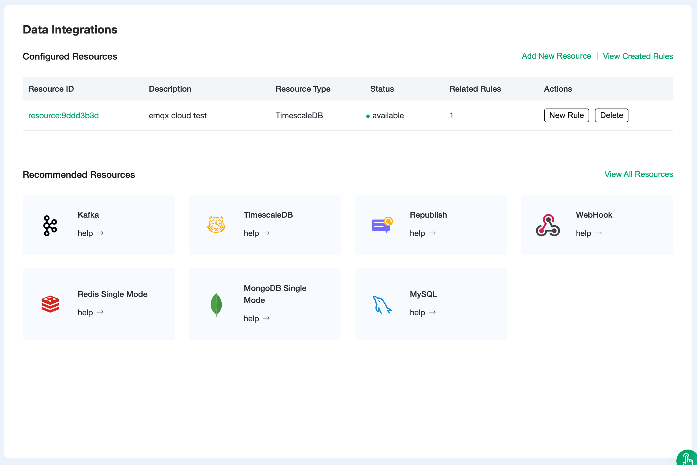
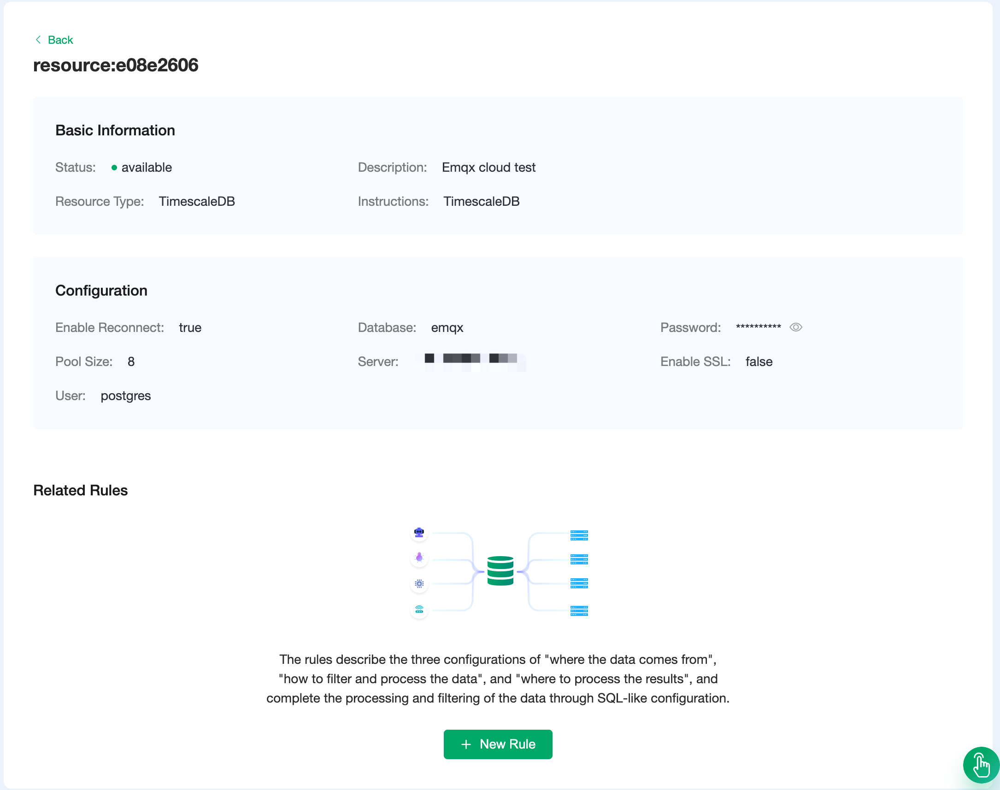
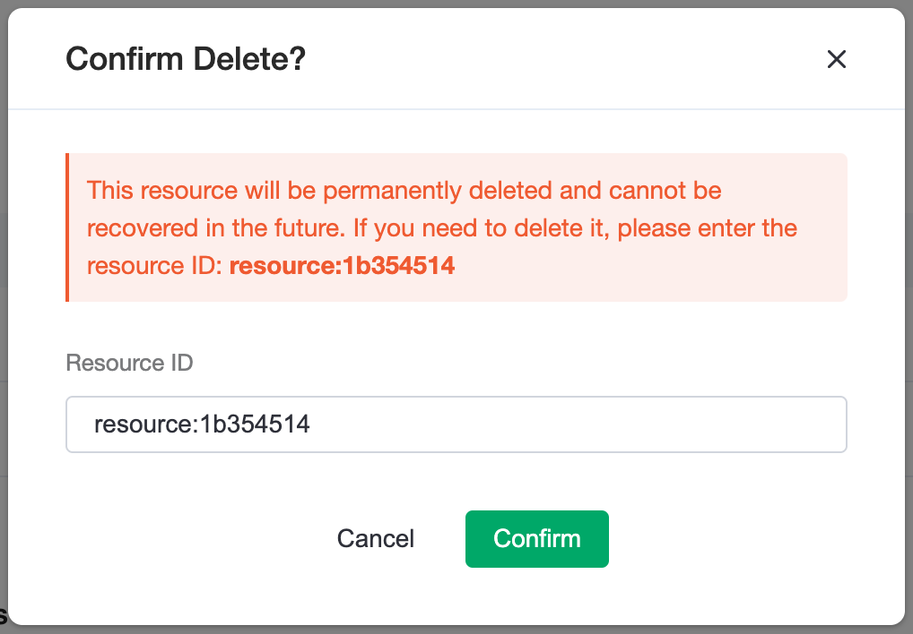

# Resource

EMQX Cloud resources are the key concept for Data Integrations. Most of the resources are the services provided by the cloud providers. Before starting, you need to ensure that the deployment status is `running`. 

In a professional plan, we provide all the resources. However, in a standard plan, only `MQTT Bridge`, `Republish`, `Webhook`, `debug mode` are available. Because other resources require a VPC peering and can only be connected through Intranet. 

::: tip Tip
Before adding a resource, you need to ensure that you have added [VPC peering connection](../deployments/vpc_peering.md). Or you can open [NAT Gateway](../vas/vas-intro.md) to connect to the service without VPC peering.
:::

## Resource Browse Page
This is the browse page for all the resources that EMQX Cloud lists. The most commonly used types are Data Forwarding and Data Persisting. Like forwarding data to Kafka clusters or saving data into MongoDB. Select the item from the list of available resources to continue.

   

## Set up a resource
We set up a TimescaleDB Resource for an example. Filling in the corresponding resource configuration and click `Test` Button. If the connection is successful, We will receive a message and click to see the detail. Otherwise please check the resource configuration.

   

If you created a resource, it will be listed on the overview page. You can add another resource as well. All the resources you created will be listed on the overview page. You can browse all the resources through the link 'Add New Resouce' or 'View All Resources'.

   

## Resource Detail
1. Click the resource ID link to view the resource detail. The Basic Information section and Configuration section show the default information and the content you fill in during the set-up.

2. The related rules section shows all the rules attached to this resource. A resource can correspond to more than one rule. [Read more about Rules](./rules.md). 

   

## Delete Resources

1. In the Configured Resources List, click the `delete` button to delete a resource.  

2. You have to enter the resource ID to confirm the deletion. 

   

3. Make sure to empty all the rules under the resource before deleting the resource.