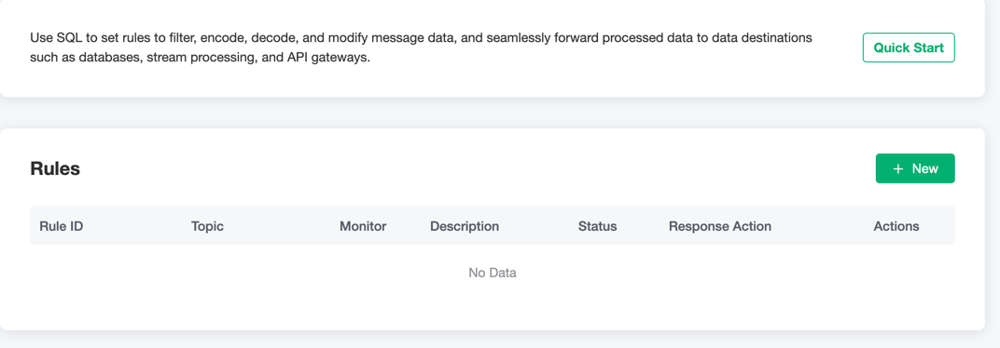
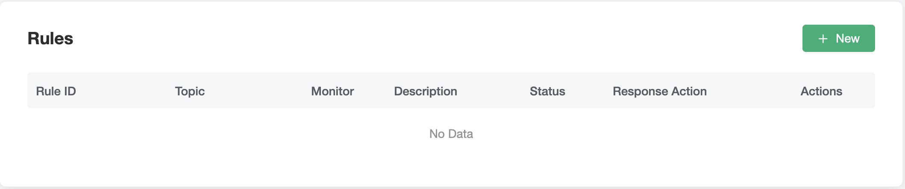
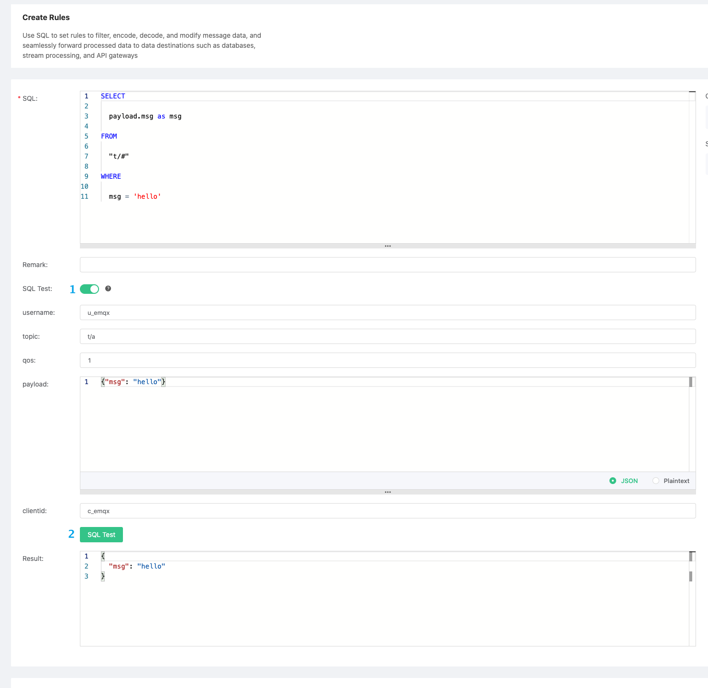
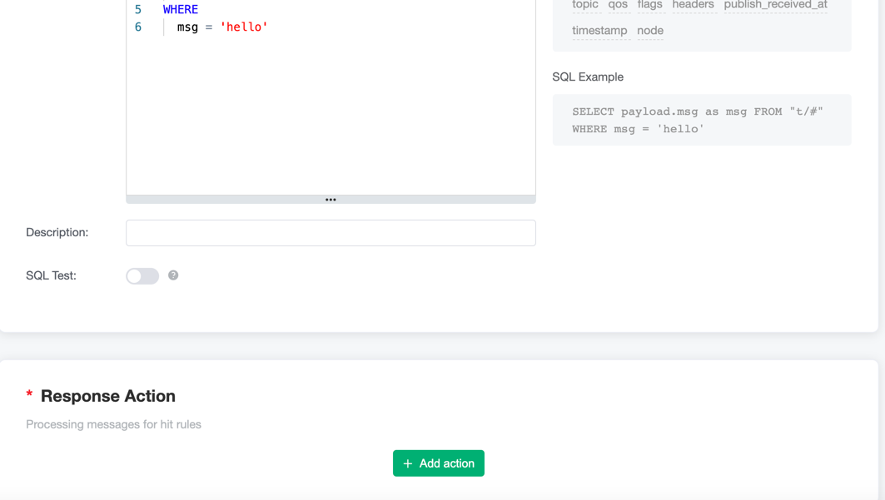
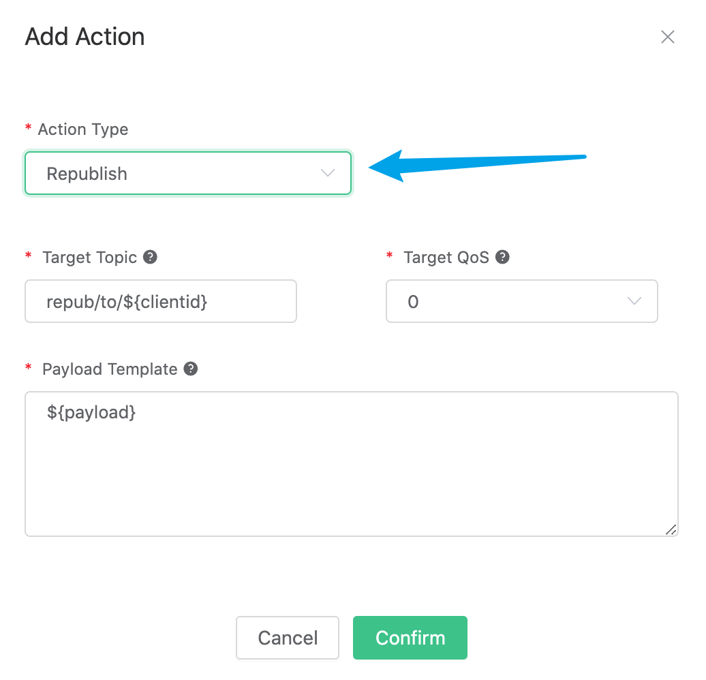
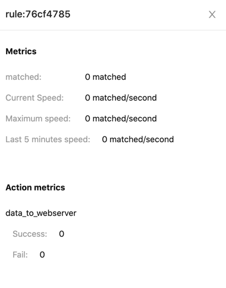
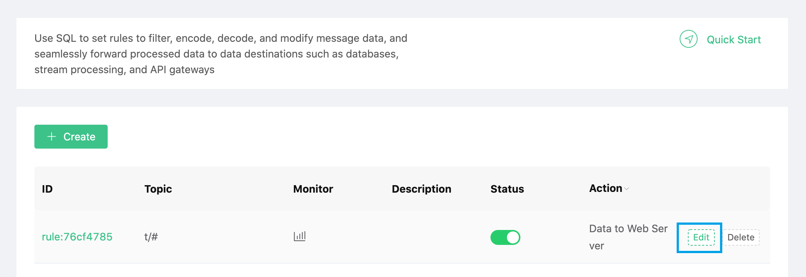
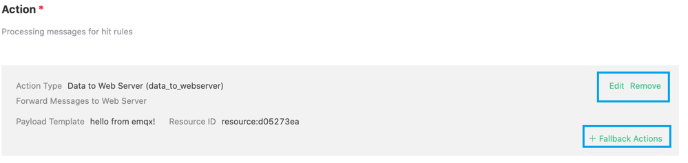
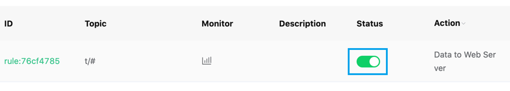
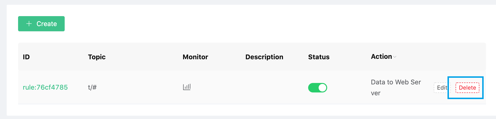

# Rule

The rule describes the three configurations of "where the data comes from", "how to filter and process the data", and "where the processing results go". That is to say, a usable rule contains three elements:

- Trigger event: The rule is triggered by an event, and the event injects the context information (data source) of the event into the rule when triggered. The event type is specified through the FROM clause of SQL;
- Processing rules (SQL): Use SELECT clause and WHERE clause and built-in processing functions to filter and process data from context information;
- Response action: If there is a processing result output, the rule will execute the corresponding action, such as persisting to the database, republishing the processed message, and forwarding the message to the message queue. A rule can configure multiple response actions.

## A simple example

The rule shown in the figure below is used to process the data when **message is published**, filter out the msg field, message topic and qos of all topic messages, and send them to the Web Server and /uplink topics. You can refer to [EMQ X Rules](https://docs.emqx.io/broker/latest/en/rule/rule-engine.html) for more  guidelines.

## Add rules

Before creating a rule engine, you need to make sure that the deployment status is **running**

1. Log in to [EMQ X Cloud Console](https://cloud.emqx.io/console/)

2. Click on the deployment of the desired connection, and you will enter the deployment details page

3. Click the EMQ X Dashboard button on the page, and you will enter the EMQ X Dashboard

4. Click `Rule Engine` → `Rule` on the left menu of EMQ X Dashboard, and click the Create button on the rule list page

   

5. Create a new test SQL, click the switch behind `SQL test`, fill in the corresponding test parameters, and finally click the `SQL test` button

   

6. Add an action

::: tip Tip
Before adding an action, you need to ensure that you have added [VPC peering connection](../deployments/security_features_and_settings/vpc_peering.md), and [create resource](resource.md)
:::

   

   In the pop-up action configuration dialog box, select the corresponding action type and fill in the configuration information of the corresponding action

   

## View rule monitoring status

1. Log in to [EMQ X Cloud Console](https://cloud.emqx.io/console/)

2. Click on the deployment of the desired connection, and you will enter the deployment details page

3. Click the EMQ X Dashboard button on the page, and you will enter the EMQ X Dashboard

4. Click `Rule Engine` → `Rules` on the left menu of EMQ X Dashboard, and click the rule monitoring icon on the rule list page

   

## Edit rules

1. Log in to [EMQ X Cloud Console](https://cloud.emqx.io/console/)

2. Click on the deployment of the desired connection, and you will enter the deployment details page

3. Click the EMQ X Dashboard button on the page, and you will enter the EMQ X Dashboard

4. Click `Rule Engine` → `Rules` on the left menu of EMQ X Dashboard, and click the `Edit` button on the rule list page

   

   When editing rules, you can also edit the actions added in the rules

   

5. Change rule status

   

## Delete rules

1. Log in to [EMQ X Cloud Console](https://cloud.emqx.io/console/)

2. Click on the deployment of the desired connection, and you will enter the deployment details page

3. Click the EMQ X Dashboard button on the page, and you will enter the EMQ X Dashboard

4. Click `Rule Engine` → `Rule` on the left menu of EMQ X Dashboard, click the rule `Delete` button on the rule list page

   