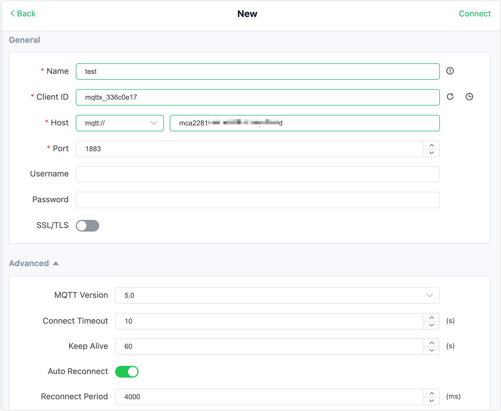

# Integrate with AWS RDS MySQL

AWS RDS (Amazon Relational Database Service) is a managed relational database service provided by Amazon Web Services (AWS). It allows users to easily create, manage, and scale relational databases in the cloud without worrying about the underlying infrastructure operations.


AWS RDS supports multiple database engines, including MySQL, PostgreSQL, Oracle, SQL Server, and Amazon Aurora (a highly compatible database engine with MySQL and PostgreSQL). 

This tutorial introduces how to persist the MQTT data to AWS RDS MySQL by creating a data integration with AWS RDS MySQL in EMQX Cloud. Through the data integration, clients can report the temperature and humidity data to EMQX Cloud using the MQTT protocol, and further store the data in AWS RDS MySQL. In this tutorial, we also demonstrate how to use [MQTTX](https://www.emqx.com/en/products/mqttx) to test the data integration. The tutorial includes the following steps:

1. [Create and Connect to a MySQL DB Instance](#create-and-connect-to-a-mysql-db-instance)
2. [Create MySQL Database and Data Table](#create-mysql-database-and-data-table) 
3. [Create VPC Peering Connection with AWS RDS MySQL](#create-vpc-peering-connection-with-aws-rds-mysql)
3. [Create Data Integration](#create-data-integration)
4. [Use MQTTX to Test Data Integration](#use-mqttx-to-test-data-integration)

::: tip

This data integration feature is not available in the Standard Plan.

:::

## Prerequisites

Before creating the data integration, make sure that you have [created a dedicated deployment](../create/dedicated.md).

For Professional Plan deployment users, you must complete the creation of VPC peering connections first. The IP mentioned in this tutorial refers to the resources' private IP. (If [NAT gateway service](../vas/nat-gateway.md) is enabled, public IP can also be used for the connection.)

## Create and Connect to a MySQL DB Instance

This section describes how to create a MySQL database instance in AWS RDS and use EC2 instance to connect to the DB instance. The basic building block of Amazon RDS is the DB instance. This environment is where you run your MySQL databases.

### Create a MySQL DB Instance

You can refer to step 2 in [Creating and connecting to a MySQL DB instance](https://docs.aws.amazon.com/AmazonRDS/latest/UserGuide/CHAP_GettingStarted.html) for some general instructions, but you also need to refer to the following instructions to configure some settings specific to the data integration with EMQX Cloud.

1. Sign in to the [AWS Management Console](https://console.aws.amazon.com/ec2/), and search for "RDS". 

2. In the upper-right corner of the Amazon RDS console, select the same AWS Region as the region in which you deploy your EMQX Cloud dedicated plan.

3. In the navigation pane, select **Databases**. 

4. Click **Create database** and select **Standard create**. 

5. Select **MySQL** as **Engine Options**.

   

6. Configure the information in the following sections according to your business needs.

   - **Templates**
   - **Availability and durability**
   - **Settings**
   - **Instance configuration**
   - **Storage**

7. Configure the connectivity information. In **VPC security group (firewall)**, you can select **Choose existing** if you already have an existing VPC group or select **Create new**. Enter a name in the **New VPC security group name** textbox.

   This information will be used later for [creating VPC peering connection](#create-vpc-peering-connection). 

   

   

8. Complete the rest of the configrations according to your business needs.

9. Click the **Create database** button at the bottom. 

10. In the **Databases** list, choose the name of the new MySQL DB instance to show its details. When the status changes to **Available**, you can connect to the DB instance.

### Connect to MySQL DB Instance

You need to create an EC2 instance and use the EC2 instance to connect to your AWS RDS MySQL instance. For detailed information, refer to step 1 and step 3 in [Creating and connecting to a MySQL DB instance](https://docs.aws.amazon.com/AmazonRDS/latest/UserGuide/CHAP_GettingStarted.html).

::: tip Note

In the upper-right corner of the Amazon RDS console, you need to select the AWS Region you used for the MySQL DB instance previously. 

:::

## Create MySQL Database and Data Table 

After you connect to the AWS RDS MySQL instance, you need to create an MQTT database and a data table to store the data.

1. Use EC2 to create a database named `mqtt` in the MySQL instance you created previously. 

   ```sql
   CREATE DATABASE emqx;
   USE emqx;
   ```


2. Create a data table named "temp_hum". 

   ```bash
   CREATE TABLE `temp_hum` (
   `id` int(11) unsigned NOT NULL AUTO_INCREMENT,
   `up_timestamp` timestamp NULL DEFAULT NULL,
   `client_id` varchar(32) DEFAULT NULL,
   `temp` float unsigned DEFAULT NULL,
   `hum` float unsigned DEFAULT NULL,
   PRIMARY KEY (`id`),
   KEY `up_timestamp_client_id` (`up_timestamp`,`client_id`)
   ) ENGINE=InnoDB AUTO_INCREMENT=26 DEFAULT CHARSET=utf8mb4;
   ```

## Create VPC Peering Connection with AWS RDS MySQL

By default, EMQX Cloud is deployed in a Virual Private Cloud (VPC), which can not send data to third-party systems over the public network. To enable access to the AWS RDS MySQL database, you need to create the VPC peering connection between EMQX Cloud Console and AWS RDS MySQL . For more information on VPC peering connections, you can refer to [VPC Peering Connections](../deployments/vpc_peering.md).

1. Sign in to [EMQX Cloud Console](https://cloud-intl.emqx.com/console) and go to your deployment. 

2. On the Overview page, scroll down to find **VPC Peering Connection**. Click the **+ VPC Peering Connection** button. 

3. In the pop-up dialog, check the information on **Region of Deployment**, **VPC ID of Deployment**, **CIDR of Deployment**, and **Account ID of EMQX Cloud**. Do not close the dialogue. 
    

4. Go to the AWS Management console, search for "VPC". 

5. On the VPC dashboard, click **Peering Connections** in the navigation pane , and click the **Create peering connection** button. On **Peering connection settings** page, configure the following fields:

   - **Name**: Type the security group name you configured in [Create a MySQL DB Instance](#create-a-mysql-db-instance).

   - **VPC ID (Requester)**: The local VPC ID refers to the VPC to which AWS RDS MySQL belongs. Select the VPC you configurated in [Create a MySQL DB Instance](#create-a-mysql-db-instance). You can view the information on your database details page.

     

   - **Account**: Select `Another account`.

   - **Account ID**: Fill in the account ID of EMQX Cloud, the same as the `Account ID of EMQX Cloud` in step 1.

   - **Region**: Select `This region (us-west-2)`.

   - **VPC (Accepter)**: Fill in the `VPC ID of Deployment` in step 1.

   After you complete the settings, click the **Create Peering Connection** button.

   

6. The following details page will be displayed once the peering connection is created. Save the information of **Peering connection ID** and **Requester VPC** for later use.
   

7. Return to EMQX Cloud Console, fill in the information saved in step 3, and click the **Confirm** button to complete the peering connection creation.

   - **Peering ID**: Fill in the `Peering connection ID`.
   - **VPC ID**: Fill in the `Requester VPC`.

   

   Make sure that the status of the VPC Peering Connection is running.

    

8. Return to AWS console VPC dashboard. Click **Route tables** in the navigation pane. 

9. Click the Route table ID of the corresponding VPC. Click **Edit routes** to add the `CIDR of deployment` saved in step 1 to the route table. Select `peer connection` as **Target**.

   

10. Go to **Security** -> **Security Groups**, click the Security group ID of your database you configured in [Create a MySQL DB Instance](#create-a-mysql-db-instance). You can find the information on your database details page.

11. Click **Edit inbound rule** -> **Add rule** to add a new rule. <!-- 如何选这些选项？这一步的目的？--> 

     - **Type**: Select `All TCP`.
     - **Source**: Enter EMQX Cloud CIDR of deployment `10.31.70.0/24`.

     

## Create Data Integration

This section introduces how to create a data integration with AWS RDS MySQL in EMQX Cloud Console, inculding creating a MySQL resource to connect to, creating a rule which determines how messages are forwarded to MySQL database and creating an action corresponding to the rule.

### Create MySQL Resource

1. Go to your deployment in EMQX Cloud Console, and click **Data Integrations** on the left navigation menu.

2. Click **MySQL** under the **Data Persistence**. 

    

3. Fill in the connection information of MySQL database.

   - **MySQL Server**: Enter the Endpoint information of your AWS RDS MySQL database. You can view the information on your database details page.

     

   - **MySQL Database**: Enter the name of the database you created in [Create MySQL Database and Data Table](#create-mysql-database-and-data-table).

   - **MySQL User Name**: Enter the login ID for the master user of your database you configured previously.

   - Leave other options as default.

    Click **Test** to test the connection.

    

4. Click **New** to create MySQL resource. Under the **Configured Resources**, you can see a new MySQL resource is created.

### Create a Rule and Action

EMQX Cloud provides a powerful [rule engine](./rules.md) that can transform, and enrich the raw MQTT message, and then send the processed message to the third-party systems. 

1. Under **Configured Resources**, click **New Rule** for the MySQL resource.

   

2. On the **New Rule** page, enter the following SQL statement in **SQL**. The rule used in this demonstration will read the messages from the `temp_hum/emqx` topic and enrich the JSON object by adding client_id, topic, and timestamp info. 

   - `up_timestamp`: the time when the message is reported
   - `client_id`: the ID of the client that publishes the message
   - `temp`: the temperature data in the message payload
   - `Hum`: the humidity data in the message payload

   ```sql
   SELECT 
   timestamp AS up_timestamp, 
   clientid AS client_id,
   payload.temp AS temp, 
   payload.hum AS hum 
   FROM 
   "temp_hum/emqx"
   ```

   For example, here is the raw JSON you send to the topic:

   ```json
   {"temp": 18, "hum": 56}
   ```

   You can enable **SQL Test** by clicking the toggle switch to test the rule and see the results. 

   

   

2. Click the **Next** button at the bottom to create an action. 

   - **Resources**: Select the MySQL resource created in [Create MySQL Resource](#create-mysql-resource).

   - **Action Type**: Select `Data Persistence - Data to MySQL`.

   - **SQL Template**: Enter the following data to insert into the SQL template.

     ```sql
     INSERT INTO temp_hum(up_timestamp, client_id, temp, hum) VALUES (FROM_UNIXTIME(${up_timestamp}/1000), ${client_id}, ${temp}, ${hum}) 
     ```

   Leave other options as default. Click **Add**.

   

4. Click **Confirm**. Now the rule and action for the data integration with MySQL are created. You can see the data integration works from rule details page. 


All the MQTT messages sent to the `temp_hum/emqx` topic will be persisted into your MySQL database.

## Use MQTTX to Test Data Integration

The demonstration in this section simulates temperature and humidity data and reports these data to EMQX Cloud via the MQTTX and then uses the EMQX Cloud Data Integrations to save the data into your MySQL database. 

1. Click **New Connection** on MQTTX to connect to the EMQX Cloud deployment. Fill the connection information:

   - **Name**: Connection name. Use whatever name you want. In this demonstration, `test` is used.
   - **Host**: The MQTT broker connection address. You can get it from the EMQX Cloud overview page.
   - **Port**: MQTT broker connection port. You can get it from the EMQX Cloud overview page.
   - **Username/Password**: Use the credential when you created the deployment.

   Leave other fileds as default. Click the **Connect** button on top right and the connection should be established.

   

2. Send messages to EMQX Cloud. Set payload format to `JSON`. Set topic to `temp_hum/emqx` (the topic we just set in the rule). Enter the following JSON body in payload:

   ```json
   {"temp": 20.1, "hum": 57}
   ```

   Click the send button on the right. You can change the temperature value and send more data to EMQX Cloud. 

   The data sent to EMQX Cloud should be processed by the rule engine and inserted into MySQL automatically.

    

3. Check the rule monitoring and the number of success should be increased.

   

4. Check the data persisted into the AWS RDS MySQL database `mqtt` using EC2. There should be data inserted to the table `temp_hum`.

 