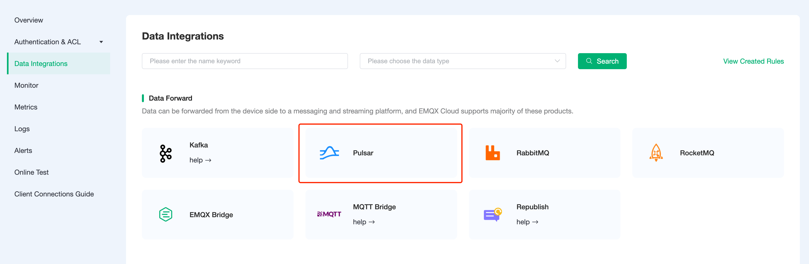
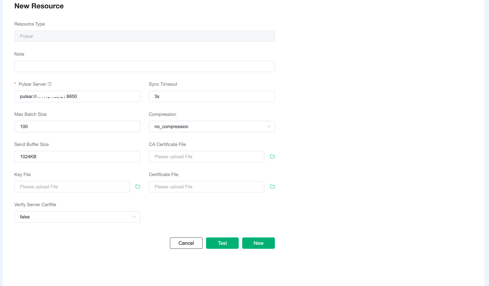
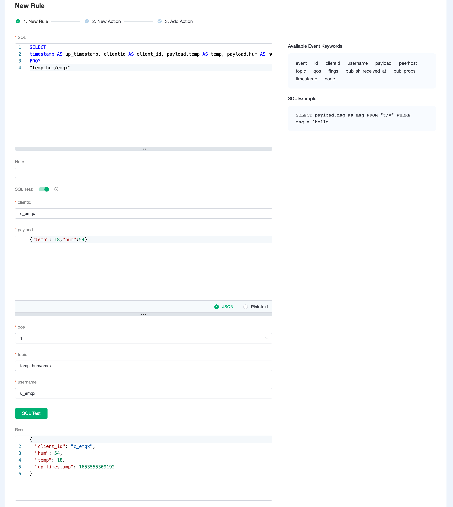
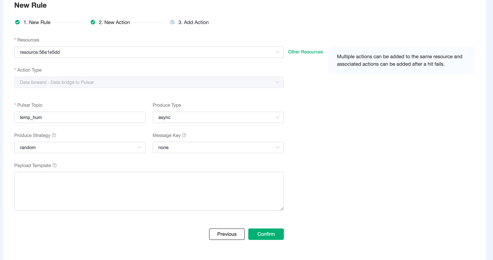
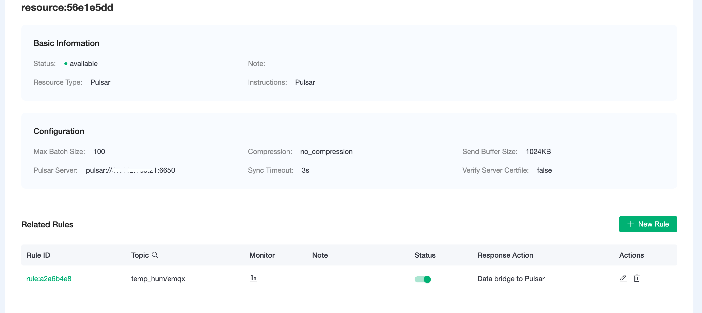
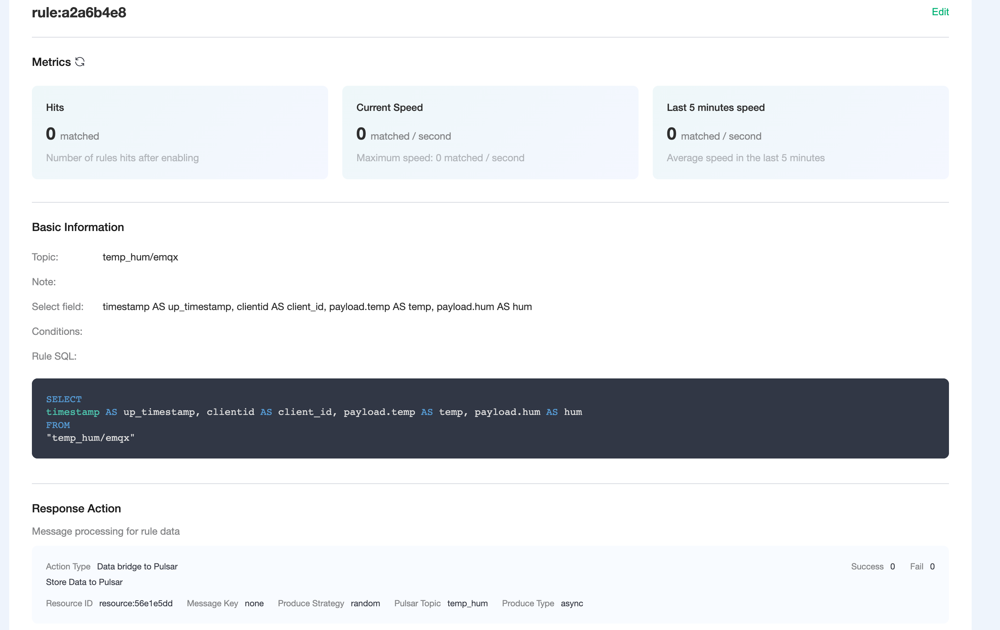
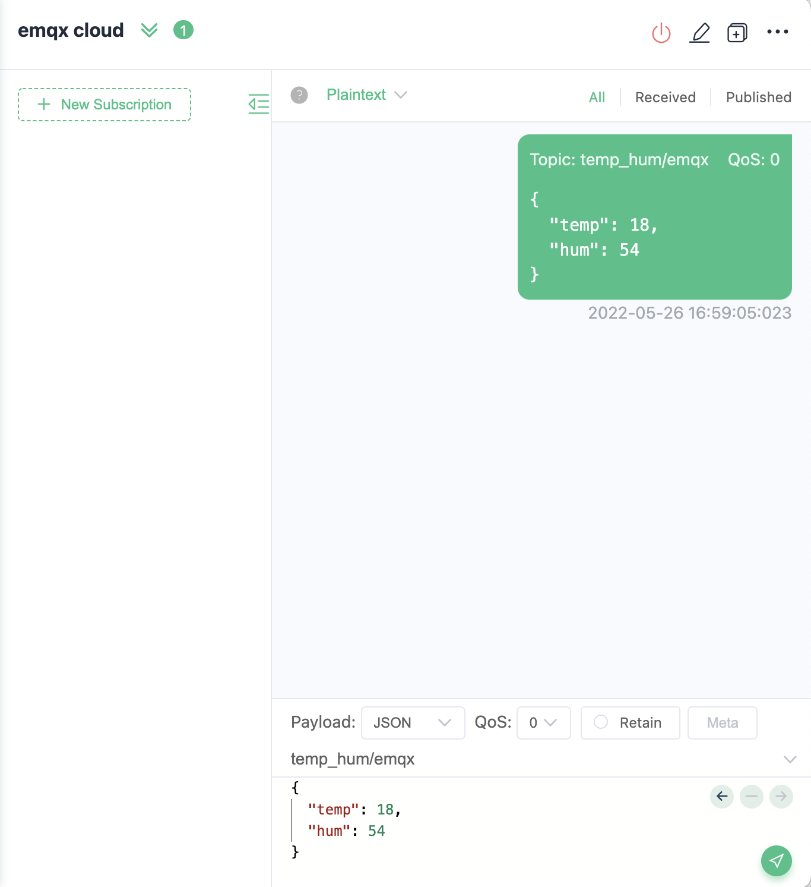
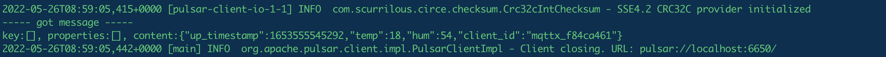

# Bridge device data to Pulsar using the Data Integrations

In this article, we will simulate the temperature and humidity data, and report these data to EMQX Cloud via the MQTT protocol, and then we will use EMQX Cloud Data Integrations to bridge the data to Pulsar.

Before you start, you will need to complete the following:

* A deployment (EMQX Cluster) has been created on EMQX Cloud.

* For professional deployment users: please complete the creation of a [VPC Peering Connections](../deployments/vpc_peering.md) connection first. All IPs mentioned below refer to the resource's intranet IP.

## Pulsar Configuration

1. Install Pulsar with Docker

   ```shell
   docker run -d \
     --name pulsar \
     -p 6650:6650 \
     -p 8080:8080 \
     -v $PWD/data:/pulsar/data \
     apachepulsar/pulsar:latest \
     bin/pulsar standalone
   ```
2. Start consume

   ```shell
   docker exec -it pulsar bash bin/pulsar-client consume temp_hum -s sub
   ```

## Data Integrations Configuration

Go to Deployment Details and click on `Data Integrations` on the left menu bar.

1. Create Pulsar Resource

   Click on `Pulsar` under the Data Persistence.

   

   Fill in the information of the pulsar you have just created and click `Test`. If there is an error, you should check if the configuration is correct. Then click on `New` to create Pulsar resource.

   

2. Create Rule

   Choose the Pulsar resource under Configured Resources, click on `New Rule` and enter the following rule to match the SQL statement. In the following rule, we read the time when the message was reported `up_timestamp`, client ID, payload via `temp_hum/emqx` topic. Also, we can read temperature and humidity from this topic.

   ```sql
   SELECT
   TIMESTAMP AS up_timestamp, clientid AS client_id, payload.temp AS temp, payload.hum AS hum  
   FROM
   "temp_hum/emqx"
   ```

   You can use `SQL Test` to see the result

   


3. Add Action

   Click on the Next action in the bottom to enter action view. Select the resource created in the first step, select `Data forward - Data bridge to Pulsar` as Action Type, and setup Pulsar Topic to `temp_hum`.

   
   Click on `Confirm` to create action.

4. View Resource Detail

   Click on the resource to see the detail.

   


5. Check Rules Monitoring

   Click the monitor icon of rule to see the metrics

   

## Test

1. Use [MQTT X](https://mqttx.app/) to simulate reporting temperature and humidity data

   You need to replace broker.emqx.io with the deployment [connection address](../deployments/view_deployment.md) you have created and add the [client-side authentication information](../deployments/auth.md) in the EMQX Dashboard.
   
    - topic: `temp_hum/emqx`
    - payload:
      ```json
      {
         "temp": 18,
         "hum": 54
      }
      ```

2. View data bridge results

   We can see the pulsar consume has already got message.

   
