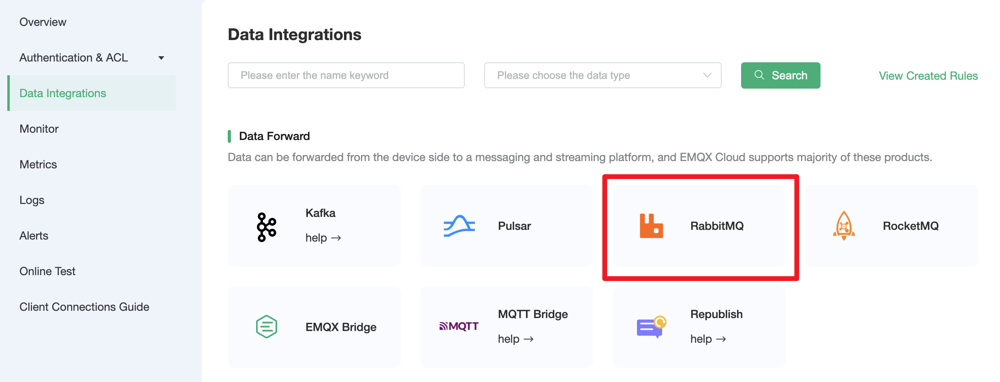
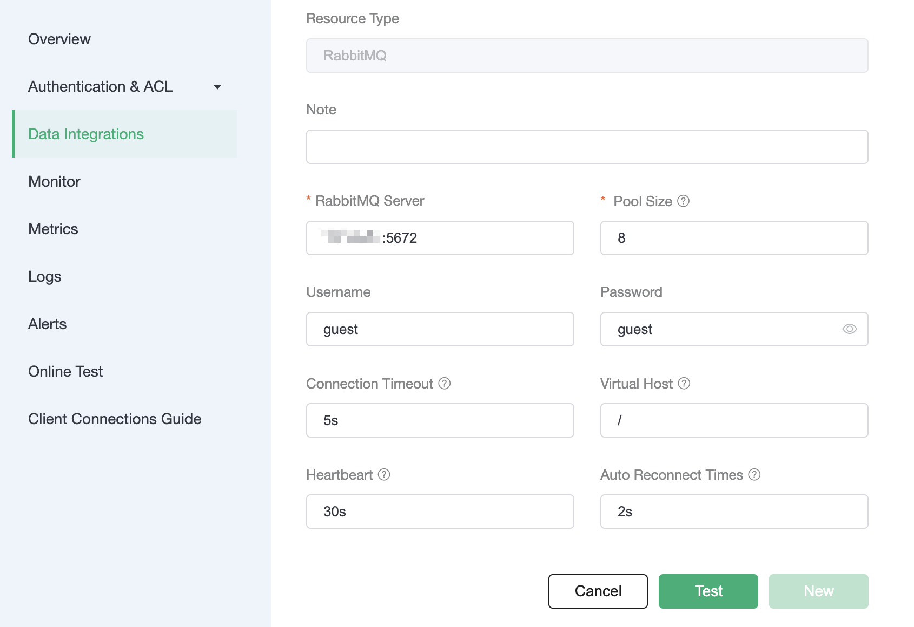
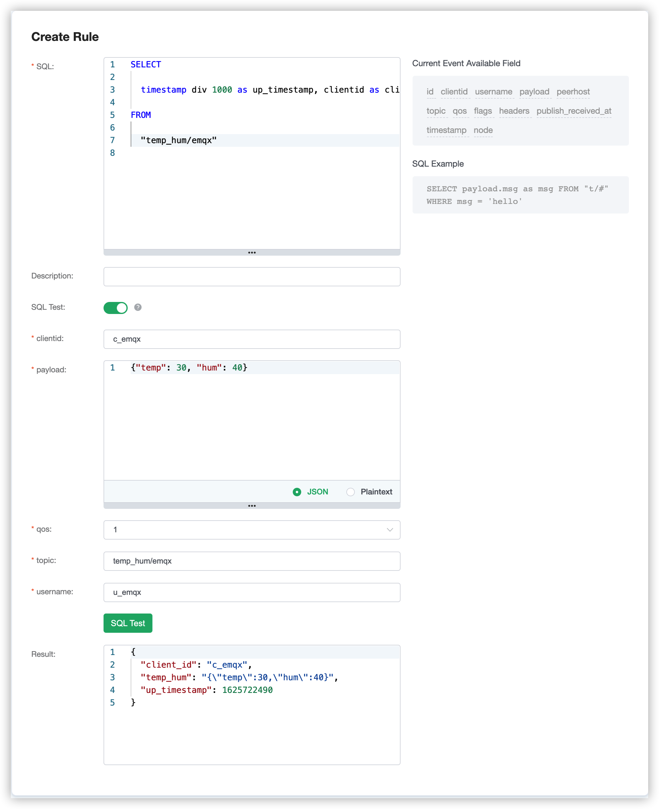
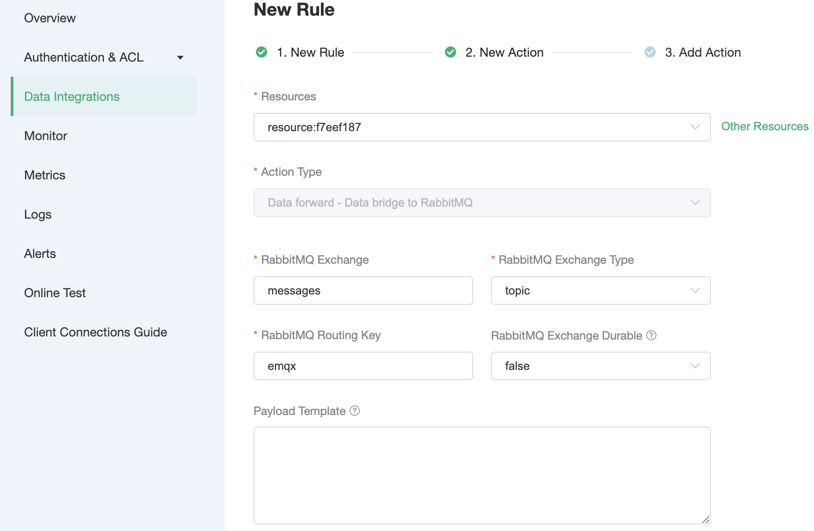
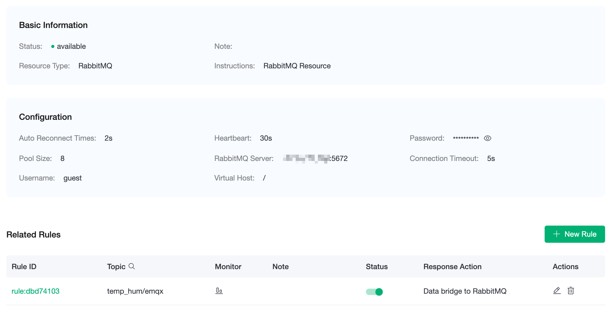
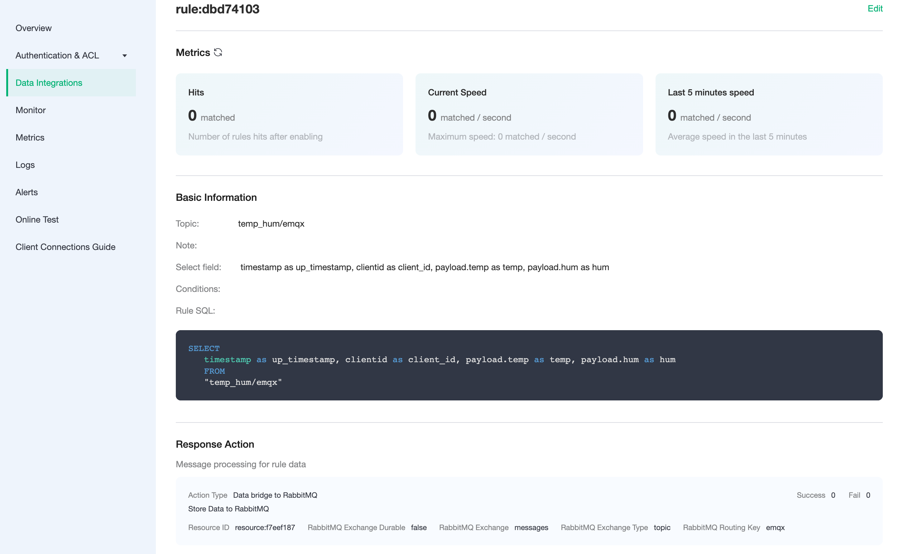
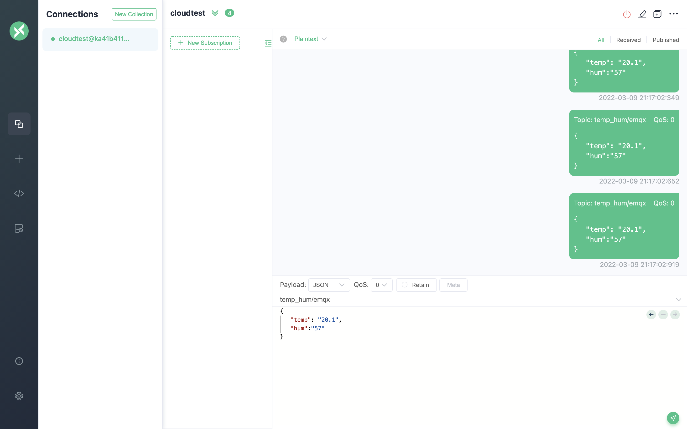
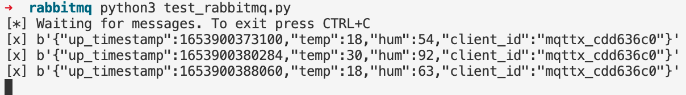

# Bridge device data to RabbitMQ using the Data Integrations

::: warning Note
This feature is available in Professional Plan.
:::

In this article, we will simulate the temperature and humidity data, and report these data to EMQX Cloud via the MQTT protocol, and then we will use EMQX Cloud Data Integrations to bridge the data to RabbitMQ.

Before you start, you will need to complete the following:

* A deployment (EMQX Cluster) has been created on EMQX Cloud.

* For Professional Plan users: Please complete [Peering Connection Creation](../deployments/vpc_peering.md) first, all IPs mentioned below refer to the internal network IP of the resource.(Professional Plan with a [NAT gateway](../vas/nat-gateway.md) can also use public IP to connect to resources)

## RabbitMQ Configuration
1. RabbitMQ installation

   ```bash
   docker run -d \
     --hostname my-rabbit \
     --name some-rabbit \
     -p 5672:5672 \
     rabbitmq:3
   ```

## EMQX Cloud Data Integration Configuration

Go to Deployment Details and click on `Data Integrations` on the left menu bar.

1. Create resources
   Click on `RabbitMQ` under the Data Forward.

   

   Fill in the information about the RabbitMQ you just created and click Test, if there is an error you should configure it correctly in time. Then click on `New` to create RabbitMQ resource.

   

2. Create a rule

   Choose the RabbitMQ resource under Configured Resources, click on `New Rule` and enter the following rule to match the SQL statement. In the following rule, we read the time when the message was reported `up_timestamp`, client ID, payload via `temp_hum/emqx` topic. Also, we can read temperature and humidity from this topic.

   ```sql
   SELECT
   timestamp as up_timestamp, clientid as client_id, payload.temp as temp, payload.hum as hum
   FROM
   "temp_hum/emqx"
   ```

   You can use `SQL Test` to see the result

   

3. Add Action

   Click on the Next action in the bottom to enter action view. Select the resource created in the first step, select `Data forward - Data bridge to RabbitMQ` as Action Type, and setup the following parameters.

   - RabbitMQ Exchange: `messages`
   - RabbitMQ Exchange Type: `topic`
   - RabbitMQ Routing Key: `emqx`

   

4. View resource details

   Click on the resource to see the detail.
   
   

5. View rule details

   Click the monitor icon of rule to see the metrics

   

## Testing

1. use [MQTT X](https://mqttx.app/) to simulate temperature and humidity data reporting

   You need to replace broker.emqx.io with the created deployment connection address, and add client authentication information.
    - topic: `temp_hum/emqx`
    - payload:
      ```json
      {
        "temp": 18,
        "hum": 54
      }
      ```

   
2. Viewing data bridging results

   Use a Python client to consume the messages

   ```python
   # Import the pika library
   import pika

   # Create a connection
   connection = pika.BlockingConnection(
       pika.ConnectionParameters(host='RabbitMQ server public ip')
   )
   channel = connection.channel()

   # Create an exchange named messages
   channel.exchange_declare(exchange='messages', exchange_type='topic')

   # Bind exchange and queue, and specify routing_key
   result = channel.queue_declare(queue='test_queue', exclusive=True)
   queue_name = result.method.queue
   channel.queue_bind(exchange='messages', queue=queue_name, routing_key='emqx')

   # Define a callback function to handle the incoming messages
   def callback(ch, method, properties, body):
       print("[x] %r" % body)

   # Define a consumer that receives messages from the queue
   channel.basic_consume(
       queue=queue_name, on_message_callback=callback, auto_ack=True
   )

   print('[*] Waiting for messages. To exit press CTRL+C')
   channel.start_consuming()
   ```

   
