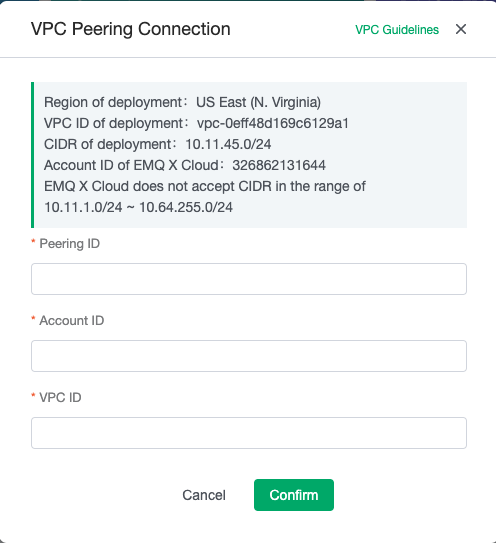
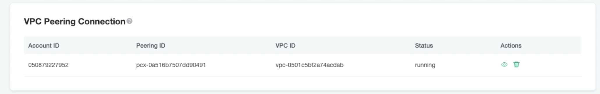
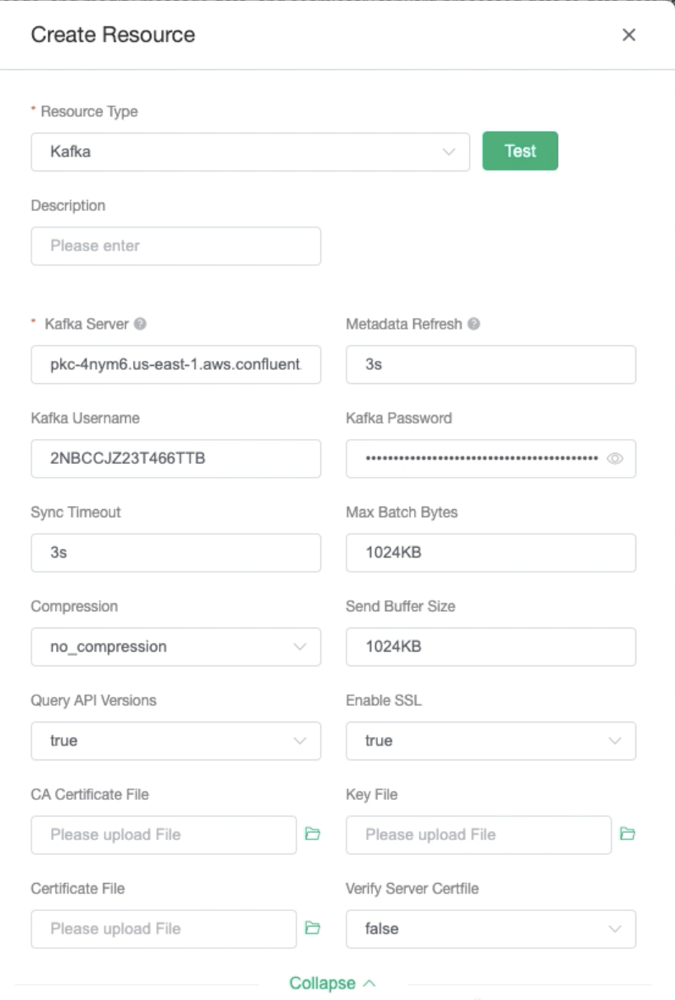
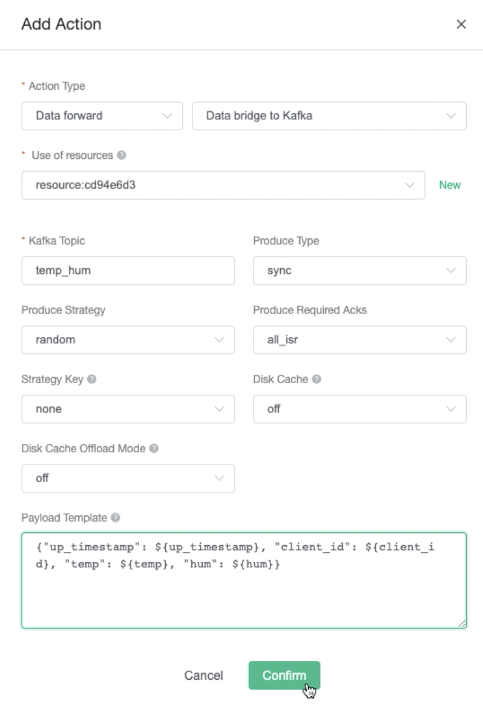
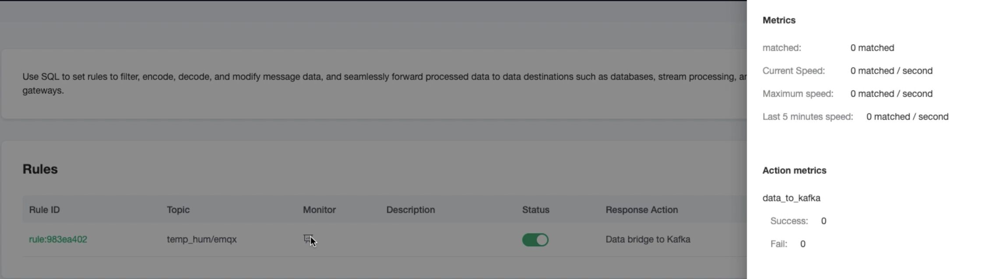

# Bridge device data to Confluent Cloud using the Rule Engine

In this article, we will simulate temperature and humidity data and report these data to EMQ X Cloud via the MQTT protocol and then use the EMQ X Cloud rules engine to dump the data into Confluent Cloud.

Before you start, you need to complete the following operations:
* Deployments have already been created on EMQ X Cloud (EMQ X Cluster).
* This feature is available for professional deployment
* There are three types of Confluent Cloud cluster you could choose:
  * For basic and standard cluster, please open the NAT first.
  * For dedicated cluster, please complete [Peering Connection Creation](../deployments/vpc_peering.md) first, all IPs mentioned below refer to the intranet IP of the resource.


  <div style="position: relative; padding: 30% 45%;">
  <iframe style="position: absolute; width: 100%; height: 100%; left: 0; top: 0;" src="https://www.youtube.com/embed/jLn0q8xf-1Y" title="YouTube video player" frameborder="0" allow="accelerometer; autoplay; encrypted-media; gyroscope; picture-in-picture" allowfullscreen></iframe>
  </div>


## Confluent Cloud Configuration

### Create a cluster

*  Login to the Confluent Cloud console and create a cluster.
*  At this time, we select the dedicated cluster as an example.

   

*  Select region/zones (make sure the deployment region matches the region of the Confluent Cloud)

   

*  Select VPC Peering for the networking so this cluster could be accessed only by vpc peering connection. 

   

*  Specify a CIDR block for the cluster and click `Conttinue`

*  Based on your needs, choose the way to manage the encryption key
   
   

*  After binding the card, you are ready to launch the cluster

### Manage the cluster using Confluent Cloud CLI

Now that you have a cluster up and running in Confluent Cloud， you can manage it using the Confluent Cloud CLI. Here are some basic commands that you could use with Confluent Cloud CLI.

#### Install the Confluent Cloud CLI

```bash
curl -L --http1.1 https://cnfl.io/ccloud-cli | sh -s -- -b /usr/local/bin
```

If you already have the CLI installed, you could update it by:

```bash
ccloud update
```

#### Log in to your account

```bash
ccloud login --save
```

#### Select the environment

```bash
ccloud environment use env-v9y0p
```

#### Select the cluster

```bash
ccloud kafka cluster use lkc-djr31
```

#### Use an API key and secret

If you have an existing API key that you'd like to use, add it to the CLI by:

```bash
ccloud api-key store --resource lkc-djr31
Key: <API_KEY>
Secret: <API_SECRET>
```

If you don't have the API key and secret, you can create one by:

```bash
ccloud api-key create --resource lkc-djr31
```

After add them to teh CLI, you could use the API key and secret by:

```bash
ccloud api-key use "API_Key" --resource lkc-djr31
```

#### Create a topic

```bash
ccloud kafka topic create topic-name
```

You could check the topic list by:

```bash
ccloud kafka topic list
```

#### Produce messages to the topic

```bash
ccloud kafka topic produce topic-name
```

#### Consume messages from the topic

```bash
ccloud kafka topic consume -b topic-name
```

### Build VPC Peering Connection with the deployment

After the cluster has been created, we should add peering

*  Go to the `Networking` section of the `Cluster settings` page and click on the `Add Peering` button.

   

*  Fill in the vpc information. (You could get the information from `VPC Peering` section of the deployment console)
   
   
   
   

*  When the connection status is `Inactive`, go back to the deployment console to accept the peering request. Fill in the vpc information of the confluent cloud cluster and click `Confirm`. When the vpc status turns to `running`, you successfully create the vpc peering connection. 

   
   
   
   

## EMQ X Cloud rule engine configuration

Go to the `Rule Engine` page

1. Create a new resource

   Click on the `+ New`  button in the `Resources` section and select `Kafka` as the resource type. Fill in the Conflent Cloud information you have just created and click Test. If you get an error, instantly check that the database configuration is correct.
   

2. Create a new rule

   Click on the `+ New`  button in the `Rules` section. Enter the following rule to match the SQL statement.  In the following rule we read the time `up_timestamp` when the message is reported, the client ID, the message body (Payload) from the `temp_hum/emqx` topic and the temperature and humidity from the message body respectively.

   ```sql
   SELECT 
   
   timestamp as up_timestamp, clientid as client_id, payload.temp as temp, payload.hum as hum
   
   FROM
   
   "temp_hum/emqx"
   ```
   

3. Create a response action 
   
   Click on the `Add Action` toward the bottom of the page and select action type as `Data Forwarding` and `Bridge Data to Kafka`. Select the resource created in the first step and fill in the following data:

   Kafka topic: emqx
   Message content template:
   
   ```
   {"up_timestamp": ${up_timestamp}, "client_id": ${client_id}, "temp": ${temp}, "hum": ${hum}}
   ```
   

5. View rules monitoring
   
   Go back to the `Rule Engine` page to monitor the rule
   

## Test

1. Use [MQTT X](https://mqttx.app/) to simulate temperature and humidity data reporting

   You need to replace broker.emqx.io with the created deployment [connection address](../deployments/view_deployment.md), and add [client authentication information](../deployments/auth.md) to the EMQ X Dashboard.
   
   
2. View data dump results

    ```bash
    # Go to the Kafka instance and view the temp_hum topic
    ccloud kafka topic consume -b temp_hum
    ```
   
