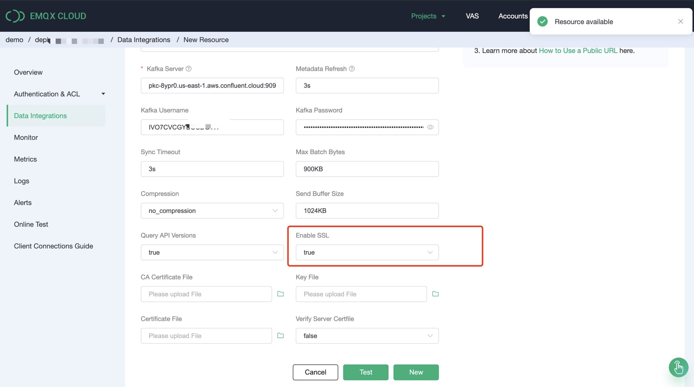
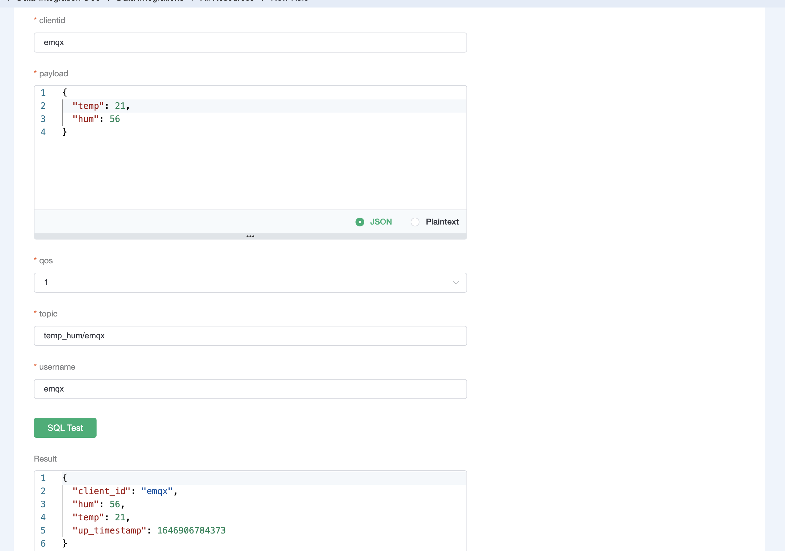
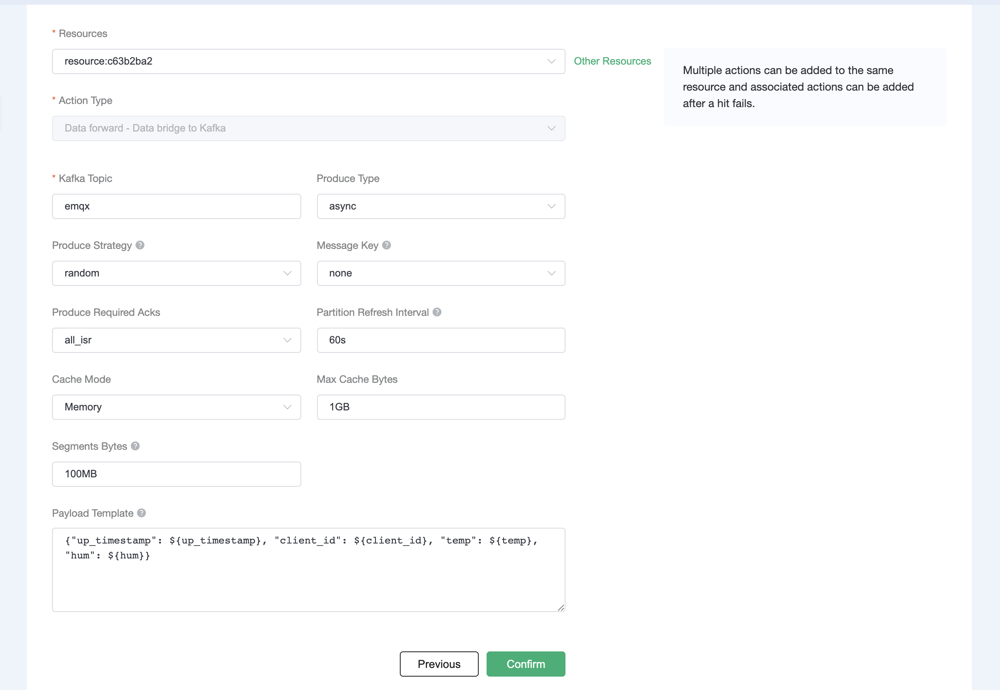
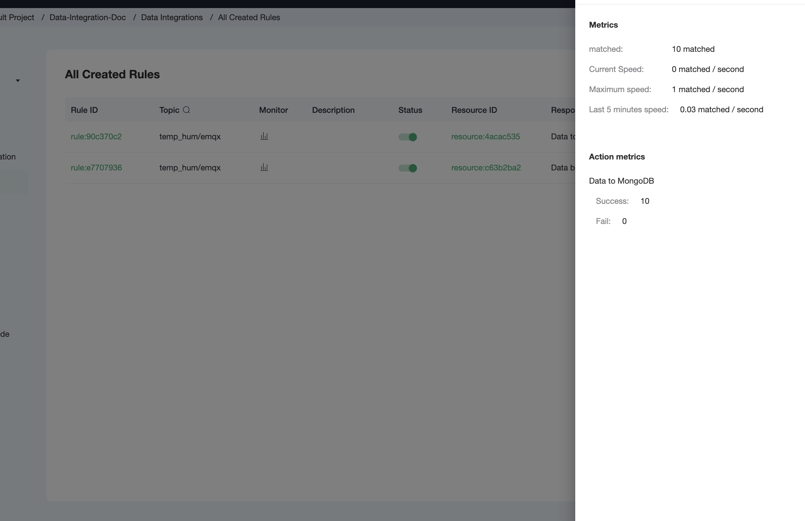

# Integrate with Confluent Cloud

Confluent Cloud is a fully-managed events streaming platform based on on Apache Kafka, delivered as a fully managed service. This tutorial introduces how to stream the MQTT data to Confluent Cloud by creating a data integration with Confluent Cloud in EMQX Cloud. Through the data integration, clients can report the temperature and humidity data to EMQX Cloud using the MQTT protocol and stream the data into Confluent Cloud. This tutorial also demonstrates how to use [MQTTX](https://www.emqx.com/en/products/mqttx) to test the data integration.

## Prerequisites

Before you start, you must complete the following operations:

- Create a deployment (EMQX Cluster) on EMQX Cloud.
- For Professional Plan deployment users, you must complete the creation of VPC peering connections first. The IP mentioned in this tutorial refers to the resources' private IP. (If [NAT gateway service](../vas/nat-gateway.md) is enabled, public IP can also be used for the connection.)
- For BYOC Plan users, you must establish a peering connection between the VPC where BYOC is deployed and the VPC where the resources are located. All IPs mentioned below refer to the internal IP of the resources. If you need to access the resources via public IP addresses, please configure a NAT gateway in your public cloud console for the VPC where BYOC is deployed.


## Set Up Confluent Cloud Clusters

There are 4 types of clusters. Each of them has different network access. You can check [Confluent Doc](https://docs.confluent.io/cloud/current/networking/overview.html#cloud-networking-support-public) to learn more background knowledge.


Different types of clusters require different network environments for deployment. 

| Feature            | Basic | Standard | Enterprise | Dedicated |
| ------------------ | ----- | -------- | ---------- | --------- |
| Public networking  | YES   | YES      | NO         | YES       |
| Private networking | NO    | NO       | YES        | YES       |

The following sections demonstrate how to set up a Confluent Cloud cluster in public networking and private networking.


### Set Up a Cluster in Public Networking
If you have or want to create Confluent Basic / Standard / Dedicated clusters, you can set up public networking solutions.

#### Create a Cluster

1. Login to the Confluent Cloud console and create a cluster. In this demo, you can select Basic cluster as an example, and click **Begin Configuration**.

2. Select region/zones. Considering the latency, it is recommended that the EMQX Cloud deployment region matches the region of the Confluent Cloud. Click **Continue**.

  

3. Enter your cluster name and click **Launch cluster**. Now you have a running cluster in the cloud.

#### Create a topic

1. From the navigation menu, click **Topics**, and then click **Create topic**.
2. In the **Topic name** field, type `emqx` and then select **Create with defaults**.


#### Create API Key

1. From the navigation menu, click **API Keys**, and then click **Add key**.

2. Select scope for API Key. You can select `Global access`, then click **Next**.

3. Create API Key and download the key for later configuration. 


#### Enable NAT Gateway in EMQX Cloud

1. Login to EMQX Cloud console, and enter the deployment Overview page.

2. Click the **NAT Gateway** tab on the lower section of the page, and click **Subscribe Now**. Learn more about [NAT Gateway](../vas/nat-gateway.md).


In the above steps, we have completed the prerequisite settings of public networking.


### Sep Up a Cluster in Private Networking

If you have or want to create Confluent Enterprise / Didicated clusters, you can set up private networking solutions.

1. Login to the Confluent Cloud console and create a cluster. In this demo, you can select Dedicated cluster as an example, and click **Begin Configuration**.

2. Select region/zones. Make sure the EMQX Cloud deployment region matches the region of the Confluent Cloud. Click **Continue**.

  

3. Select **VPC Peering** for Networking so this cluster can be accessed only by VPC peering
    connection. Specify a CIDR block for the cluster and Click **Continue**.

  

4. Select the way to manage the encryption key based on your needs and click **Continue**.

  

5. After binding the card, you are ready to launch the cluster.

#### Manage the Cluster Using Confluent Cloud CLI

Now that you have a cluster up and running in Confluent Cloud, you can manage it using the Confluent Cloud CLI. Here are some basic commands that you could use with Confluent Cloud CLI.

**Install the Confluent Cloud CLI**

```bash
curl -sL --http1.1 https://cnfl.io/cli | sh -s -- -b /usr/local/bin
```

If you already have the CLI installed, you could update it by:

```bash
confluent update
```

**Log in to your account**

```bash
confluent login --save
```

**Select the environment**

```bash
confluent environment use env-xxxxx
```

**Select the cluster**

```bash
confluent kafka cluster use lkc-xxxxx
```

**Use an API key and secret**

If you have an existing API key that you'd like to use, add it to the CLI by:

```bash
confluent api-key store --resource lkc-xxxxx
Key: <API_KEY>
Secret: <API_SECRET>
```

If you don't have the API key and secret, you can create one by:

```bash
confluent api-key create --resource lkc-xxxxx
```

After adding them to the CLI, you could use the API key and secret by:

```bash
confluent api-key use "API_Key" --resource lkc-xxxxx
```

**Create a topic**

```bash
confluent kafka topic create <topic-name>
```

You can check the topic list by:

```bash
confluent kafka topic list
```

**Produce messages to the topic**

```bash
confluent kafka topic produce <topic-name>
```

**Consume messages from the topic**

```bash
confluent kafka topic consume -b <topic-name>
```

#### Establish VPC Peering Connection with EMQX Cloud Deployment

After you create the cluster, you need to add peering in Confluent Cloud console.

1. From the navigation menu, click **Cluster settings**, and then click the **Networking** tab. Click the **Add Peering** button.

  

2. Enter the vpc information. You can get the information from the **VPC Peering Connection** section on the deployment Overview page of your deployment on the EMQX Cloud console. Click the **Save** button.

  

  

3. Check the VPC Peering Connection status.
   - If the connection status is `Inactive`, go to the Cloud deployment to accept the peering request. Enter the vpc information of the confluent cloud cluster and click **Confirm**. 
   - When the vpc status turns to `running`, you successfully create the vpc peering connection.

  


In the above steps, we have completed the prerequisite settings of private networking.

## Create Confluent Cloud Data Integration

1. In the EMQX Cloud console, click **Data Integrations** from the navigation menu in your deployment and click **Confluent**.

   


2. Enter the information in **Endpoints** on the Confluent cluster settings page to the **Bootstrap Server**. Enter the key and secret generated in [Create API Key](#create-api-key) in **Key** and **Secret** fields. Click **Test** to verify the connection to the Confluent server.
   

3. Click **New** to create a Confluent resource. Under the **Configured Resources**, you can see a new Confluent resource is created.


4. Create a new rule. Enter the following SQL statement in the **SQL** input field. The rule used in this demonstration will read the messages from the `temp_hum/emqx` topic and enrich the JSON object by adding client_id, topic, and timestamp info. 

   - `up_timestamp`: the time when the message is reported
   - `client_id`: the ID of the client that publishes the message
   - `temp`: the temperature data in the message payload
   - `Hum`: the humidity data in the message payload

   ```sql
SELECT 
   timestamp as up_timestamp, 
   clientid as client_id, 
   payload.temp as temp,
   payload.hum as hum
   FROM
   "temp_hum/emqx"
   ```
   
   

5. Test the SQL rule by entering the test payload, topic, and client information, and click **SQL Test**. If you see the results like the following, it means the SQL test succeeds.

   

6. Click **Next** to add an action to the rule. Select `Data forward - Data bridge to Kafka from the **Action Type** drop-down list. Use the following Kafka topic and message template. Click **Confirm**.

   ```bash
   # kafka topic
   emqx
   
   # kafka message template 
   {"up_timestamp": ${up_timestamp}, "client_id": ${client_id}, "temp": ${temp}, "hum": ${hum}}
   ```

   

7. After successfully binding the action to the rule, you can click **View Details** to see the rule sql statement and the bound actions.

   

8. To see the created rules, click the **View Created Rules** button on the Data Integrations page. Click the icon in the **Monitor** column to see the detailed metrics of the rule and action.

   

## Test Data Bridge 

1. Use [MQTTX](https://mqttx.app/) to simulate temperature and humidity data reporting.

   You need to enter the deployment connection address and add client authentication information for connecting to the EMQX Dashboard.
   

2. View data bridge results using the Confluent command.

   ```bash
   # Go to the confluent peering server and view the emqx topic
   confluent kafka topic consume -b emqx
   ```

   

3. View data in Confluent Console. 

   
