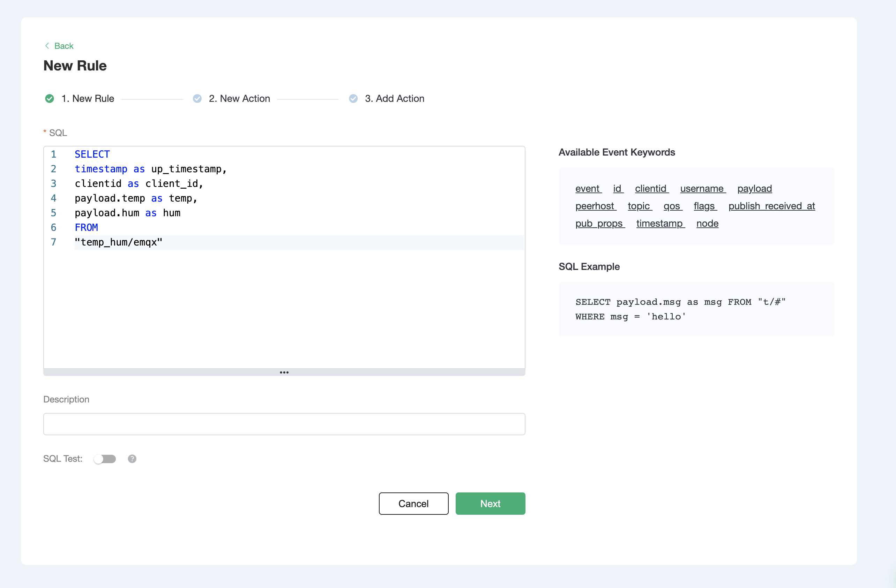
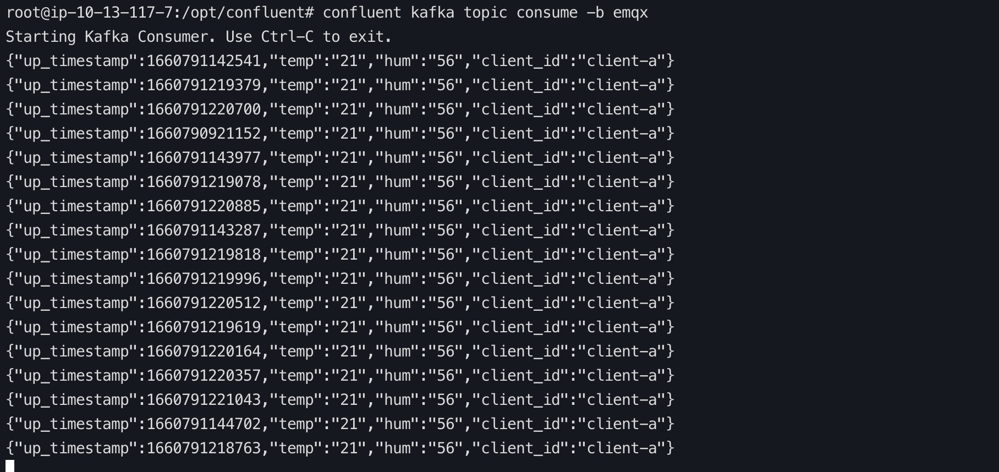

# Integrate with Confluent Cloud

In this article, we will simulate temperature and humidity data and report these data to EMQX Cloud via the MQTT protocol and then use the EMQX Cloud Data Integrations to bridge the data into Confluent Cloud.

Before you start, you need to complete the following operations:

- Deployments have already been created on EMQX Cloud (EMQX Cluster).
- For Professional Plan users: Please complete [Peering Connection Creation](../deployments/vpc_peering.md) first, all IPs mentioned below refer to the internal network IP of the resource.(Professional Plan with a [NAT gateway](../vas/nat-gateway.md) can also use public IP to connect to resources)

  <LazyIframeVideo vendor="youtube" src="https://www.youtube.com/embed/jLn0q8xf-1Y/?autoplay=1&null" />

## Confluent Cloud Configuration

### Create a cluster

* Login to the Confluent Cloud console and create a cluster.
* At this time, we select the dedicated cluster as an example.

  

* Select region/zones (make sure the deployment region matches the region of the Confluent Cloud)

  

* Select VPC Peering for the networking so this cluster could be accessed only by vpc peering
  connection.

  

* Specify a CIDR block for the cluster and click `Conttinue`

* Based on your needs, choose the way to manage the encryption key

  

* After binding the card, you are ready to launch the cluster

### Manage the cluster using Confluent Cloud CLI

Now that you have a cluster up and running in Confluent Cloud， you can manage it using the Confluent Cloud CLI. Here are some basic commands that you could use with Confluent Cloud CLI.

#### Install the Confluent Cloud CLI

```bash
curl -sL --http1.1 https://cnfl.io/cli | sh -s -- -b /usr/local/bin
```

If you already have the CLI installed, you could update it by:

```bash
confluent update
```

#### Log in to your account

```bash
confluent login --save
```

#### Select the environment

```bash
confluent environment use env-xxxxx
```

#### Select the cluster

```bash
confluent kafka cluster use lkc-xxxxx
```

#### Use an API key and secret

If you have an existing API key that you'd like to use, add it to the CLI by:

```bash
confluent api-key store --resource lkc-xxxxx
Key: <API_KEY>
Secret: <API_SECRET>
```

If you don't have the API key and secret, you can create one by:

```bash
confluent api-key create --resource lkc-xxxxx
```

After add them to teh CLI, you could use the API key and secret by:

```bash
confluent api-key use "API_Key" --resource lkc-xxxxx
```

#### Create a topic

```bash
confluent kafka topic create <topic-name>
```

You could check the topic list by:

```bash
confluent kafka topic list
```

#### Produce messages to the topic

```bash
confluent kafka topic produce <topic-name>
```

#### Consume messages from the topic

```bash
confluent kafka topic consume -b <topic-name>
```

### Build VPC Peering Connection with the deployment

After the cluster has been created, we should add peering

* Go to the `Networking` section of the `Cluster settings` page and click on the `Add Peering`
  button.

  

* Fill in the vpc information. (You could get the information from `VPC Peering` section of the
  deployment console)

  

  

* When the connection status is `Inactive`, go back to the deployment console to accept the peering request. Fill in the vpc information of the confluent cloud cluster and click `Confirm`. When the vpc status turns to `running`, you successfully create the vpc peering connection.

  


## Deployment Data Integrations Configuration

Go to the `Data Integrations` page

1. Create kafka resources and verify that they are available.

   On the data integration page, click kafka resources, fill in the kafka connection details, and then click test. Please check the kafka service if the test fails.
   

2. Click the New button after the test is passed, and you will see the Create Resource successfully message.

   

3. Create a new rule

   Put the following SQL statement in the SQL input field. The device reporting message time (up timestamp), client ID, and message body (Payload) will be retrieved from the temp hum/emqx subject in the SQL rule, and the device ambient temperature and humidity will be read from the message body.

   ```sql
   SELECT 
   timestamp as up_timestamp, 
   clientid as client_id, 
   payload.temp as temp,
   payload.hum as hum
   FROM
   "temp_hum/emqx"
   ```
  
   

4. Rule SQL Testing

   To see if the rule SQL fulfills our requirements, click SQL test and fill in the test payload, topic, and client information.

   

5. Add Action to Rule

   Click Next to add a Kafka forwarding action to the rule once the SQL test succeeds. To demonstrate how to bridge the data reported by the device to Kafka, we'll utilize the following Kafka topic and message template.

   ```bash
   # kafka topic
   emqx
   
   # kafka message template 
   {"up_timestamp": ${up_timestamp}, "client_id": ${client_id}, "temp": ${temp}, "hum": ${hum}}
   ```

   

6. After successfully binding the action to the rule, click View Details to see the rule sql statement and the bound actions.

   

7. To see the created rules, go to Data Integrations/View Created Rules. Click the Monitor button to see the detailed match data of the rule.

   

## Test

1. Use [MQTTX](https://mqttx.app/) to simulate temperature and humidity data reporting

   You need to replace broker.emqx.io with the created deployment connection address, add client authentication information to the EMQX Dashboard.
   

2. View data bridging results

    ```bash
    # Go to the confluent peering server and view the emqx topic
    confluent kafka topic consume -b emqx
    ```

   
