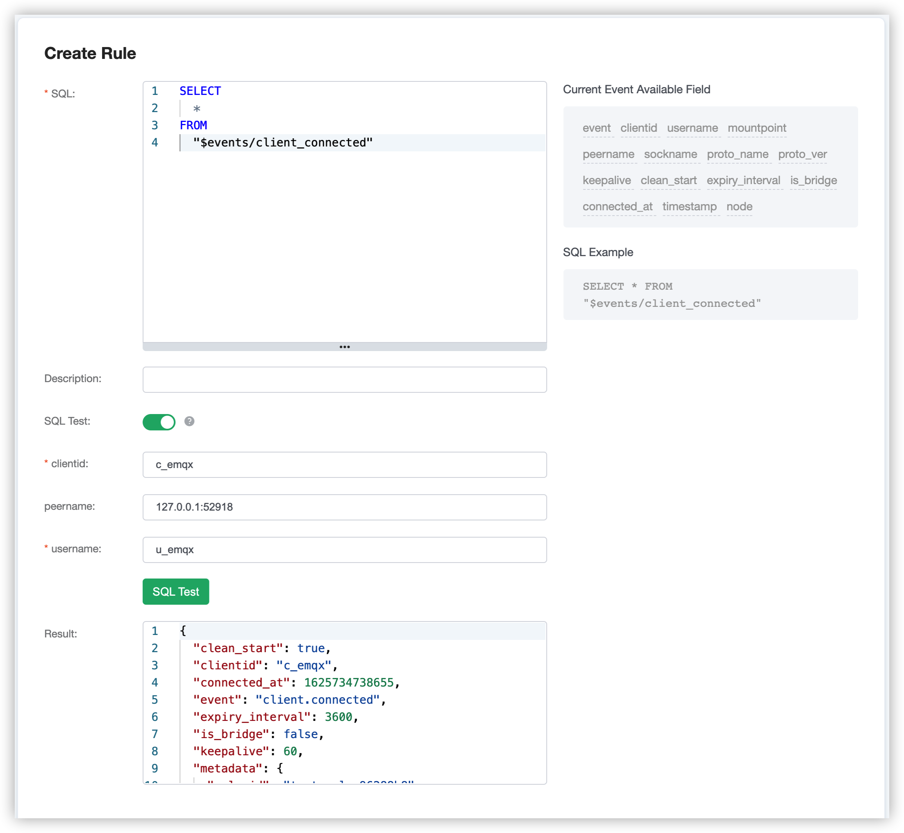
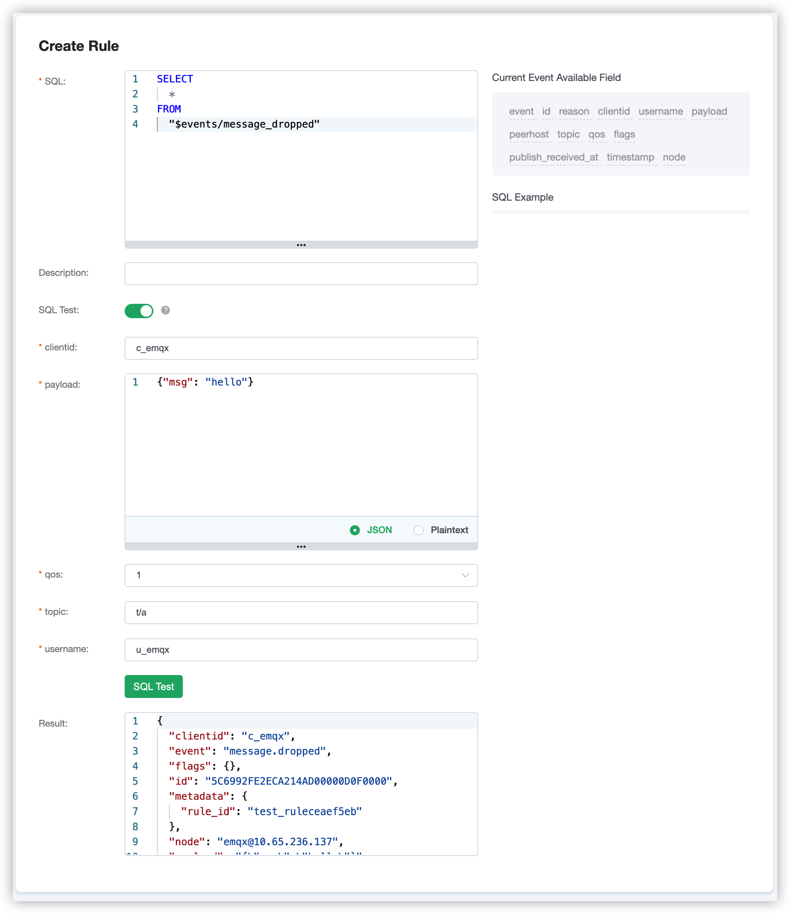
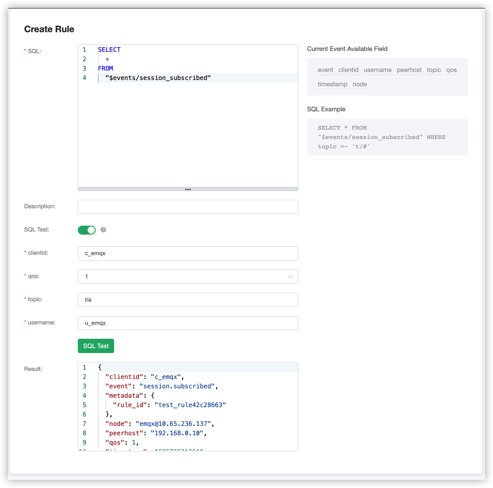

# Rule engine events

EMQX Cloud Rule Engine provide event topic available for FROM clause.

| Event topic name | Explanation |
| ---- | ---- |
| $events/client_connected | Client connect |
| $events/client_disconnected | Client disconnect |
| $events/message_delivered | Message delivery |
| $events/message_acked | Message acknowledged |
| $events/message_dropped | Message dropped |
| $events/session_subscribed | Subscribe |
| $events/session_unsubscribed | Unsubscribe |

This article will introduce the use of rule engine events, and the meaning of each field from three aspects: client connect and disconnect events, message events, topic subscribe and unsubscribe events.


## Client connect and disconnect events

### Client connect

The topic of client connect is `$events/client_connected`, click on Rules on the left menu bar → Rules, click on Create and enter the following rule to match the SQL statement.
   ```sql
    SELECT
        *
    FROM
        "$events/client_connected"
   ```

You can test the SQL, view the return field after firing this rule.



The fields are explained as follows.

| field | Explanation |
| ---- | ---- |
| clean_start | MQTT clean_start |
| clientid | Client ID |
| connected_at | Terminal connection completion time (s) |
| event | Event type, fixed at "client.connected" |
| expiry_interval | MQTT Session Expiration time |
| is_bridge | Whether it is MQTT bridge connection |
| keepalive | MQTT keepalive interval |
| mountpoint | Mountpoint for bridging messages |
| node | Node name of the trigger event |
| peername | IPAddress and Port of terminal |
| proto_name | Protocol name |
| proto_ver | Protocol version |
| sockname | IPAddress and Port listened by emqx |
| timestamp | Event trigger time (ms) |
| username | Current MQTT username |


### Client disconnect

The topic of client disconnect is `$events/client_disconnected`, click on Rules on the left menu bar → Rules, click on Create and enter the following rule to match the SQL statement.
   ```sql
    SELECT
        *
    FROM
        "$events/client_disconnected"
   ```  

You can test the SQL, view the return field after firing this rule.


The fields are explained as follows.

| field | Explanation |
| ---- | ---- |
| clientid | Client ID |
| disconnected_at | Terminal disconnection completion time (s) |
| event | Event type, fixed at "client.disconnected" |
| node | Node name of the trigger event |
| peername | IPAddress and Port of terminal |
| reason | Reason for disconnection of terminal: <br>normal: the client is actively disconnected <br>kicked: the server kicks out, and it is kicked out through REST API <br>keepalive_timeout: keepalive timeout <br>not_authorized: auth failed，or acl_nomatch = disconnect, Pub/Sub without permission will disconnect the client <br>tcp_closed: bad protocol <br>internal_error: malformed message parsing error |
| sockname | IPAddress and Port listened by emqx |
| timestamp | Event trigger time (ms) |
| username | Current MQTT username |
| peername | IPAddress and Port of terminal |


## Message events

### Message delivery

The topic of client disconnect is `$events/message_delivered`, click on Rules on the left menu bar → Rules, click on Create and enter the following rule to match the SQL statement.
   ```sql
    SELECT
        *
    FROM
        "$events/message_delivered"
   ```  

You can test the SQL, view the return field after firing this rule.


The fields are explained as follows.

| field | Explanation |
| ---- | ---- |
| clientid | Client ID |
| event | Event type, fixed at "message.delivered" |
| flags | MQTT Message flags |
| from_clientid | Message source client ID |
| from_username | Message source username |
| id | MQTT message ID |
| node | Node name of the trigger event |
| payload | MQTT payload |
| peerhost | Client IPAddress |
| publish_received_at | Time when PUBLISH message reaches Broker (ms) |
| qos | Enumeration of message QoS 0,1,2 |
| timestamp | Event trigger time (ms) |
| topic | MQTT topic |
| username | Current MQTT username |


### Message acknowledged

The topic of client disconnect is `$events/message_acked`, click on Rules on the left menu bar → Rules, click on Create and enter the following rule to match the SQL statement.
   ```sql
    SELECT
        *
    FROM
        "$events/message_acked"
   ```  

You can test the SQL, view the return field after firing this rule.


The fields are explained as follows.

| field | Explanation |
| ---- | ---- |
| clientid | Client ID |
| event | Event type, fixed at "message.acked"|
| flags | MQTT message flags |
| from_clientid | Message source client ID |
| from_username | Message source username |
| id | MQTT message ID |
| node | Node name of the trigger event |
| payload | MQTT payload |
| peerhost | Client IPAddress |
| publish_received_at | Time when PUBLISH message reaches Broker (ms) |
| qos | Enumeration of message QoS 0,1,2 |
| timestamp | Event trigger time (ms) |
| topic | MQTT topic |
| username | Current MQTT username |


### Message dropped

The topic of client disconnect is `$events/message_dropped`, click on Rules on the left menu bar → Rules, click on Create and enter the following rule to match the SQL statement.
   ```sql
    SELECT
        *
    FROM
        "$events/message_dropped"
   ```  

You can test the SQL, view the return field after firing this rule.


The fields are explained as follows.

| field | Explanation |
| ---- | ---- |
| clientid | Client ID |
| event | Event type, fixed at "message.dropped" |
| flags | MQTT message flags |
| id | MQTT message ID |
| node | Node name of the trigger event |
| payload | MQTT payload |
| peerhost | Client IPAddress |
| publish_received_at | Time when PUBLISH message reaches Broker (ms) |
| qos | Enumeration of message QoS 0,1,2 |
| reason | Reason for message dropped |
| timestamp | Event trigger time (ms) |
| topic | MQTT topic |
| username | Current MQTT username |


## Topic subscribe and unsubscribe events

### Subscribe

The topic of client disconnect is `$events/session_subscribed`, click on Rules on the left menu bar → Rules, click on Create and enter the following rule to match the SQL statement.
   ```sql
    SELECT
        *
    FROM
        "$events/session_subscribed"
   ```  

You can test the SQL, view the return field after firing this rule.


The fields are explained as follows.

| field | Explanation |
| ---- | ---- |
| clientid | Client ID |
| event | Event type, fixed at "session.subscribed" |
| node | Node name of the trigger event |
| peerhost | Client IPAddress |
| qos | Enumeration of message QoS 0,1,2 |
| timestamp | Event trigger time (ms) |
| topic | MQTT topic |
| username | Current MQTT username |


### Unsubscribe

The topic of client disconnect is `$events/session_unsubscribed`, click on Rules on the left menu bar → Rules, click on Create and enter the following rule to match the SQL statement.
   ```sql
    SELECT
        *
    FROM
        "$events/session_unsubscribed"
   ```  

You can test the SQL, view the return field after firing this rule.


The fields are explained as follows.

| field | Explanation |
| ---- | ---- |
| clientid | Client ID |
| event | Event type, fixed at "session.unsubscribed" |
| node | Node name of the trigger event |
| peerhost | Client IPAddress |
| qos | Enumeration of message QoS 0,1,2 |
| timestamp | Event trigger time (ms) |
| topic | MQTT topic |
| username | Current MQTT username |