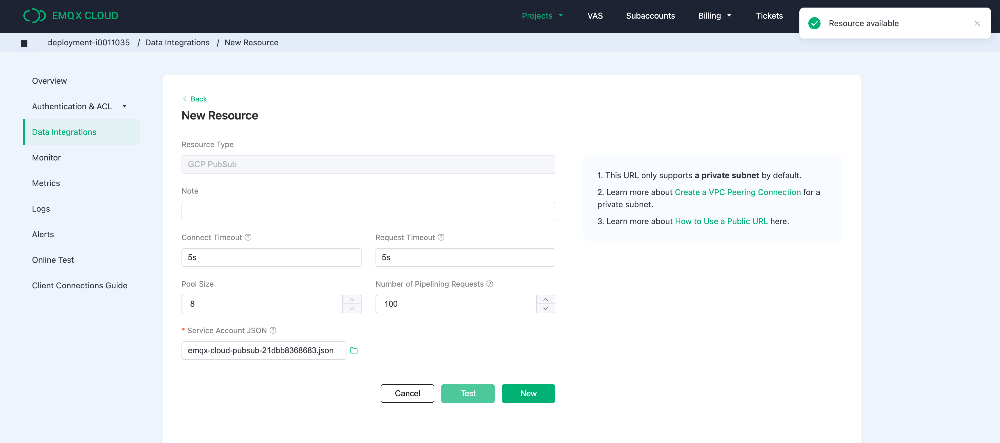
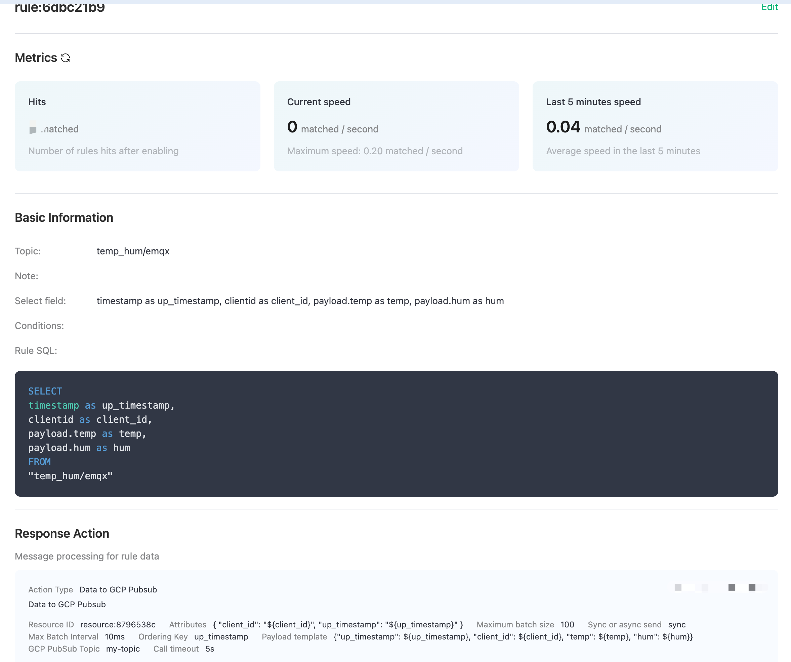
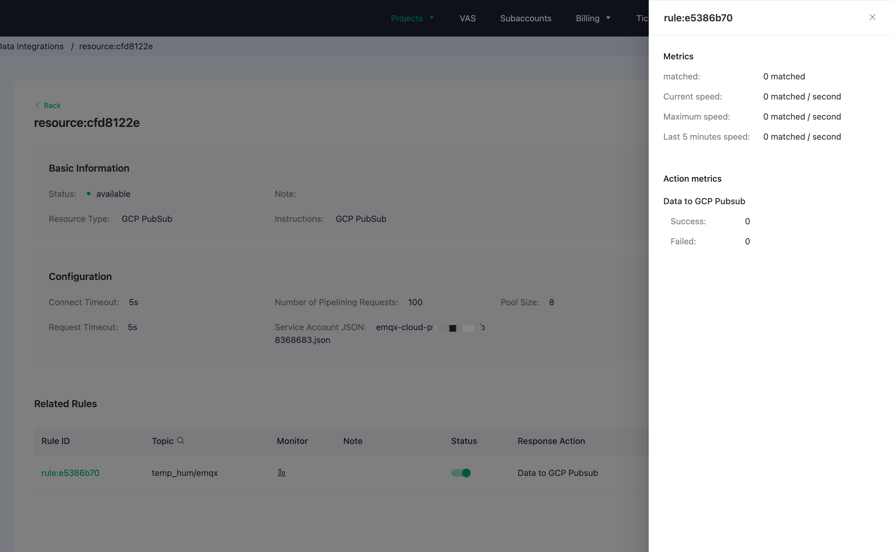
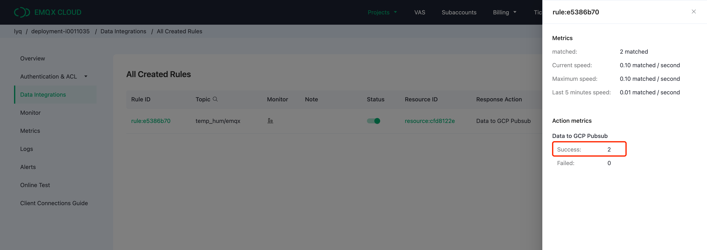
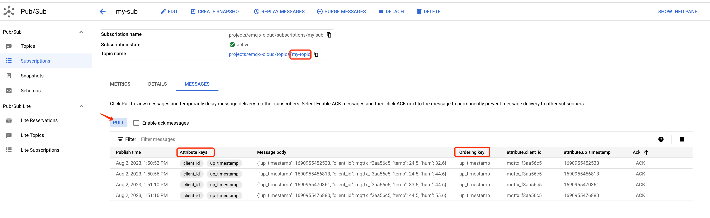

# Bridge device data to GCP Pub/Sub using the Data Integrations

In this article, we will simulate temperature and humidity data and report these data to EMQX Cloud via the MQTT protocol and then use the EMQX Cloud Data Integrations to forward the data into [GCP Pub/Sub](https://cloud.google.com/pubsub).

Before you start, you need to complete the following operations:

* Deployments have already been created on EMQX Cloud (EMQX Cluster).
* For Professional deployment (AWS, Azure) users: Please complete [NAT gateway](../vas/nat-gateway.md) first, all IPs mentioned below refer to the public IP of the resource.
  
> Professional deployment on the GCP platform uses the internal network by default, and there is no need to enable NAT gateway.

## GCP Pub/Sub configuration

If you are using GCP Pub/Sub for the first time, you can refer to the [help documentation](https://cloud.google.com/pubsub/docs/quickstarts) for a quick start.

### Create a topic

   Enter the GCP Pub/Sub console, click Create Topic, and enter the Topic ID to successfully create a Topic.

   

   Click on the Topic ID to view the Topic details.

   

   Click Subscriptions to view the subscribed topic details and message forwarding results.

   

## Deployment Data Integrations Configuration

Go to the `Data Integrations` page

1. Create a GCP Pub/Sub resource and verify that it’s available.

   On the data integration page, click GCP Pub/Sub resources.
   

   Fill in the Service Account JSON and other details, and then click test. Please check the GCP Pub/Sub service if the test fails.

   > *Service Account JSON* : Go to the GCP console, select the appropriate project - IAM & Admin - Service Accounts - Email, enter the email details page, click KEYS, and generate a JSON file for identity authentication.

   

2. Click the New button after the test is passed and you will see the Create Resource successfully message.

   

3. Create a new rule

   Put the following SQL statement in the SQL input field. The device reporting message time (up timestamp), client ID, and message body (Payload) will be retrieved from the temp hum/emqx subject in the SQL rule, and the device ambient temperature and humidity will be read from the message body.

   ```sql
   SELECT 
   timestamp as up_timestamp, 
   clientid as client_id, 
   payload.temp as temp,
   payload.hum as hum
   FROM
   "temp_hum/emqx"
   ```

   

4. Rule SQL Testing

   To see if the rule SQL fulfills our requirements, click SQL test and fill in the test payload, topic, and client information.

   

5. Add Action to Rule

   Click Next to add a GCP Pub/Sub forwarding action to the rule once the SQL test succeeds. To demonstrate how to forword the data reported by the device to GCP Pub/Sub, we'll utilize the following GCP Pub/Sub topic and message template.

   ```bash
   # GCP Pub/Sub message template 
   {"up_timestamp": ${up_timestamp}, "client_id": ${client_id}, "temp": ${temp}, "hum": ${hum}}
   ```

   

6. After successfully binding the action to the rule, click View Details to see the rule sql statement and the bound actions.

   

7. To see the created rules, go to Data Integrations/View Created Rules. Click the Monitor button to see the detailed match data of the rule.

   

## Test

1. Use [MQTT X](https://mqttx.app/) to simulate temperature and humidity data reporting

   You need to replace broker.emqx.io with the created deployment [connection address](../deployments/view_deployment.md), add [client authentication information](../deployments/auth.md) to the EMQX Dashboard.

   

2. View rules monitoring

   Check the rule monitoring and add one to the "Success" number.

   

3. View data bridging results

   Go to the GCP Pub/Sub instance and view the forwarding result.

   
