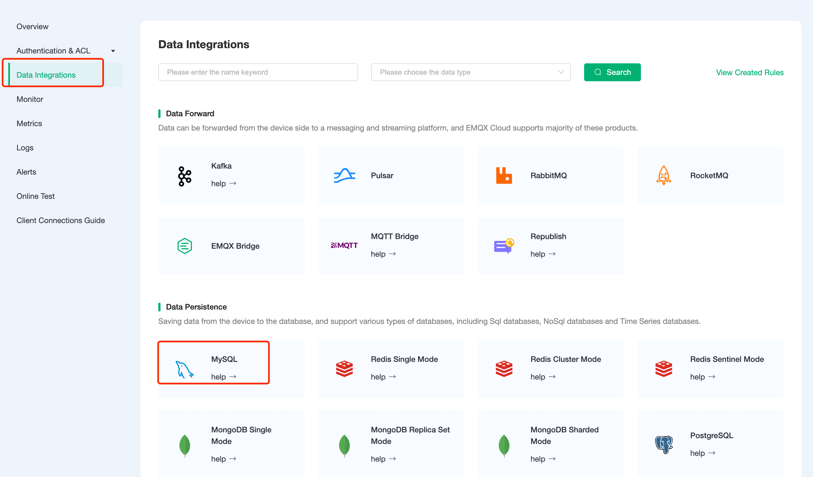
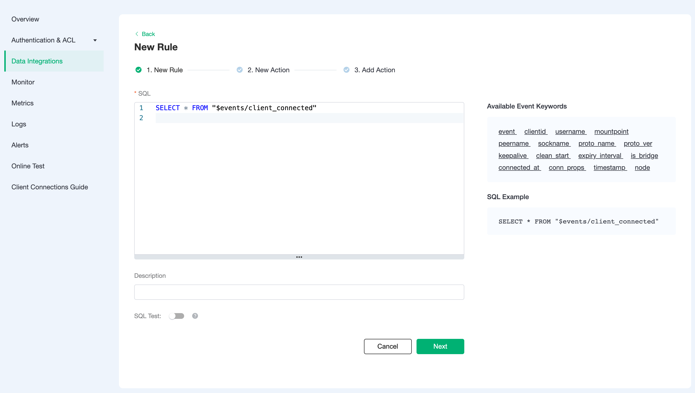
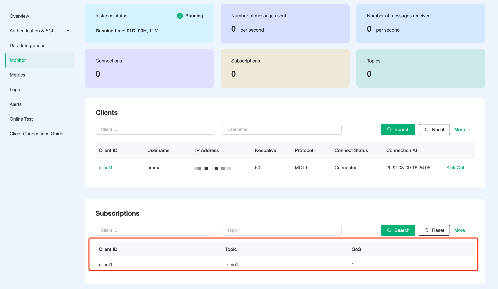

# Get Subscription Topic Information Using the Data Integrations

We will use EMQX Cloud data integration to fetch subscription relationships from cloud service resources (third-party databases or message queues) and proxy device subscriptions, which is implemented in this article using MySQL as an example.

Before you start, you need to complete the following operations:

- Deployments have already been created on EMQX Cloud (EMQX Cluster).
- For Professional Plan users: Please complete [Peering Connection Creation](../deployments/vpc_peering.md) first, all IPs mentioned below refer to the internal network IP of the resource.(Professional Plan with a [NAT gateway](../vas/nat-gateway.md) can also use public IP to connect to resources)

## MySQL configuration

1. Install MySQL

   ```bash
   docker run -d --restart=always \
     --name mysql \
     -p 3306:3306 \
     -e MYSQL_ROOT_PASSWORD=public \
     mysql/mysql-server:5.7
   ```

2. New database

   ```bash
   docker exec -it mysql mysql -uroot -ppublic
   CREATE DATABASE emqx;
   USE emqx;
   ```

3. New subscription relationship table

   ::: tip
   The subscription relationship table structure cannot be modified, please use the above SQL statement to create
   :::

   Use the following SQL statement to create `mqtt_sub` table. This table will be used to save the device subscription relationship data.

   ```sql
   DROP TABLE IF EXISTS `mqtt_sub`;
   CREATE TABLE `mqtt_sub` (
       `id` int(11) unsigned NOT NULL AUTO_INCREMENT,
       `clientid` varchar(64) DEFAULT NULL,
       `topic` varchar(180) DEFAULT NULL,
       `qos` tinyint(1) DEFAULT NULL,
       PRIMARY KEY (`id`),
       KEY `mqtt_sub_idx` (`clientid`,`topic`,`qos`),
       UNIQUE KEY `mqtt_sub_key` (`clientid`,`topic`),
       INDEX topic_index(`id`, `topic`)
   ) ENGINE=InnoDB DEFAULT CHARSET=utf8MB4;
   ```

4. Set the EMQX cluster IP segment to be allowed to access the database (optional)

   For professional deployment, if you want to get deployment segment, you can go to Deployment Details → View Peer Connection Information and copy the deployment VPC segment.

   ```sql
   # Professional deployment
   GRANT ALL PRIVILEGES ON *.* TO root@'10.11.30.%' IDENTIFIED BY 'public' WITH GRANT OPTION;

   # Basic deployment
   GRANT ALL PRIVILEGES ON *.* TO root@'%' IDENTIFIED BY 'public' WITH GRANT OPTION;
   ```

5. Insert test data and view it

   ```sql
   INSERT INTO mqtt_sub(clientid, topic, qos) values("test", "t1", 1);

   select * from mqtt_sub;
   ```

## EMQX Cloud Data Integrations configuration

Go to Deployment Details and click on EMQX Dashbaord to go to Dashbaord.

1. New Resource

   Click on Data Integrations on the left menu bar → Resources, click on New Resource and drop down to select the MySQL resource type. Fill in the mysql database information you have just created and click Test. If you get an error, instantly check that the database configuration is correct.
   
   

2. Fill in rule

   Click `Data Integration` on the left menu bar, find the configured resource, click New Rule, and then enter the following rule to match the SQL statement

   ```sql
   SELECT * FROM "$events/client_connected"
   ```

   

3. Add a response action

   Click Next, select the resource created in the first step, drop down and select Action Type → Proxy Subscriptions → Get Subscription List from MySQL

   

4. Return to the list of rules

   

5. View rules monitoring

   

## Test

1. Inserting subscription data in MySQL

   Insert the subscription data with client ID client1, subscription topic1 and QoS 1.

   ```sql
   INSERT INTO mqtt_sub(clientid, topic, qos) values("client1", "topic1", 1);
   select * from mqtt_sub;
   ```

   
2. Use [MQTT X](https://mqttx.app/) to connect the deployment

   You need to replace broker.emqx.io with the created deployment connection address, and add client authentication information to the EMQX Dashboard.
   In this case, set the clientID to client1
   

3. View subscription relationships in the Dashboard

   Go to Deployment Details and click on EMQX Dashbaord to go to Dashbaord and view the client subscription relationship in `Subscriptions`.
   
