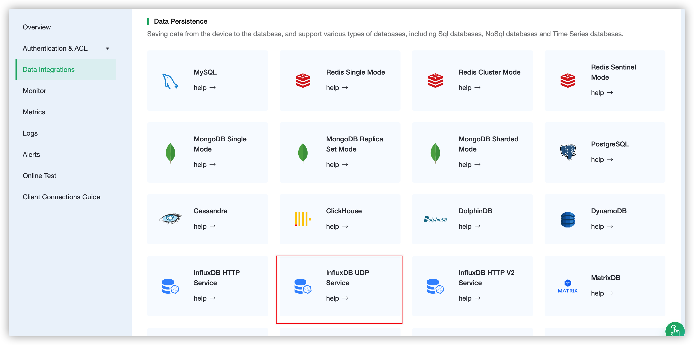
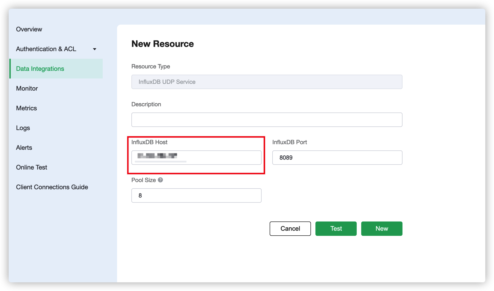
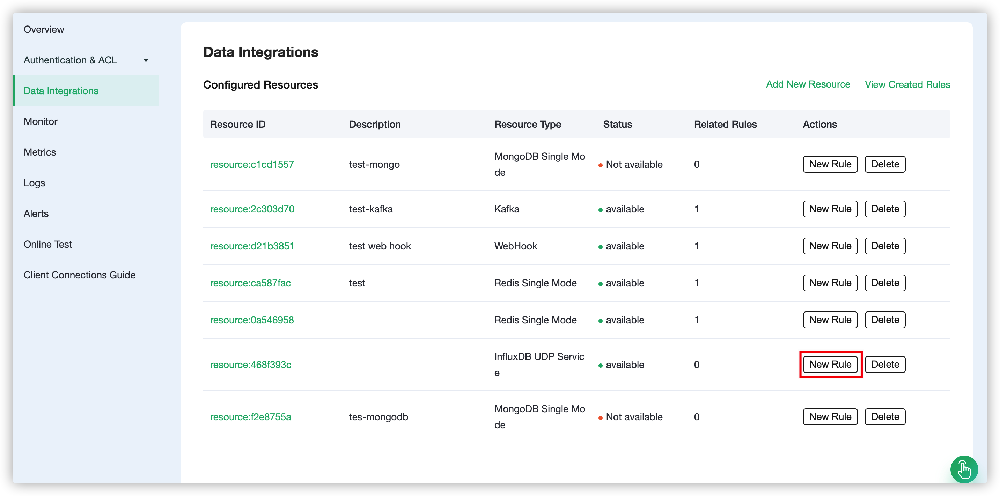
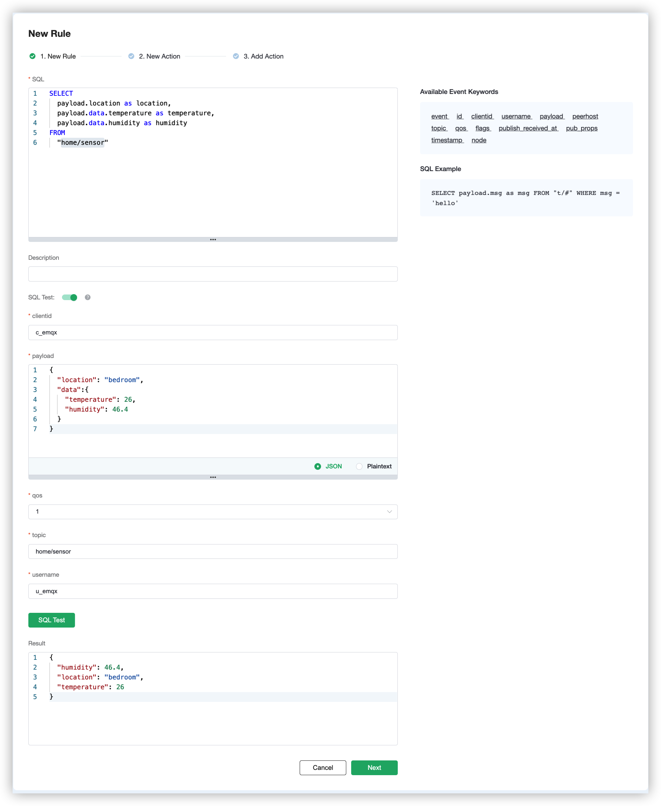
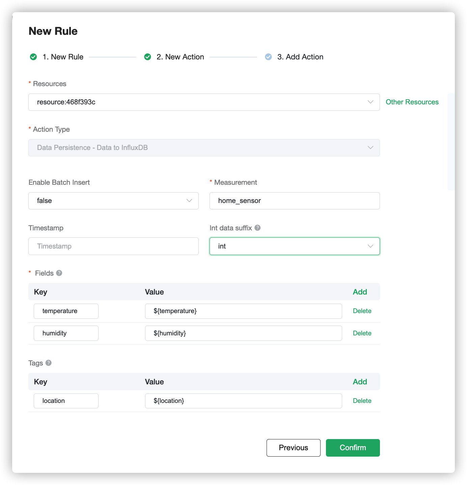

# Integrate with InfluxDB

[InfluxDB](https://www.influxdata.com/) is an open source database for storing and analyzing time series data, with built-in HTTP API, support for SQL-like statements, and unstructured features that are very friendly for users. Its powerful data throughput and stable performance make it very suitable for the IoT field.

Through the EMQX Cloud Data Integrations, we can customize the Template file, and then convert the MQTT message in JSON format to Measurement and write it to InfluxDB.

In this guide, we will complete the creation of an InfluxDB data integration to achieve the following functions:

* Record the temperature and humidity of each room. When there is a temperature and humidity monitoring message sent to the home/sensor topic, the Data Integrations will be triggered to record this data in InfluxDB.

To achieve this function, we will complete the following 4 tasks:

1. Install and initialize InfluxDB
2. Set the filter conditions of the rule
3. Create a resource and action
4. Complete the data integration creation and test

Before you start, you will need to complete the following:

* Deployments have already been created on EMQX Cloud (EMQX Cluster).
* For Professional Plan users: Please complete [Peering Connection Creation](../deployments/vpc_peering.md) first, all IPs mentioned below refer to the internal network IP of the resource.(Professional Plan with a [NAT gateway](../vas/nat-gateway.md) can also use public IP to connect to resources)

## 1. Install and initialize InfluxDB

First, we create an InfluxDB on our server. To quickly create InfluxDB, we use docker for quick installation, and open **8089** UDP port. The database name is **db**.

```shell
$ docker pull influxdb:1.8
$ git clone -b v1.0.0 https://github.com/palkan/influx_udp.git
$ cd influx_udp
$ docker run -d --name=influxdb \
      -p 8086:8086 \
      -p 8089:8089/udp \
      -v ${PWD}/files/influxdb.conf:/etc/influxdb/influxdb.conf:ro \
      -e INFLUXDB_DB=db \
      influxdb:1.8
```


## 2. Create InfluxDB UDP Server Resource

Go to [EMQX Cloud Console](https://cloud-intl.emqx.com/console/), and click to enter the deployment of InfluxDB to be used.

On the deployment page, select the Data Integrations and click Create.



On the Create Resource page, fill in  **\<Server IP>:8089**for the server address

::: tip
Currently, InfluxDB uses a UDP port. Therefore, it is impossible to detect whether the connection is successful
:::



Click Test button when configuration is complete, then click New button to create a resource when it is available.

## 3. Create Rule

After the resource is successfully created, you can return to the data integration page and find the newly created resource, and click create rule.



Our goal is that as long as the home/sensor topic has monitoring information, the engine will be triggered. Certain SQL processing is required here:

* Only target the topic "home/sensor"
* Get the three data we need: location, temperature, humidity

According to the above principles, the SQL we finally get should be as follows:

```sql
SELECT
  payload.location as location,
  payload.data.temperature as temperature,
  payload.data.humidity as humidity
FROM
  "home/sensor"
```

The payload in SQL represents the data we send to EMQX Cloud. The JSON structure is as follows:

```json
{
  "location": "room",
  "data":{
    "temperature": "temperature",
    "humidity": "humidity"
  }
}
```
This SQL can be interpreted as: When the "home/sensor" topic receives a message, the three fields of location, data.temperature, and data.humidity are selected in the message.

You can click **SQL Test** under the SQL input box to fill in the data:

* topic: home/sensor
* payload:
```json
{
  "location": "bedroom",
  "data":{
    "temperature": 26,
    "humidity": 46.4
  }
}
```
Click Test to view the get data results. If the settings are correct, the test output box should get the complete JSON data as follows:

```json
{
  "temperature": 25, 
  "location": "bedroom",
  "humidity": 46.4
}
```


::: tip
If test fails, please check whether the SQL is compliant, and whether the topic in the test is consistent with the SQL filled in.
:::

## 4. Create Action

After completing the rule configuration, click Next to configure and create an action. For other fields, you can refer to the table below.

| parameter     | Required | Type | Meaning                                                      |
| :------------ | :------- | :--- | :----------------------------------------------------------- |
| Measurement   | Yes      | str  | Specify the measurement written to InfluxDB                  |
| Fields        | Yes      | str  | Specify where to get the value of fields written to InfluxDB |
| Tags          | No       | str  | Specify where to get the value of tags written to InfluxDB   |
| Timestamp Key | No       | str  | Specify where to get the timestamp value written to InfluxDB |

For our situation, this part can be filled in like this



* For Measurement, it can be set at will, and we fill in "home_sensor" here
* For Field Keys, we fill in the two data we need to record: temperature and humidity
* For Tag Keys, we set it as location
* Timestamp Key is null by default

After filling in, click OK.

The created action will be displayed in the response action column. After confirming that the information is correct, click Confirm in the lower right corner to complete the configuration of the data integration.

## 5. Test

>If you are using EMQX Cloud for the first time, you can go to [Deployment Connection Guide](../connect_to_deployments/overview.md) to view the MQTT client connection and test guide

We try to send the following data to the home/sensor topic

```json
{
  "location": "bedroom",
  "data":{
    "temperature": 25,
    "humidity": 46.4
  }
}
```
On the Data Integrations page, click Monitor and you can see that the number of successes becomes 1.


Open the server and view the data in InfluxDB.

```shell
$ docker exec -it influxdb influx
$ use db
$ select * from "home_sensor"
```
As you can see, the message just sent has been stored in InfluxDB.

```plain
> select * from "home_sensor"
name: home_sensor
time                humidity location temperature
----                -------- -------- -----------
1592984201145230677 46.4     bedroom  25
```

::: tip
In influxDB, the data type is subject to the first value. If you pass the string to humidity and temperature by mistake, it can be cleared by entering the command `DROP SERIES FROM home_sensor` in the database
:::
