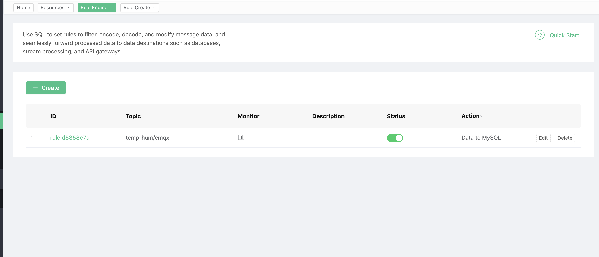
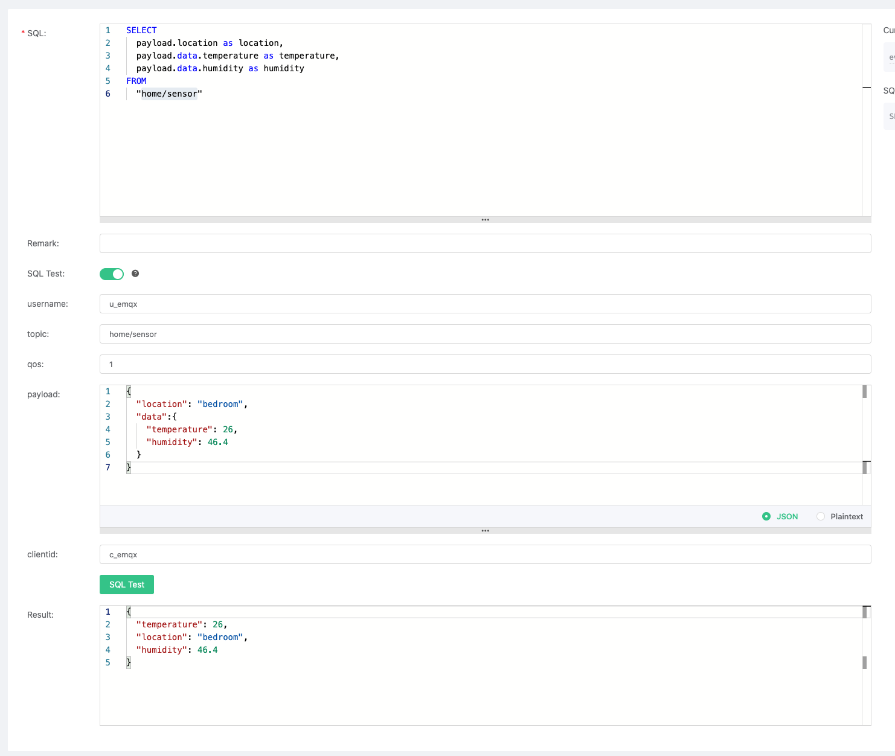
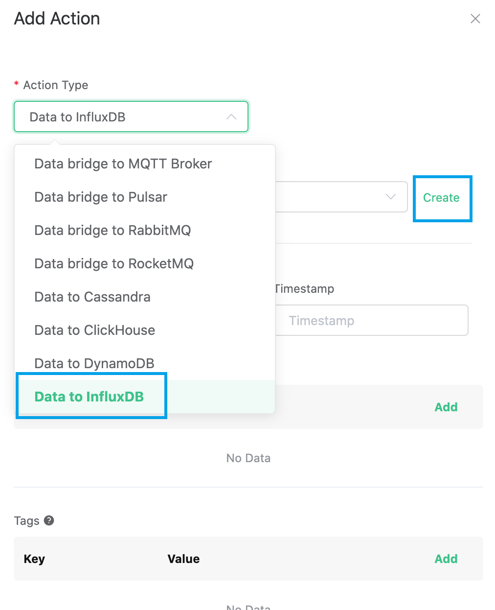
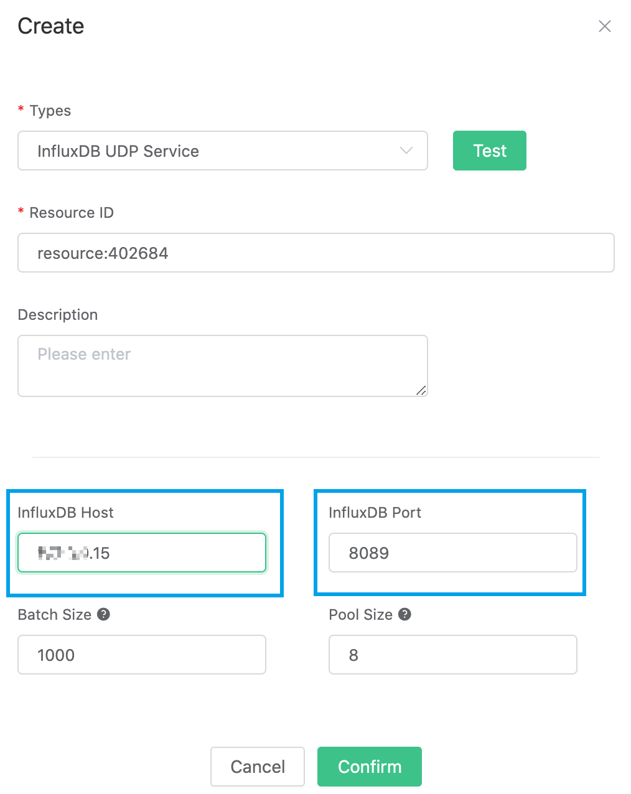
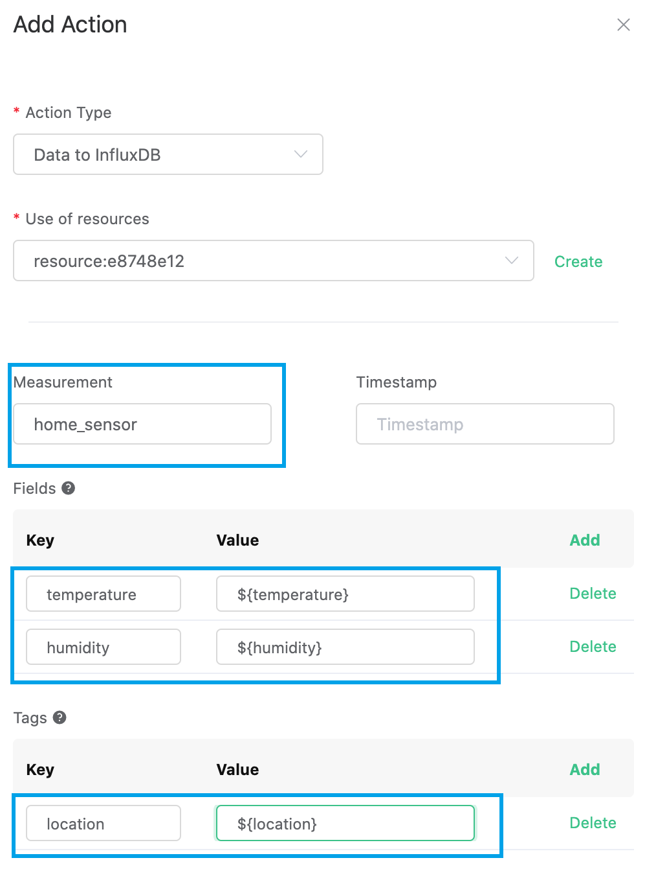
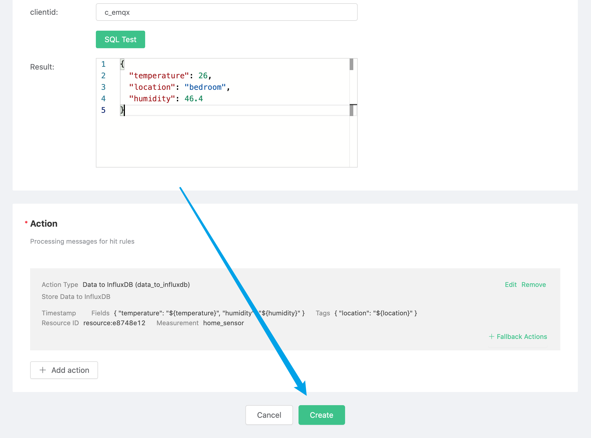
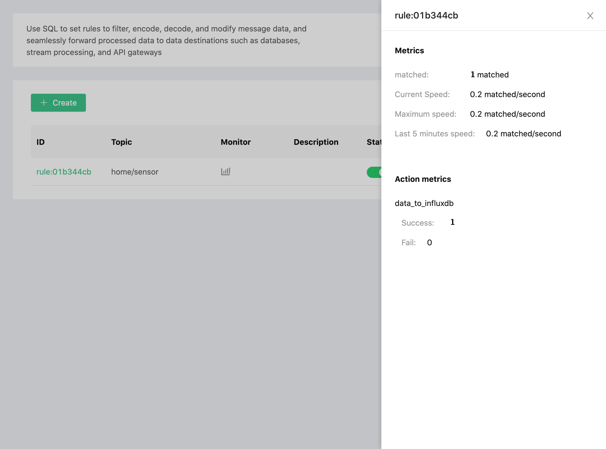

# Use EMQ X Cloud rule engine-InfluxDB

[InfluxDB](https://www.influxdata.com/) is an open source database for storing and analyzing time series data, with built-in HTTP API, support for SQL-like statements, and unstructured features that are very friendly for users. Its powerful data throughput and stable performance make it very suitable for the IoT field.

Through the EMQ X Cloud rule engine, we can customize the Template file, and then convert the MQTT message in JSON format to Measurement and write it to InfluxDB.


In this guide, we will complete the creation of an InfluxDB rule engine to achieve the following functions:

* Record the temperature and humidity of each room. When there is a temperature and humidity monitoring message sent to the home/sensor topic, the rule engine will be triggered to record this data in InfluxDB.


In order to achieve this function, we will complete the following 4 tasks:

1. Install and initialize InfluxDB
2. Set the filter conditions of the rule engine
3. Create a resource and an action
4. Complete the rule engine creation and test

::: tip Tip
Before using the rule engine, create a deployment first.
For dedicated deployment users: please complete [Peering Connection](../deployments/vpc_peering.md) first, and ensure that the servers involved in the following are established in the VPC under the peering connection. All the IP mentioned below refer to the intranet IP of the resource
For free trial and shared deployment users: There is no need to complete peering connection, and the IP mentioned below refers to the public IP of the resource
:::


## 1. Install and initialize InfluxDB

First, we create an InfluxDB on our server. In order to quickly create InfluxDB, we use docker for quick installation, and open **8089** UDP port. The database name is **db**.

```shell
$ docker pull influxdb
$ git clone -b v1.0.0 https://github.com/palkan/influx_udp.git
$ cd influx_udp
$ docker run --name=influxdb --rm -d -p 8086:8086 -p 8089:8089/udp -v ${PWD}/files/influxdb.conf:/etc/influxdb/influxdb.conf:ro -e INFLUXDB_DB=db influxdb:latest
```


## 2. Set the filter criteria of the rule engine

Go to [EMQ X Cloud Console](https://cloud.emqx.io/console/), and click to enter the deployment of InfluxDB to be used.

On the deployment page, select the rule engine and click Create.



Our goal is that as long as the home/sensor topic has monitoring information, the engine will be triggered. Certain SQL processing is required here:

* Only target the topic "home/sensor"
* Get the three data we need: location, temperature, humidity

According to the above principles, the SQL we finally get should be as follows:

```sql
SELECT
  payload.location as location,
  payload.data.temperature as temperature,
  payload.data.humidity as humidity
FROM
  "home/sensor"
```

The payload in SQL represents the data we send to EMQX Cloud. The JSON structure is as follows:

```json
{
  "location": "room",
  "data":{
    "temperature": "temperature",
    "humidity": "humidity"
  }
}
```
This SQL can be interpreted as: When the "home/sensor" topic receives a message, the three fields of location, data.temperature, and data.humidity are selected in the message.

You can click **SQL Test** under the SQL input box to fill in the data:

* topic: home/sensor
* payload:
```json
{
  "location": "bedroom",
  "data":{
    "temperature": 26,
    "humidity": 46.4
  }
}
```
Click Test to view the obtained data results. If the settings are correct, the test output box should get the complete JSON data as follows:

```json
{
  "temperature": 25,
  "location": "bedroom",
  "humidity": 46.4
}
```


::: tip Tip
If test fails, please check whether the SQL is compliant, and whether the topic in the test is consistent with the SQL filled in.
:::


## 3. Create resources and actions

Click Add Action, on the Select Action page, select **Save data to InfluxDB**, and click Next. When the action page is configured, click Create Resource.



On the Create Resource page, select **InfluxDB UDP Service** for the resource type, and fill in  **\<Server IP>:8089**for the server address

::: tip Tip
Currently, InfluxDB uses a UDP port. Therefore, it is impossible to detect whether the connection is successful
:::



Click OK to return to the configuration action page. The resource just created is selected by default. For other fields, you can refer to the table below.

| parameter | Required | Type | Meaning |
|:----|:----|:----|:----|
| Measurement   | Yes | str   | Specify the measurement written to InfluxDB |
| Fields  | Yes | str   | Specify where to get the value of fields written to InfluxDB |
| Tags  | No  | str  | Specify where to get the value of tags written to InfluxDB |
| Timestamp Key   | No  | str   | Specify where to get the timestamp value written to InfluxDB |

For our situation, this part can be filled in like this



* For Measurement, it can be set at will, and we fill in "home_sensor" here
* For Field Keys, we fill in the two data we need to record: temperature and humidity
* For Tag Keys, we set it as location
* Timestamp Key is null by default

After filling in, click OK.

The created action will be displayed in the response action column. After confirming that the information is correct, click Confirm in the lower right corner to complete the configuration of the rule engine.




## 4. Test

>If you are using EMQ X Cloud for the first time, you can go to [Deployment Connection Guide](../connect_to_deployments/introduction.md) to view the MQTT client connection and test guide

We try to send the following data to the home/sensor topic

```json
{
  "location": "bedroom",
  "data":{
    "temperature": 25,
    "humidity": 46.4
  }
}
```
On the rule engine page, click Monitor and you can see that the number of successes becomes 1.



Open the server and view the data in InfluxDB.

```shell
$ docker exec -it InfluxDB influx
$ use db
$ select * from "home_sensor"
```
As you can see, the message just sent has been stored in InfluxDB.

```plain
> select * from "home_sensor"
name: home_sensor
time                humidity location temperature
----                -------- -------- -----------
1592984201145230677 46.4     bedroom  25
```

::: tip Tip
In influxDB, the data type is subject to the first value. If you pass the string to humidity and temperature by mistake, it can be cleared by entering the command `DROP SERIES FROM home_sensor` in the database
:::
